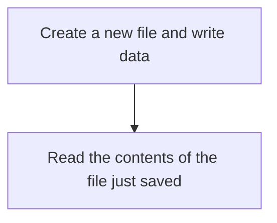
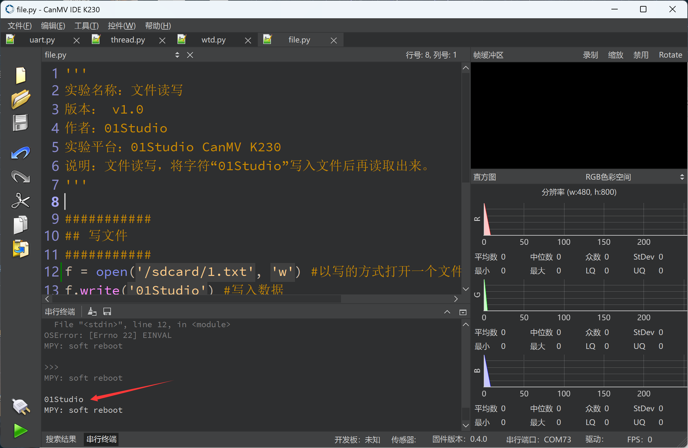
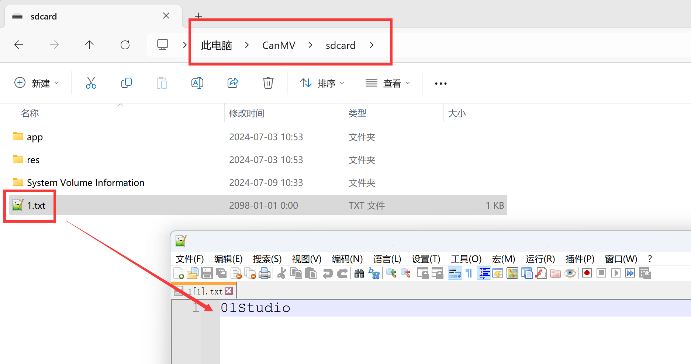

# file

## Foreword
In embedded programming, we often need to save some data after power failure, such as sensor data. EEPROM, flash and other storage methods are often used. CanMV K230 MicroPython comes with a file system, so we only need to save the data directly in a file.

## Experiment Purpose
Programming to implement file reading and writing operations.

## Experimental Explanation

Most of the file operation instructions of micropython are compatible with CPython. Therefore, we can directly use Python programming to implement file reading and writing. The directory corresponding to the CanMV K230 drive letter is under the path `/sdcard/`:

The programming process is as follows:



## Codes

```python
'''
Demo Name：File reading and writing
Version： v1.0
Author：01Studio
Platform：01Studio CanMV K230
Description：File reading and writing, write the characters "01Studio" into the file and then read it out.
'''

###########
## Writing file
###########
f = open('/sdcard/1.txt', 'w') #Open a file for writing. If the file does not exist, it will be created automatically.
f.write('01Studio') #Writing Data
f.close() #Remember to close the file after each operation.

###########
## Reading File
###########
f = open('/sdcard/1.txt', 'r') #Open a file for reading
text = f.read()
print(text) #Read data and print it in the terminal
f.close() #Remember to close the file after each operation.

```

## Experimental Results

Run the code and you can see the file contents printed on the serial terminal.



Open the CanMV drive letter, and you can see the newly created 1.txt file in the sdcard directory. The content inside is the 01Studio we wrote:


In addition to txt, you can write files with any suffix, such as json, csv or files without suffix. For more file operation methods, you can search Python or MicroPython file reading and writing on the Internet.