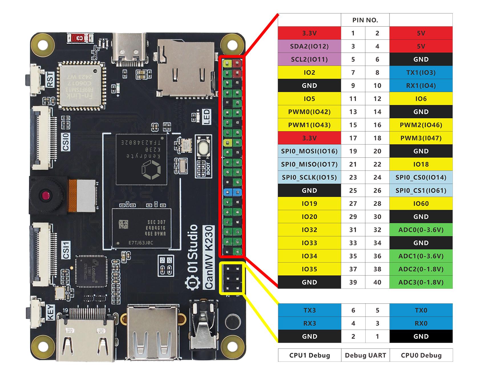
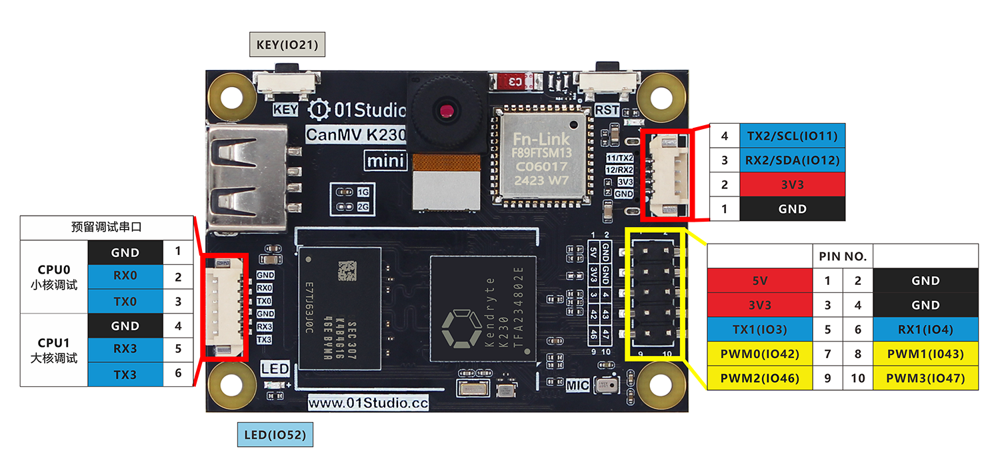

# GPIO Introduction

Let's introduce the GPIO of 01Studio CanMV K230 first, which is the commonly used I/O (input and output pins), UART (serial port), I2C, SPI, PWM, ADC and other functions. CanMV K230 is not only a powerful AI vision development board, but also can realize the GPIO functions of various microcontrollers. Familiarity with the GPIO related function description is very helpful for learning the basic experiments in this chapter.

## CanMV K230

Below is the GPIO pin diagram of the 01Studio CanMV K230 development board:

From the table and illustration above, we can see that GPIO is similar to traditional MCU development. In addition to ordinary IO ports, it also has I2C, serial port (UART), SPI and other bus interfaces, as well as power output pins (3.3V and 5V). It can be connected to various sensors and modules, and related content will be covered in the following tutorials.

### Power pin

The CanMV K230 40Pin GPIO has two 5V and two 3.3V output pins, as well as eight GND pins, which can provide external power. You can also connect a power supply (5V) to the 5V pin to power the development board.

:::danger Warning
Do not use a power supply higher than 5V to power the development board, as it may burn out.
:::

### IO

Except for the power pin and 4 ADC pins, all IO ports can be configured as input/output pins. The IO level is 3.3V.

### Pin multiplexing function

Some pins have other functions, as follows:

:::tip Tips
Some functions do not have MicroPython API yet. Please refer to the 01Studio tutorial and CanMV official documentation for details.
:::

### PWM

- PWM0（GPIO42）
- PWM1（GPIO43）
- PWM2（GPIO46）
- PWM3（GPIO47）

### UART 

- UART1
    - TX1（GPIO3）
    - RX1（GPIO4）

- UART2
    - TX2（GPIO11）
    - RX2（GPIO12）

### I2C

- I2C2
    - SDA2(GPIO12)
    - SCL2(GPIO11)

### SPI 
- SPI0
    - MOSI (GPIO16)
    - MISO (GPIO17)
    - SCLK (GPIO15)
    - CS0 (GPIO14)
    - CS1 (GPIO61)

### I2S

- I2S-CLK (GPIO32)
- I2S-WS (GPIO33)
- I2S-DIN (GPIO34)
- I2S-DOUT (GPIO35)

### ADC

Do not exceed the measuring range!

- ADC0（Pin header No.32, Range: 0-3.6V）
- ADC1（Pin header No.36, Range: 0-3.6V）
- ADC2（Pin header No.38, Range: 0-1.8V）
- ADC3（Pin header No.40, Range: 0-1.8V）

## CanMV K230 mini

Below is the GPIO pin diagram of the 01Studio CanMV K230 mini development board:

From the table and illustration above, we can see that GPIO is similar to traditional MCU development. In addition to ordinary IO ports, it also has I2C, serial port (UART), SPI and other bus interfaces, as well as power output pins (3.3V and 5V). It can be connected to various sensors and modules, and related content will be covered in the following tutorials.

### Power pin

The CanMV K230 mini 10Pin GPIO has 5V and 3.3V output pins, as well as 2 GND pins, which can provide external power. You can also connect a power supply (5V) to the 5V pin to power the development board.

:::danger Warning
Do not use a power supply higher than 5V to power the development board, as it may burn out.
:::

### IO

Except for the power pin and 4 ADC pins, all IO ports can be configured as input/output pins. The IO level is 3.3V.

### Pin multiplexing function

Some pins have other functions, as follows:

:::tip Tips
Some functions do not have MicroPython API yet. Please refer to the 01Studio tutorial and CanMV official documentation for details.
:::

### PWM

- PWM0（GPIO42）
- PWM1（GPIO43）
- PWM2（GPIO46）
- PWM3（GPIO47）

### UART 

- UART1
    - TX1（GPIO3）
    - RX1（GPIO4）

- UART2
    - TX2（GPIO11）
    - RX2（GPIO12）

### I2C

- I2C2
    - SDA2(GPIO12)
    - SCL2(GPIO11)

### SPI 
- SPI0
    - MOSI (GPIO16)
    - MISO (GPIO17)
    - SCLK (GPIO15)
    - CS0 (GPIO14)
    - CS1 (GPIO61)

### I2S

- I2S-CLK (GPIO32)
- I2S-WS (GPIO33)
- I2S-DIN (GPIO34)
- I2S-DOUT (GPIO35)

### ADC

**Do not exceed the measurement range!**

- ADC0 (reserved pad on the back, range 0-1.8V)
- ADC1 (reserved pad on the back, range 0-1.8V)

