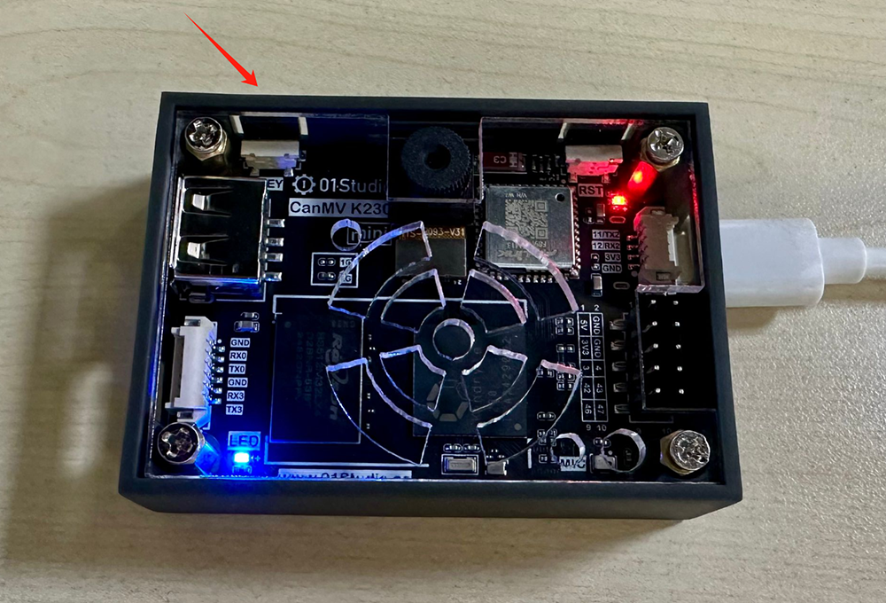
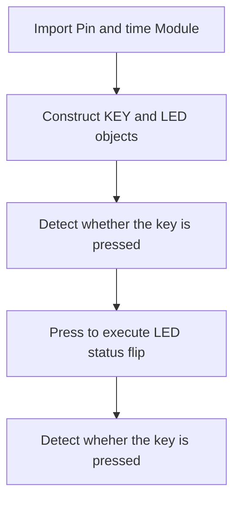
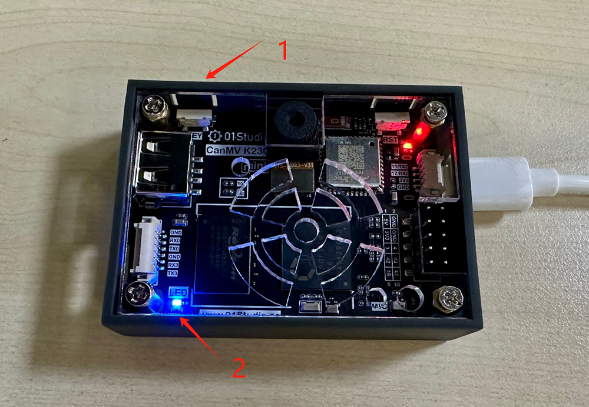

# KEY

## Foreword
Keys are the simplest and most common input devices. Many products cannot do without buttons, including early iPhones. Today we will learn how to use MicroPython to write button programs. With the key input function, we can do a lot of fun things.

## Experiment Purpose
Learn how to use the key to change the state of the LED (blue light) by MicroPython when the button is pressed.

## Experimental Explanation

CanMV K230's built-in KEY is located on the development board as shown in the figure below:

- CanMV K230


- CanMV K230 mini



Let's look at the schematic diagram of CanMV K230 and find the IO pins corresponding to the buttons at first.


As can be seen from the schematic diagram, one side of the KEY is connected to pin 21 of K230, and the other side is connected to GND. So when the Key is not pressed, it inputs a high level (1), and when it is pressed, it inputs a low level (0).

Since K230 has many functions, most GPIO pins will reuse multiple functions. Therefore, CanMV K230 provides FPIOA library (Field Programmable Input and Output Array) to realize different pin function selection. For details, please refer to:[FPIOA](https://www.kendryte.com/k230_canmv/main/zh/api/machine/K230_CanMV_FPIOA%E6%A8%A1%E5%9D%97API%E6%89%8B%E5%86%8C.html#)。

Like the Light Up LED in the previous chapter, the input detection of the Key also uses the Pin object module, as follows:

## class Pin
Pin Module

### Constructors
```python
KEY = machine.Pin(id, mode, pull)
```

Pin is located in the machine module and can be imported directly:

- `id` ：Chip pin number.For example:0、2、46
- `mode` : Input/Output mode.
    - `Pin.IN` : Input mode;
    - `Pin.OUT` : Output mode;   
- `pull`: Pull-up and pull-down resistor configuration.
    - `None` : None;
    - `Pin.PULL_UP` : Pull-up resistor enabled;
    - `Pin.PULL_DOWN` : Pull-down resistor enabled.


### Methods
```python
KEY.value([X])
```
Set the pin level value：
- `Output Mode` ：Output level value.
    - `0` :  Output low level (0V);
    - `1` :  Output high level (3.3V);
- `Input Mode` ：No parameters are required. Get the current pin input level value.

<br></br>

For more usage, please read the official documentation:<br></br>
https://docs.micropython.org/en/latest/library/machine.Pin.html#machine-pin

<br></br>

When the Key is pressed, it may jitter, as shown in the figure below, which may cause misjudgment, so we need to use a delay function to eliminate the jitter:


The common method is to delay about 10ms, when the key value is 0, and then determine whether the key pin value is still 0. If so, it means the key is pressed. The delay uses the time module, and the usage is as follows:
```python
import time

time.sleep(1)           # Sleep 1s
time.sleep_ms(500)      # Sleep 500ms
time.sleep_us(10)       # Sleep 10us
start = time.ticks_ms() # Get the millisecond timer start value

delta = time.ticks_diff(time.ticks_ms(), start) # Calculate the difference from power-on to the current time
```

We configure the button pin 21 to input mode, so that when the Key is pressed, the blue LED light turns on, and when it is released, the blue LED light turns off to indicate. The code writing process is as follows:



## Codes

```python
'''
Demo Name：KEY
Version：v1.0
Author：01Studio
Platform：01Studio CanMV K230
Description: Change the LED on/off status by pressing the key
'''

from machine import Pin
from machine import FPIOA
import time


#Configure GPIO52、GPIO21 as a normal GPIO
fpioa = FPIOA()
fpioa.set_function(52,FPIOA.GPIO52)
fpioa.set_function(21,FPIOA.GPIO21)

LED=Pin(52,Pin.OUT) #Build LED object and turn off LED
KEY=Pin(21,Pin.IN,Pin.PULL_UP) #Construct KEY object

state=0 #LED status

while True:

    if KEY.value()==0:   #Key pressed
        time.sleep_ms(10) #Eliminate jitter
        if KEY.value()==0: #Confirm key is pressed

            state=not state  #Use the not statement instead of the ~ 
            LED.value(state) #LED status flip
            print('KEY')

            while not KEY.value(): #Detect whether the button is released
                pass

```

## Experimental Results

After connecting the development board, run the above code in the CanMV K230 IDE:


It can be seen that each time the key KEY is pressed, the on and off status of the LED blue light flip.

- CanMV K230


- CanMV K230 mini



Pin is a very common function. Once you have learned Pin, you can use all the pins of the development board for your own use, which is very flexible.