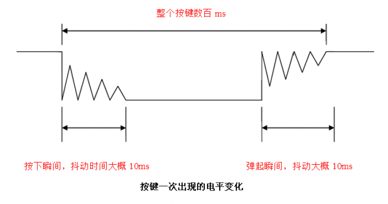

# Key

## Foreword
Keys are the simplest and most common input devices. Many products cannot do without buttons, including early iPhones. Today we will learn how to use MicroPython to write button programs. With the key input function, we can do a lot of fun things.

## Experiment Purpose
学习MicroPython编程使用按键功能，通过检测按键被按下后，改变LED（蓝灯）的亮灭状态。

## Experimental Explanation

CanMV K230自带功能按键KEY位于开发板下图所示位置：


我们先来看看CanMV K230的原理图，找到按键对应的IO引脚。


从原理图可以看到，按键KEY的一端连接到K230的引脚21，另一端连接到GND。所以按键在没按下时候输入高电平（1），按下时候输入低电平（0）。

由于K230功能多，所以大部分GPIO引脚会复用多个功能，因此CanMV K230 提供FPIOA库（Field Programmable Input and Output Array **现场可编程IO阵列**)，以便实现不同引脚功能选择。详情请参考：[FPIOA 说明](https://developer.canaan-creative.com/k230_canmv/main/zh/api/machine/K230_CanMV_FPIOA%E6%A8%A1%E5%9D%97API%E6%89%8B%E5%86%8C.html#)。

和前面LED一样，按键的输入检测也是用到Pin对象模块，具体如下：

## class Pin
Pin Module

### Constructors
```python
KEY = machine.Pin(id, mode, pull)
```

Pin位于machine模块下:

- `id` ：Chip pin number.For example:0、2、46
- `mode` : Input/Output mode.
    - `Pin.IN` : Input mode;
    - `Pin.OUT` : Output mode;   
- `pull`: Pull-up and pull-down resistor configuration.
    - `None` : None;
    - `Pin.PULL_UP` : Pull-up resistor enabled;
    - `Pin.PULL_DOWN` : Pull-down resistor enabled.


### Methods
```python
KEY.value([X])
```
Set the pin level value：
- `Output Mode` ：Output level value.
    - `0` :  Output low level (0V);
    - `1` :  Output high level (3.3V);
- `Input Mode` ：No parameters are required. Get the current pin input level value.

<br></br>

For more usage, please read the official documentation:<br></br>
https://docs.micropython.org/en/latest/library/machine.Pin.html#machine-pin

<br></br>

按键被按下时候可能会发生抖动，抖动如下图，有可能造成误判，因此我们需要使用延时函数来进行消抖：



常用的方法就是当检测按键值为0时，延时一段时间，大约10ms，再判断按键引脚值仍然是0，是的话说明按键被按下。延时使用time模块，使用方法如下：
```python
import time

time.sleep(1)           # 睡眠1秒
time.sleep_ms(500)      # 睡眠500毫秒
time.sleep_us(10)       # 睡眠10微妙
start = time.ticks_ms() # 获取毫秒计时器开始值

delta = time.ticks_diff(time.ticks_ms(), start) # 计算从上电开始到当前时间的差值
```

我们将按键引脚21配置成输入模式，实现当检测到按键被按下时候点亮LED蓝灯，松开时关闭LED蓝灯来做指示。代码编写流程如下：


## 参考代码

```python
'''
Demo Name：KEY
Version：v1.0
Author：01Studio
Platform：01Studio CanMV K230
说明：通过按键改变LED的亮灭状态
'''

from machine import Pin
from machine import FPIOA
import time


#Configure GPIO52、GPIO21 as a normal GPIO
fpioa = FPIOA()
fpioa.set_function(52,FPIOA.GPIO52)
fpioa.set_function(21,FPIOA.GPIO21)

LED=Pin(52,Pin.OUT) #构建LED对象,开始熄灭
KEY=Pin(21,Pin.IN,Pin.PULL_UP) #Construct KEY object

state=0 #LED引脚状态

while True:

    if KEY.value()==0:   #按键被按下
        time.sleep_ms(10) #消除抖动
        if KEY.value()==0: #确认按键被按下

            state=not state  #使用not语句而非~语句
            LED.value(state) #LED状态翻转
            print('KEY')

            while not KEY.value(): #检测按键是否松开
                pass

```

## Experimental Results

在CanMV K230 IDE运行代码：


可以看到当按键KEY每次被按下时候，LED蓝灯亮灭状态发生翻转。


Pin是非常通用的功能，学会了Pin，就可以把开发板所有的引脚为自己所用，灵活性很强。