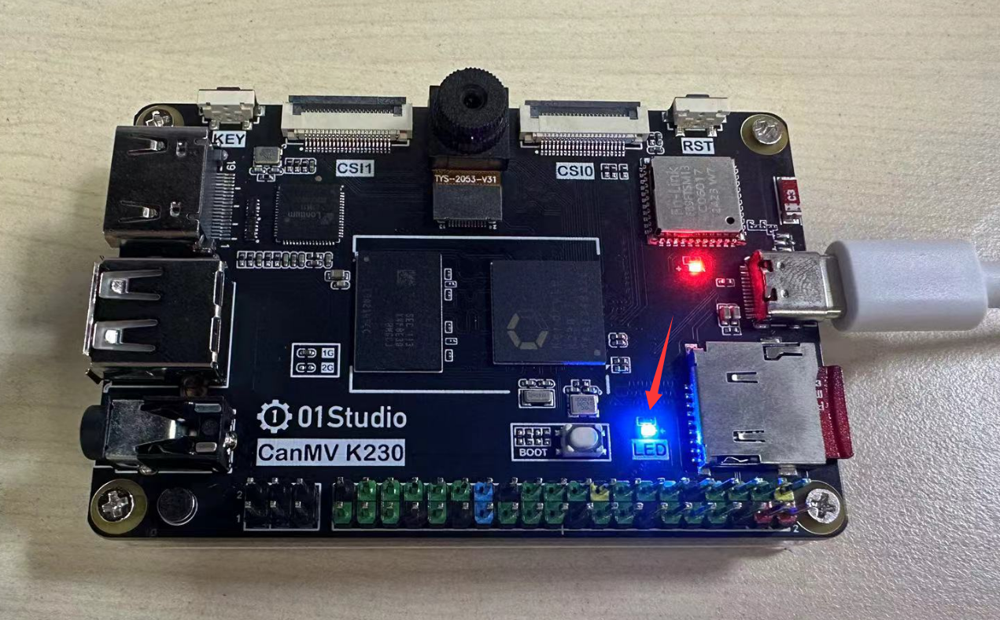
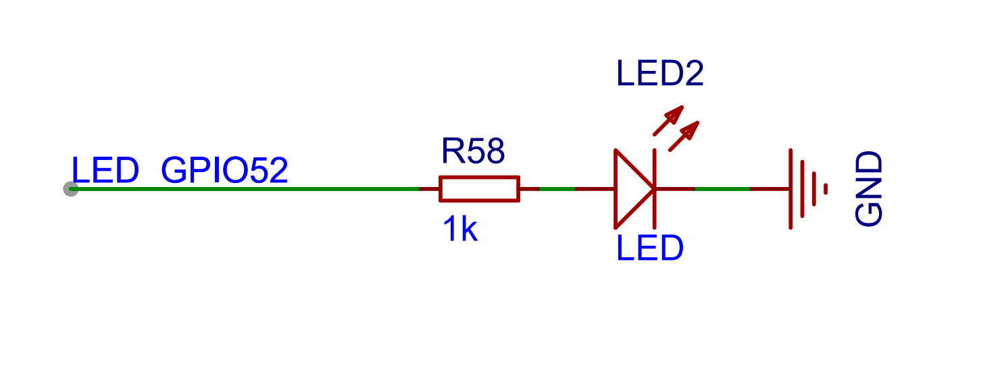
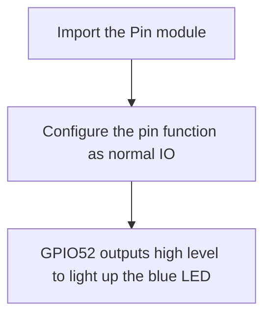
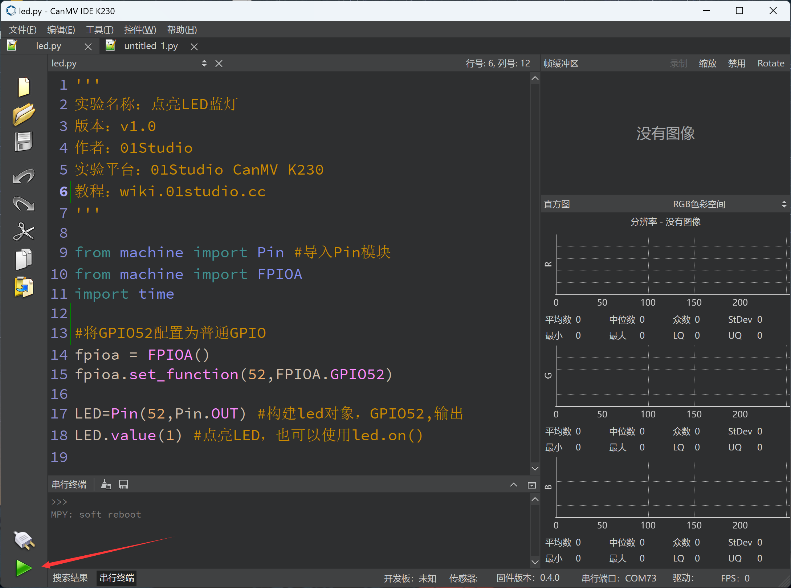

# Light up LED

## Foreword
I believe that most people start learning embedded MCU programming by lighting up an LED. Learning MicroPython based on the K230 platform is no exception. By lighting up the first LED, you can have a certain understanding of the compilation environment and program architecture, laying a foundation for future learning and larger programs, and increasing your confidence.

## Experiment Purpose
Learn how to light up the LED and turn on the LED (blue light).

## Experimental Explanation

CanMV K230 has a controllable LED light connected to GPIO.

- CanMV K230



- CanMV K230 mini


The IO pins connected to CanMV K230 are as follows (see the schematic diagram of the development board). The GPIO corresponding to the LED blue light is IO52. From the circuit, we can see that when IO52 is high, the blue light is on.



Since K230 has many functions, most GPIO pins will reuse multiple functions. Therefore, CanMV K230 provides FPIOA library (Field Programmable Input and Output Array) to realize different pin function selection. For details, please refer to:[FPIOA](https://www.kendryte.com/k230_canmv/en/main/api/machine/K230_CanMV_FPIOA_API_Manual.html)。

To control the LED, use the Pin object in the machine module. The instructions are as follows:

## class Pin

Pin Module.

### Constructors

```python
from machine import Pin

LED = Pin(id, mode, pull)
```

Pin is located in the machine module and can be imported directly:

- `id` ：Chip pin number. For example:1、2、52。
- `mode` ：Input/output mode.
    - `Pin.IN` : Input mode;
    - `Pin.OUT` : Output mode;   
- `pull`: Pull-up and pull-down resistor configuration.
    - `None` : None;
    - `Pin.PULL_UP` : Pull-up resistor enabled;
    - `Pin.PULL_DOWN` : Pull-down resistor enabled.


### Methods
```python
LED.value([X])
```
Set the pin level value:
- `Output Mode` ：Output level value.
    - `0` : Output low level (0V);
    - `1` : Output high level (3.3V);
- `Input Mode` ：No parameters are required. Get the current pin input level value.

<br></br>

```python
LED.on()
```
Lead out the output high level "1", 3.3V.

<br></br>

```python
LED.off()
```

Lead out the output low level "0", 0V.

<br></br>

For more usage, please read the official documentation: <br></br>
https://docs.micropython.org/en/latest/library/machine.Pin.html#machine-pin


<br></br>

The above is a detailed description of the Pin object in MicroPython's machine. Machine is a large module, and Pin is one of the small modules under machine. There are two ways to reference related modules in Python programming:

- Method 1 : import machine, and then operate through machine.Pin;

- Method 2 : from machine import Pin, which means directly importing the Pin module from machine, and then directly operating by constructing the LED object. Obviously, method 2 will appear more intuitive and convenient, and this experiment also uses method 2 for programming.

The coding process is as follows:



## Codes

```python
'''
Demo Name：Light up the Blue LED
Version：v1.0
Author：01Studio
Platform：01Studio CanMV K230
Tutorial：wiki.01studio.cc
'''

from machine import Pin 
from machine import FPIOA
import time

#Configure GPIO52 as a normal GPIO
fpioa = FPIOA()
fpioa.set_function(52,FPIOA.GPIO52)

LED=Pin(52,Pin.OUT) #Construct LED object, GPIO52, output
LED.value(1) #To turn on the LED, you can also use led.on()

```

## Experimental Results

After connecting the development board, run the above code in the CanMV K230 IDE:



You can see the blue LED light is on.

- CanMV K230


- CanMV K230 mini


From the first experiment, we can see that the key to using MicroPython for development is to learn the constructor and its usage, so that operations on related objects can be completed. With the support of powerful module functions, the experiment only used two simple lines of code to light up the LED.