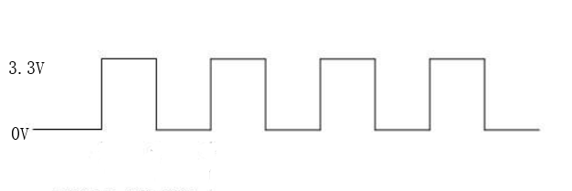

# PWM

## Foreword
PWM (Pulse Width Modulation) is a specific signal output, which is mainly used to output square waves with different frequencies and duty cycles (the proportion of high-level time in a cycle to the total time) to achieve fixed frequency or average voltage output.


## Experiment Purpose
Through the PWM signal output of different frequencies, the passive buzzer is driven to emit sounds of different frequencies.

## Experimental Explanation

Buzzers are divided into active buzzers and passive buzzers. The use of active buzzers is very simple. You only need to connect the power supply to make the buzzer sound, and disconnect the power supply to stop the sound. The passive buzzer used in this experiment needs to be given a specified frequency to make a sound. The advantage is that the sound tone of the buzzer can be changed by changing the frequency, so as to determine whether the PWM output frequency of CanMV K230 is changing.

Let's take a look at the PWM object description.

## Class PWM

### Constructors
```python
pwm = machine.PWM(channel, freq, duty, enable=False)
```
The PWM object is located under the machine module.。

- `channel` ：Channel number, value range is 0~5; 01Studio CanMV K230 development board only leads out 4 channel rang is 0~3.

    - `0`: PWM0（GPIO42）
    - `1`: PWM1（GPIO43）
    - `2`: PWM2（GPIO46）
    - `3`: PWM3（GPIO47）
    
- `freq` ：PWM frequency, unit: Hz;
- `duty` ：PWM duty cycle, that is, the percentage of high level in a positive cycle, value range: 0-100, default 50;
- `enable` ：PWM channel output enable, optional parameter, default False

### Methods
```python
pwm.freq([value])
```
Set the frequency. Return the current frequency without passing any parameters.

<br></br>

```python
pwm.duty([value])
```
Set the duty cycle. Return the current duty cycle without passing parameters.

<br></br>

```python
pwn.deinit()
```
Unregister PWM.

<br></br>


For more usage, please read the official documentation:<br></br>
https://docs.micropython.org/en/latest/library/machine.PWM.html#machine-pwm

<br></br>


We can drive the passive buzzer with a square wave of a specific frequency. The principle of the square wave is very simple, which is the high and low level conversion of a certain frequency, which can be simply understood as a PWM output with a duty cycle of 50%.



Combined with the above explanations, the code writing flow chart is summarized as follows：


## Code

```python
'''
Demo Name：PWM
Version：v1.0
Author：01Studio
Platform：01Studio CanMV K230
Description：By outputting PWM signals of different frequencies, the passive buzzer is driven to emit sounds of different frequencies.
'''

from machine import Pin, PWM
from machine import FPIOA
import time

#Configure PIN 42 as PWM0 f
#Channel 0: GPIO42, Channel 1: GPIO43, Channel 2: GPIO46, Channel 3: GPIO47,
fpioa = FPIOA()
fpioa.set_function(42,FPIOA.PWM0)

#Construct a buzzer PWM object, channel 0, frequency 200Hz, duty cycle 50%, and enable output by default
Beep = PWM(0,200, 50, enable=True) # Create and configure PWM in the same statement, with a duty cycle of 50%

#The buzzer emits a sound frequency of 200Hz
Beep.freq(200)
time.sleep(1)

#The buzzer emits a sound frequency of 400Hz
Beep.freq(400)
time.sleep(1)

#The buzzer emits a sound frequency of 600Hz
Beep.freq(600)
time.sleep(1)

#The buzzer emits a sound frequency of 800Hz
Beep.freq(800)
time.sleep(1)

#The buzzer emits a sound frequency of 1000Hz
Beep.freq(1000)
time.sleep(1)

#Stop
Beep.enable(False)

```

## Experimental Results

This experiment uses PIN 42 to connect a passive buzzer.

Run the code and you can hear the buzzer emit different frequencies in turn.


f you have the conditions, you can use an oscilloscope to measure the IO42 pin of CanMV K230 and observe the changes in the PWM waveform.


In this section, we found that the object function usage in the experiment is very simple, which is a good thing, so that we can focus more on the application and make more interesting creations. We don't need to pay too much attention to the complex underlying code development. As the complexity of the functions to be realized increases, the amount of programming code increases, and the logic will also be slightly complicated.
