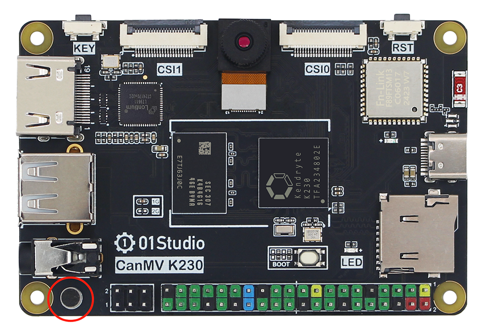
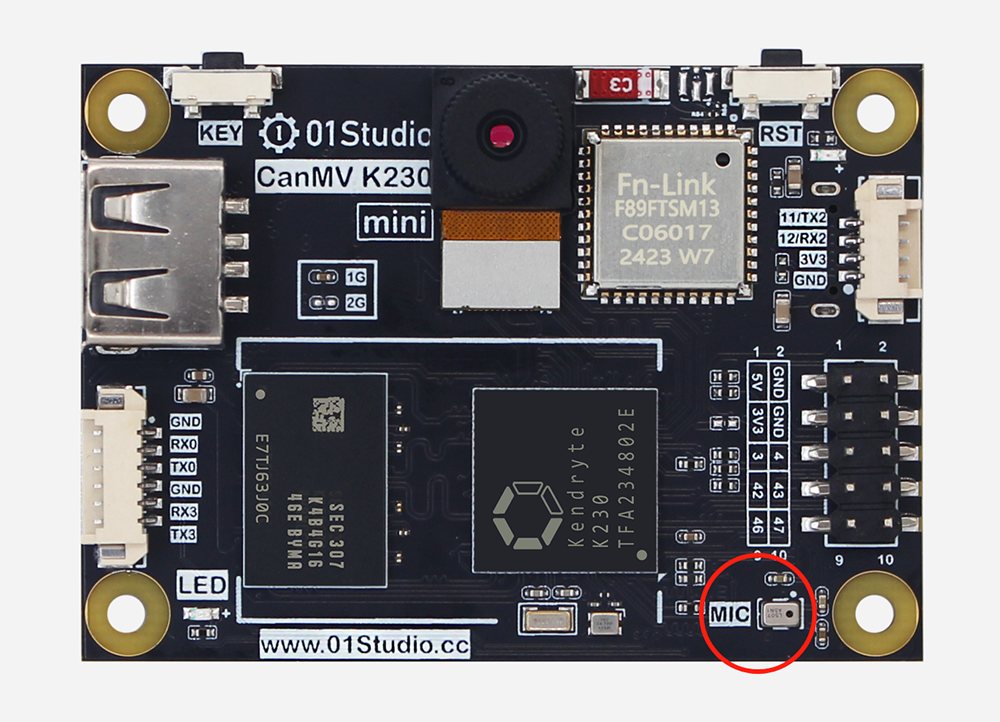
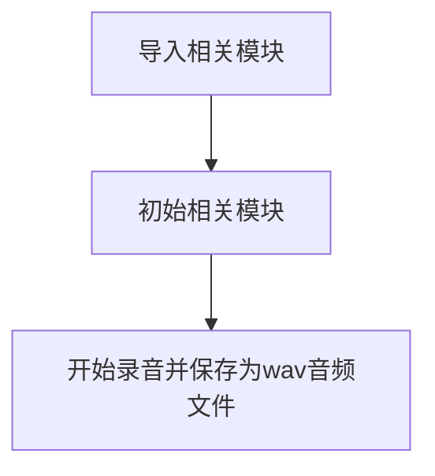
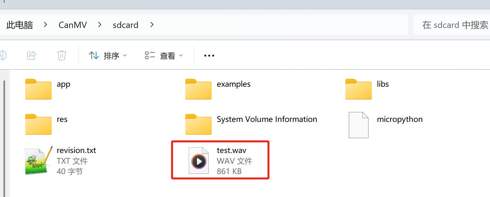

# record

## 前言

01Studio CanMV K230板载1路麦克风，可以用作音频输入（录音）。

## 实验目的

录音并保存为wav文件。

## 实验讲解

01Studio CanMV K230开发板板载1个麦克风，连接K230主控的右路MIC输入（右声道）。

- CanMV K230



- CanMV K230 mini



CanMV K230 MicroPython库集成了PyAudio（音频流处理）和wave（wav文件处理）模块。可以使用python编程实现录音并保存为wav文件。具体介绍如下：

## pyAudio对象

### 构造函数

```python
from media.pyaudio import * #导入pyaudio模块，用于采集和播放音频

p = PyAudio()
```
构建PyAudio对象。

### 使用方法

```python
stream = p.open(format=FORMAT,
                channels=CHANNELS,
                rate=RATE,
                input=True,
                frames_per_buffer=CHUNK)
```
初始化音频流。

- `format`: 采样点字节数。
- `channels`: 声道数。
    - `1`: 单声道；
    - `2`: 双声道立体声。
- `rate`: 采样率。
- `input`: 是否为音频输入。
    - `True`: 是；
    - `False`: 否；
- `frames_per_buffe`: 每块音频时长。

<br></br>

```python
stream.volume(vol, channel)
```
设置音量。
- `vol`: 范围[0-100]，表示音量大小。
- `channel`: 声道。
    - `LEFT`: 左声道；
    - `RIGHT`: 右声道。

<br></br>

```python
stream.read(frames)
```
读取音频数据。
- `frames`: 帧数。

<br></br>

```python
stream.write(data)
```
写入音频数据。
- `data`: 音频数据（ bytes 字节序列）

<br></br>

```python
stream.start_stream(data)
```
启动音频流。

<br></br>

```python
stream.stop_stream(data)
```
停止音频流。

<br></br>

```python
stream.close(data)
```
关闭音频流。

## wave对象

### 构造函数

```python
import media.wave as wave   #导入wav模块，用于保存和加载wav音频文件

wf = wave.open(filename, mode)
```
使用wave对象打开一个音频文件。
- `filename`: 文件名称。
- `mode`: 打开模式。
    - `r`: 只读模式
    - `rb`: 只读二进制模式
    - `w`: 只写模式
    - `rb`: 只写二进制模式

### 使用方法

```python
wf.write_frames(data)
```
写入音频数据。

- `data`:音频数据（ bytes 字节序列）

更多用法请阅读[官方文档](https://developer.canaan-creative.com/k230_canmv/zh/main/zh/api/mpp/K230_CanMV_Audio%E6%A8%A1%E5%9D%97API%E6%89%8B%E5%86%8C.html#)。

本节代码编程流程如下：



## 参考代码

```python
'''
实验名称：录音
实验平台：01Studio CanMV K230
教程：wiki.01studio.cc
'''

import os
from media.media import *   #导入media模块，用于初始化vb buffer
from media.pyaudio import * #导入pyaudio模块，用于采集和播放音频
import media.wave as wave   #导入wav模块，用于保存和加载wav音频文件

#IDE中断检测
def exit_check():
    try:
        os.exitpoint()
    except KeyboardInterrupt as e:
        print("user stop: ", e)
        return True
    return False

def record_audio(filename, duration):

    CHUNK = 44100//25      #设置音频chunk值
    FORMAT = paInt16       #设置采样精度,支持16bit(paInt16)/24bit(paInt24)/32bit(paInt32)
    CHANNELS = 2           #设置声道数,支持单声道(1)/立体声(2)
    RATE = 44100           #设置采样率

    try:
        p = PyAudio()
        p.initialize(CHUNK)    #初始化PyAudio对象
        MediaManager.init()    #vb buffer初始化

        #创建音频输入流
        stream = p.open(format=FORMAT,
                        channels=CHANNELS,
                        rate=RATE,
                        input=True,
                        frames_per_buffer=CHUNK)

        #stream.volume(70, LEFT)
        stream.volume(85, RIGHT) #01Studio CanMV K230使用右路麦克风接口
        print("volume :",stream.volume())

        #启用音频3A功能：自动噪声抑制(ANS)
        stream.enable_audio3a(AUDIO_3A_ENABLE_ANS)

        frames = []
        #采集音频数据并存入列表
        for i in range(0, int(RATE / CHUNK * duration)):
            data = stream.read()
            frames.append(data)
            if exit_check():
                break
        #将列表中的数据保存到wav文件中
        wf = wave.open(filename, 'wb') #创建wav 文件
        wf.set_channels(CHANNELS) #设置wav 声道数
        wf.set_sampwidth(p.get_sample_size(FORMAT))  #设置wav 采样精度
        wf.set_framerate(RATE)  #设置wav 采样率
        wf.write_frames(b''.join(frames)) #存储wav音频数据
        wf.close() #关闭wav文件
    except BaseException as e:
        print(f"Exception {e}")
    finally:
        stream.stop_stream() #停止采集音频数据
        stream.close()#关闭音频输入流
        p.terminate()#释放音频对象
        MediaManager.deinit() #释放vb buffer

###########################
##     主函数代码
###########################

os.exitpoint(os.EXITPOINT_ENABLE) #用于检测IDE中断

print("audio record start")

record_audio('/sdcard/test2.wav', 5)  #录制wav音频文件，时长5秒

print("audio record done")

```

## 实验结果

运行程序，对着K230上的麦克风说话：

- CanMV K230


- CanMV K230 mini


录音结束后可以看到在canmv u盘的sdcard根目录生成`test.wav`音频文件。



