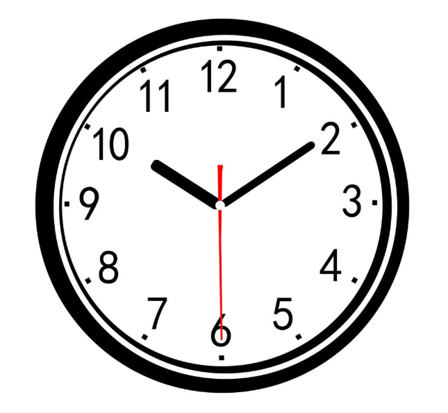
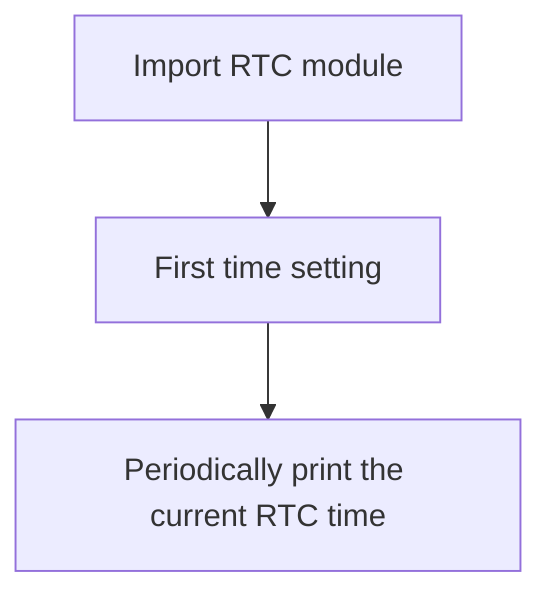
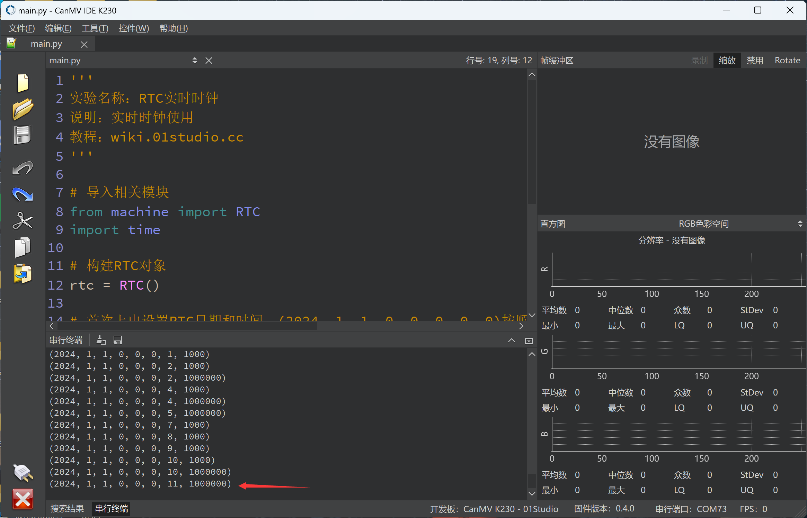

# RTC


## Foreword
Clocks are the most commonly used items in our daily life. Watches, computers, mobile phones, etc. always display the current time. It can be said that every electronics enthusiast wants to have an electronic clock of their own. Next, we will use the MicroPython development board to make an electronic clock of our own.




## Experiment Purpose
Learn RTC programming.

## Experimental Explanation

The principle of the experiment is to read the RTC data. Undoubtedly, MicroPython has integrated a built-in clock function module. It is located in the RTC module of the machine. The specific introduction is as follows:

## Class RTC

### Constructors
```python
rtc = machine.RTC()
```
The RTC object is located under the machine module.

### Methods
```python
rtc.datetime((2024, 1, 1, 0, 0, 0, 0, 0))
```
Set the RTC date and time. (2024, 1, 1, 0, 0, 0, 0, 0) represents (year, month, day, week, hour, minute, second, microsecond) in order. The week uses 0-6 to represent Monday to Sunday.

<br></br>

```python
rtc.datetime()
```
Get the current RTC time. Returns a tuple: (year, month, day, weekday, hour, minute, second, microsecond), where the weekday uses 0-6 to represent Monday to Sunday.

For more usage, please read the official documentation:<br></br>
https://docs.micropython.org/en/latest/library/machine.RTC.html#machine-rtc

<br></br>

After learning how to use RTC, we use code to implement the first power-on. If it is detected that the time is not set, we can set the time first, and then periodically print the acquired time information. The code programming flow chart is as follows:




## Codes
```python
'''
Demo Name：RTC
Description: ：Real-time clock usage
Tutorial：wiki.01studio.cc
'''

# Import module
from machine import RTC
import time

# Construct RTC object
rtc = RTC()

# Set the RTC date and time when powered on for the first time. (2024, 1, 1, 0, 0, 0, 0, 0) represents in order (year, month, day, week, hour, minute, second, microsecond).
# The day of the week uses 0-6 to represent Monday to Sunday.
if rtc.datetime()[0] != 2024:
    rtc.datetime((2024, 1, 1, 0, 0, 0, 0, 0))

while True:

    print(rtc.datetime()) #Print time

    time.sleep(1) #Delay 1s
```

## Experimental Results

Run the code, and you can see the terminal print the current RTC time information.



The RTC time is lost when the power is off. To keep the RTC time running continuously, the development board needs to be powered on. Users can use the RTC function to create their own electronic clock.
