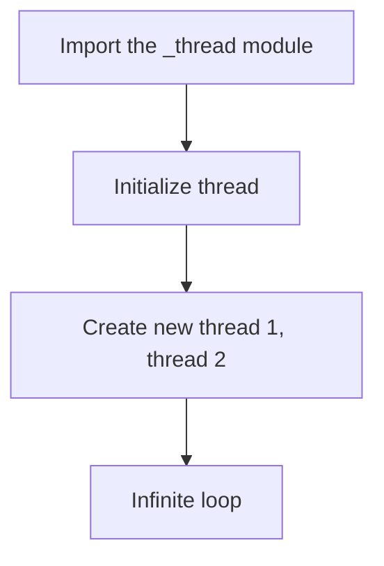
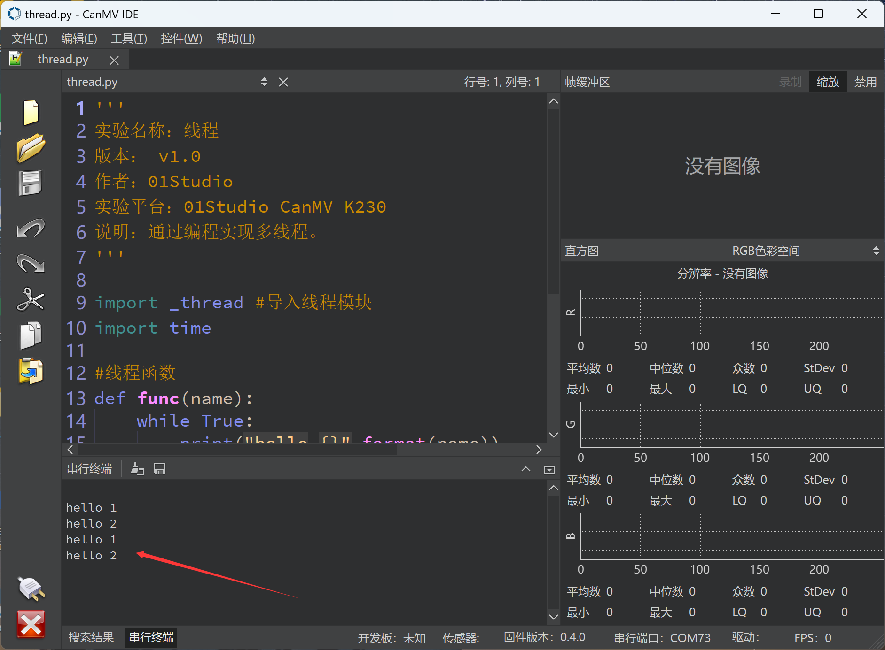

# thread

## Foreword
We have seen that the previous programming is completed in a loop, but when we need to complete different tasks in time, thread programming comes in handy. This is a bit like RTOS (real-time operating system). Today we will learn how to implement multithreading through MicroPython programming.

## Experiment Purpose
Programming to implement multi-threaded tasks running simultaneously.

## Experimental Explanation

The MicroPython firmware of CanMV K230 has integrated the _thread module. We can call it directly. This module is derived from python3 and belongs to low-level thread. For details, please refer to the official website introduction:https://docs.python.org/3.5/library/_thread.html#module-thread

The programming process is as follows:



## Codes

```python
'''
Demo Name：thread
Version： v1.0
Author：01Studio
Platform：01Studio CanMV K230
Description：Implementing multithreading through programming.
'''

import _thread #Import the _thread module
import time

#Thread Function
def func(name):
    while True:
        print("hello {}".format(name))
        time.sleep(1)

_thread.start_new_thread(func,("1",)) #Start thread1, the parameter must be a tuple
_thread.start_new_thread(func,("2",)) #Start thread2, the parameter must be a tuple

while True:
    
    time.sleep(0.01) #Prevent CPU from running full

```

## Experimental Results

Run the code and you can see that the serial terminal repeatedly executes two threads.



In this chapter, we learned thread programming based on MicroPython, which is actually low-level thread programming in Python3. The introduction of threads makes it easier for us to handle multitasking and greatly increases the flexibility of program writing.