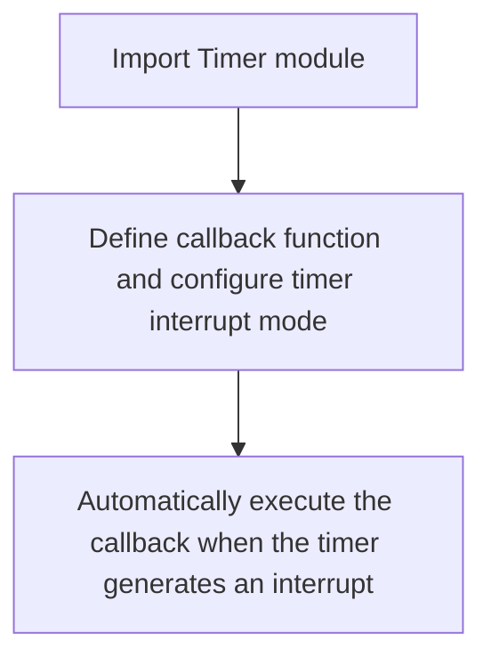
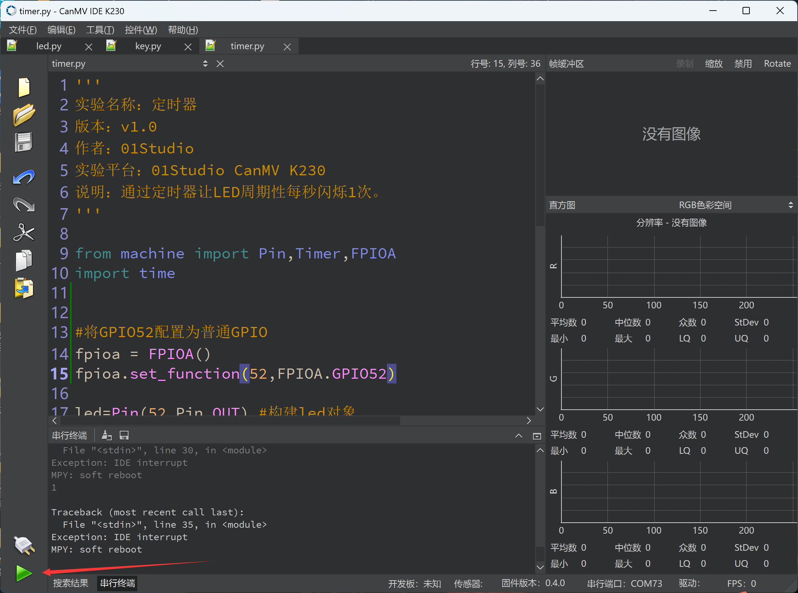
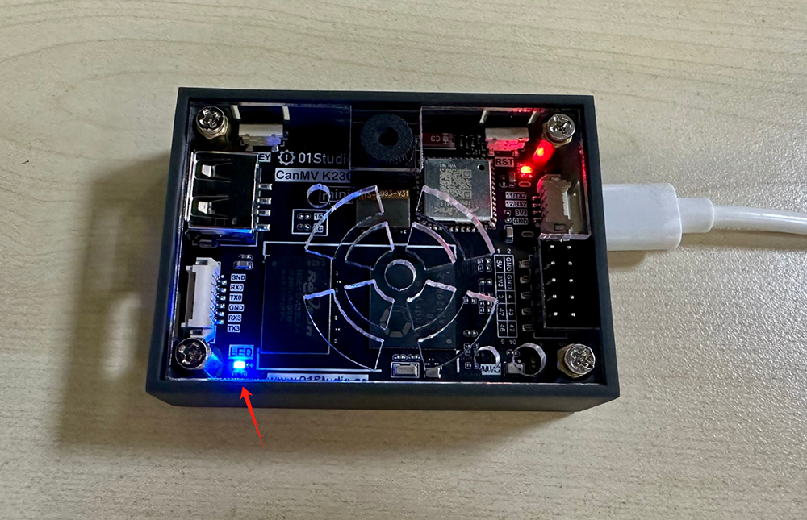

# Timer

## Foreword
Timers are used to measure time. We often set timers or alarms, and then when the time is up, they tell us what to do. The same is true for microcontrollers. Timers can be used to complete various preset tasks.

## Experiment Purpose
Use the timer to make the LED blue light flash periodically once per every second.

## Experimental Explanation

The timer is in the Timer module of machine. It can be easily programmed and used through MicroPython. We only need to understand its construction object function and usage!

## Class Timer

### Constructors
```python
tim = machine.Timer(id)
```
The timer object Timer is located under the machine module.

- `id` ：Timer number. (Only supports software timers currently )
    - `-1` ：Indicates a software timer.

### Methods
```python
tim.init(mode, freq, period, callback)
```
Timer initialization.
- `mode` ：Time mode
    - `Timer.ONE_SHOT` ：Execute only once.
    - `Timer.PERIODIC` ：Execute Periodicity. 

- `freq` ：Timer frequency, in Hz, the upper limit depends on the IO port. When freq and period are given at the same time, freq has a higher priority and period will be blocked.

- `period` ：Timer period, in ms.

- `callback` ：Callback function after timer interrupt.

<br></br>

```python
Timer.deinit()
```
Deregister the timer.

For more usage, please read the official documentation:<br></br>
https://docs.micropython.org/en/latest/library/machine.Timer.html#machine-timer

<br></br>

When the timer reaches the preset time, an interrupt will also be generated, so the programming method is similar to the external interrupt. The code programming flow chart is as follows:




## Codes

```python
'''
Demo Name：Timer
Version：v1.0
Author：01Studio
Platform：01Studio CanMV K230
Description：Use the timer to make the LED blue light flash periodically once per every second.
'''

from machine import Pin,Timer
import time

led=Pin(52,Pin.OUT)
Counter = 0
Fun_Num = 0

def fun(tim):

    global Counter
    Counter = Counter + 1
    print(Counter)
    led.value(Counter%2)

#Use software timer, number -1
tim = Timer(-1)
tim.init(period=1000, mode=Timer.PERIODIC,callback=fun) #The period is 1000ms

while True:

    time.sleep(0.01) #Avoid CPU saturation
```

## Experimental Results

Run the code in CanMV K230 IDE:



You can see that the blue LED light flashes once every 1s.

- CanMV K230


- CanMV K230 mini



This section of the experiment introduces how to use the timer. Some users may think that this function can also be achieved by using a delay function, but compared to the delay function, the advantage of the timer is that it does not take up too much CPU resources.