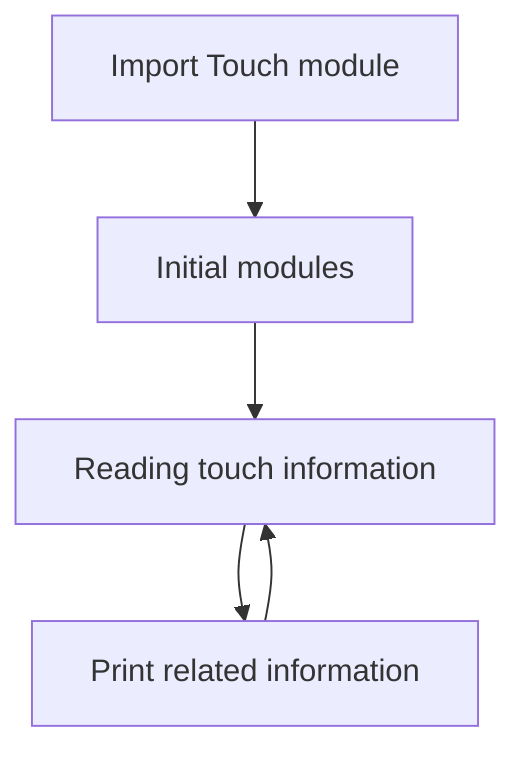
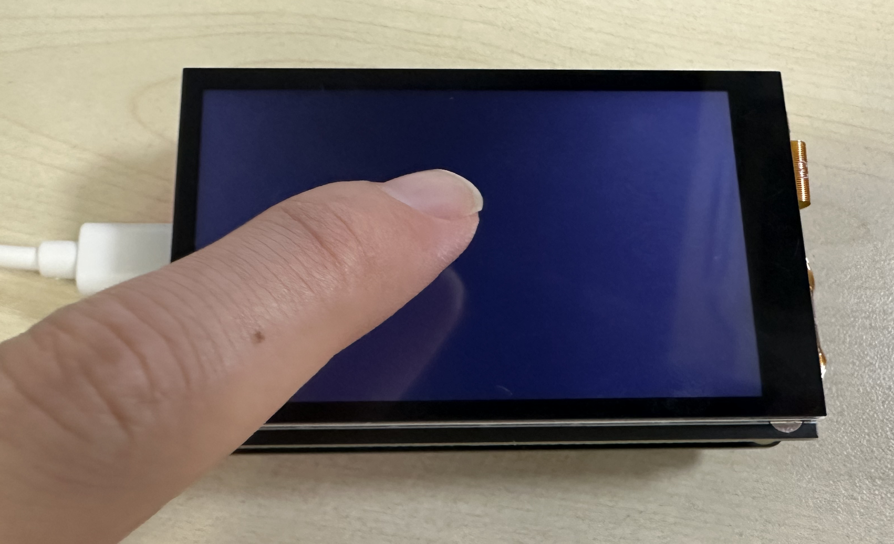
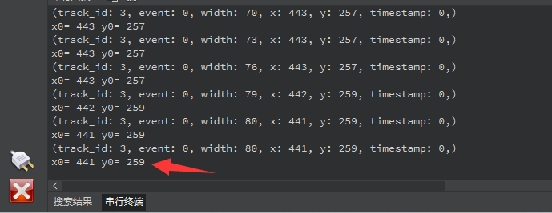
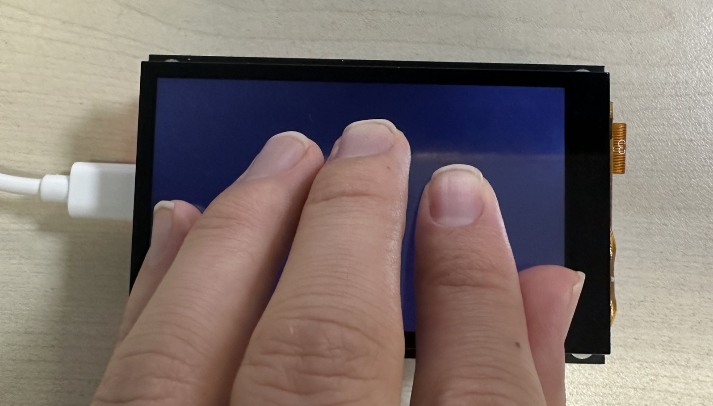
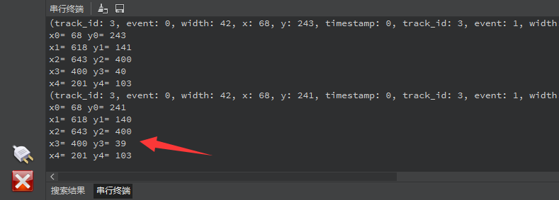

# Touchscreen

## Foreword

Touch screen is a great way for human-computer interaction. Early keypad phones have been completely replaced by touch screens. Touch screens solve the problem of direct interaction between people and screens. Today we will learn about the application of touch screens.

## Experiment Purpose

Programming to read capacitive touch screen data.

## Experimental Explanation

The 3.5-inch mipi LCD that comes with 01Studio is divided into a non-touch version and a touch version. The touch version is equipped with capacitive touch and supports single-point and multi-point touch. CanMV K230 has encapsulated the capacitive touch related library into a python API, which we can use directly.

## class touchscreen

### Constructors
```python
from machine import TOUCH

touch = TOUCH(index, rotation)
```
Construct a capacitive touch object.
- `index`: The device number of TOUCH, the device number of 01Studio 3.5-inch mipi screen is `0`
- `rotation`: The panel output coordinates are rotated, the value is [0-3].
    - `0`: Coordinates do not rotate.
    - `1`: The coordinates are rotated 90°.
    - `2`: The coordinates are rotated 180°.
    - `3`: The coordinates are rotated 270°.

### Methods

```python
touch.read([count])
```
Get touch data.
- `count`: Number of touch points. The value range is [0:10], and the default value is 0, which means all touch points are read.

The result returns the TOUCH_INFO class, where x and y represent coordinates.

Use example:

p= touch.read() #Reading TOUCH data

print(p) #Original information

print(len(p)) #Indicates the number of touch points, up to 5

print(p[0].x, p[0].y) #Print the x,y coordinates of the first point

For more usage, please read [Official Website](https://developer.canaan-creative.com/k230_canmv/main/zh/api/machine/K230_CanMV_TOUCH%E6%A8%A1%E5%9D%97API%E6%89%8B%E5%86%8C.html#)。

As can be seen above, the capacitive touch screen packaged with MicroPython becomes very easy to use. The programming process of this section is as follows:



## Codes

```python
'''
Demo Name：Capacitive touch screen
Platform：01Studio CanMV K230
Tutorial：wiki.01studio.cc
'''

from machine import TOUCH
import time

# Instantiate TOUCH device 0
tp = TOUCH(0)

while True:

    # Get TOUCH data
    p = tp.read()

    if p != (): #A touch event occurs

        print(p) #Printing raw touch data

        #Print the coordinate information of each point, up to 5 points.
        for i in range(len(p)):

            print('x'+str(i)+'=',p[i].x, 'y'+str(i)+'=',p[i].y)

    time.sleep_ms(50)
```

## Experimental Results

Run the program and touch the capacitive screen with your finger, you can see the terminal print out the coordinate information.

- Single touch:



IDE serial terminal prints touch information (single point):



- Multi-touch:



IDE serial terminal prints touch information (multi-point):



With the application of touch screen, human-computer interaction of the development board becomes simpler and more interesting.