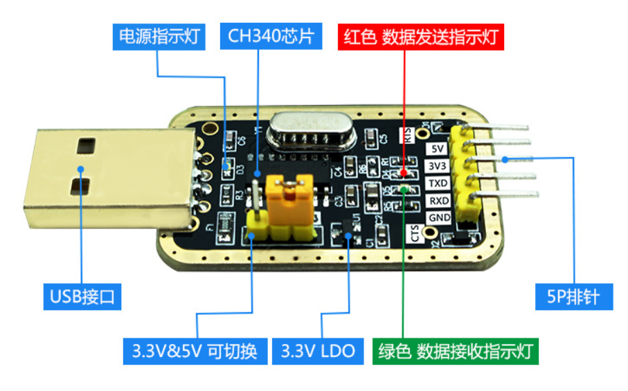

# UART

## Foreword
UART is a very commonly used communication interface. Many industrial control products and wireless transparent transmission modules use UART to send and receive commands and transmit data, as well as communicate with other development boards such as STM32, ESP32, Arduio, Raspberry Pi and other development boards with UART. In this way, users can flexibly apply various serial port function modules without considering the underlying implementation principles.

## Experiment Purpose
Programming to send and receive UART data.

## Experimental Explanation

K230 contains five UART hardware modules, of which UART0 is occupied by the small core terminal, UART3 is occupied by the large core terminal, and the remaining ones are UART1, UART2, and UART4. 01Studio CanMV K230 development board leads out two UARTs, UART1 and UART2, through pin headers for users to use.

Let's take a look at the constructor and usage of the CanMV K230 serial port object:

## Class UART

### Constructors
```python
machine.UART(id, baudrate=115200, bits=UART.EIGHTBITS, parity=UART.PARITY_NONE, stop=UART.STOPBITS_ONE)
```
Create a UART object.

- `id` ：Serial port number, 2 available
    - `UART.UART1`: UART1；TX1（GPIO3）, RX1（GPIO4）;
    - `UART.UART2`: UART2；TX2（GPIO11）, RX2（GPIO12）;

- `baudrate`：Baud rate, commonly used are 115200 and 9600;

- `bits` ：Data bits, default 8;

- `parity` ：Parity check, default is None;
    - `UART.PARITY_EVEN`: Even parity;
    - `UART.PARITY_ODD`: Odd parity;

- `stop`: Stop bit, supports 1, 1.5, 2, default is 1.

### Methods

```python
UART.read(num)
```
Read serial port buffer data.
- `num`: Read the number of bytes.

<br></br>

```python
UART.readline(num)
```
The entire line is read.
- `num`: Number of rows.

<br></br>

```python
UART.write(buf)
```
Send data.
- `buf`: The data to be sent.

<br></br>

```python
UART.deinit()
```
Unregister UART.

For more usage, please read the official documentation：<br></br>
https://developer.canaan-creative.com/k230_canmv/main/zh/api/machine/K230_CanMV_UART%E6%A8%A1%E5%9D%97API%E6%89%8B%E5%86%8C.html

<br></br>

We can use a USB to TTL tool and the computer serial port assistant to test the communication with the CanMV K230 development board.



In this experiment, we use the UART1 pin of CanMV K230 and the pin header. From the schematic diagram of CanMV K230, we can see that the external pins are: IO3--TX1, IO4--RX1.


Note that you need to use a 3.3V USB to serial TTL tool. The wiring diagram is as follows (cross wiring):


n this experiment, we can initialize UART first, and then send a message to UART, so that the PC serial port assistant will be displayed in the receiving area, and then enter the loop. When it detects that there is data to be received, the data will be received and printed, and printed and displayed through REPL. The code writing flow chart is as follows:


## Codes

```python
'''
Demo Name：UART
Author：01Studio
Platform：01Studio CanMV K230
Description：Realize serial communication through programming, and send and receive data with computer serial assistant
'''

#Import UART module
from machine import UART
from machine import FPIOA
import time

fpioa = FPIOA()

# UART1 Code
fpioa.set_function(3,FPIOA.UART1_TXD)
fpioa.set_function(4,FPIOA.UART1_RXD)

uart=UART(UART.UART1,115200) #Set UART1 and baud rate

'''

# UART2 Code
fpioa.set_function(11,FPIOA.UART2_TXD)
fpioa.set_function(12,FPIOA.UART2_RXD)

uart=UART(UART.UART2,115200) #Set UART2 and baud rate
'''

uart.write('Hello 01Studio!')#Send data

while True:

    text=uart.read(128) #Receive 128 characters
    if text != b'':
        print(text) #Print the data received by UART3 through REPL

    time.sleep(0.1) #100ms

```

## Experimental Results

We connect the TX of USB to TTL to IO4 and RX to IO3 according to the above method. GND is connected together, and 3.3V can be selected or not.


At this time, open the computer's device manager and you will see two COMs. The one with CH340 is the serial port tool, and the other is the CanMV K230 REPL. If the CH340 driver is not installed, you need to install it manually. The driver is in：<u>01Studio MicroPython Develop Kits (Base on CanMV K230)\01-Tools\01-windows\Serial Terminal\CH340 Driver</u> .


This experiment requires the use of the UART assistant. Open 01Studio MicroPython Develop Kits (Base on CanMV K230)\01-Tools\01-windows\Serial Terminal\UartAssist.exe.


Configure the serial port tool to COM14 (adjust according to your own serial port number). The baud rate is 115200. Run the program, and you can see that the serial port assistant receives the message "Hello 01Studio!" sent by CanMV K230 when it is powered on. We enter "http://www.01studio.cc" on the sending end of the serial port assistant, click Send, and you can see that CanMV K230 prints out the message in REPL after receiving it. As shown in the figure below:


Through this section, we have learned the application of serial port transmission and reception. CanMV K230 leads to 2 serial ports, so it can connect multiple serial port peripherals to achieve more functions.

## Use UART2

Comment out UART1 part of the above code and remove the comments of UART2 code to use UART2.

```python
# UART2 Code
fpioa.set_function(11,FPIOA.UART2_TXD)
fpioa.set_function(12,FPIOA.UART2_RXD)

uart=UART(UART.UART2,115200) #Set UART2 and baud rate
```

### Code

```python
'''
Demo Name：UART
Author：01Studio
Platform：01Studio CanMV K230
Description：Realize serial communication through programming, and send and receive data with computer serial assistant
'''

#Import UART module
from machine import UART
from machine import FPIOA
import time

fpioa = FPIOA()

'''
# UART1 Code
fpioa.set_function(3,FPIOA.UART1_TXD)
fpioa.set_function(4,FPIOA.UART1_RXD)

uart=UART(UART.UART1,115200) #Set UART1 and baud rate
'''

# UART2 Code
fpioa.set_function(11,FPIOA.UART2_TXD)
fpioa.set_function(12,FPIOA.UART2_RXD)

uart=UART(UART.UART2,115200) #Set UART2 and baud rate

uart.write('Hello 01Studio!')#Send data

while True:

    text=uart.read(128) #Receive 128 characters
    if text != b'':
        print(text) #Print the data received by UART3 through REPL

    time.sleep(0.1) #100ms

```

### wiring

UART2 can use the 40-pin GPIO11 (TX2), GPIO12 (RX2) pins or the 4-pin connector on the back (using the matching 1.25mm to 2.54mm DuPont cable) to connect other peripheral serial port device modules to achieve serial port communication. 


