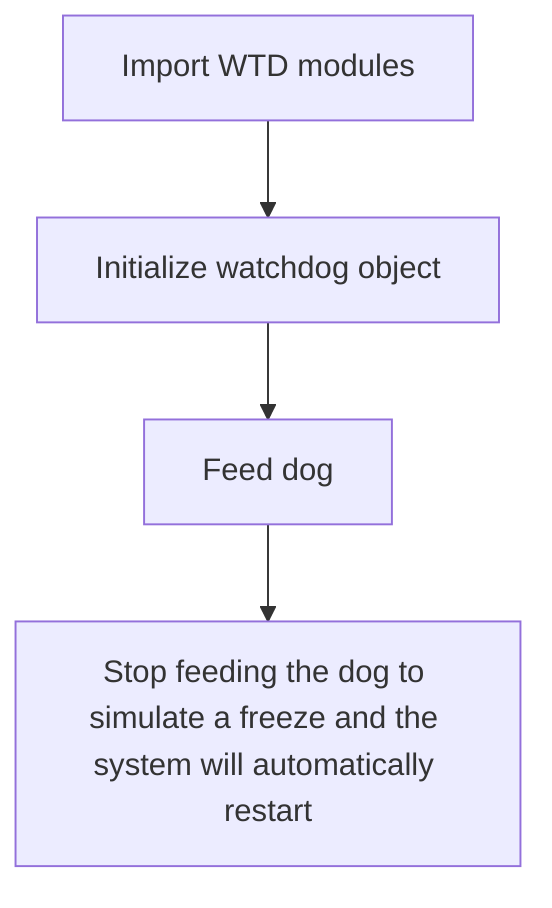
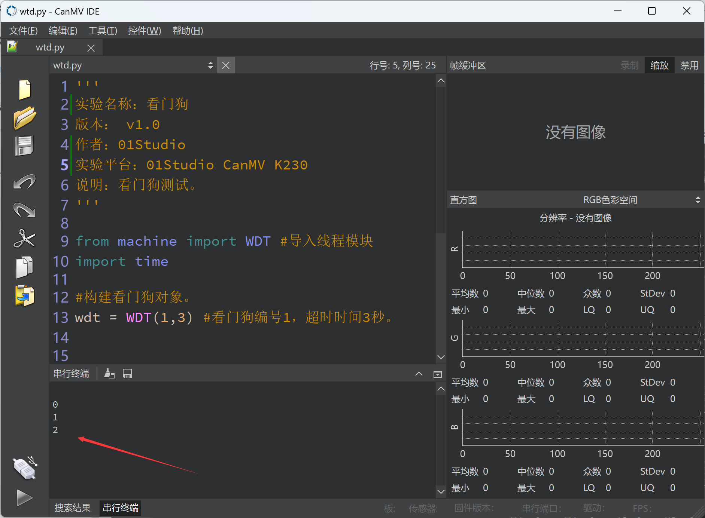

# Watch dog

## Foreword
Any code may crash during operation, and this is when the watchdog code can be added. The purpose of the watchdog is to automatically restart the system when the application crashes and eventually enters an unrecoverable state. Once started, it cannot be stopped or reconfigured in any way. Once enabled, the application must "feed" the watchdog regularly to prevent it from expiring and resetting the system.

## Experiment Purpose
Test the watchdog automatic reset function.

## Experimental Explanation

The MicroPython firmware of CanMV K230 has integrated the watchdog WDT module. We can call it directly.

## Class WDT

### Constructors
```python
from machine import WDT

wdt = WDT(id, timeout)
```
Createwatchdog object.

- `id` ：Watchdog Number.

    - `1`: Watchdog1.

- `timeout` ：Timeout period, unit seconds.

### Methods

```python
wdt.feed()
```
Feed the watchdog. This instruction needs to be executed within the timeout period specified when constructing the watchdog object.

<br></br>

For more usage, please read the official documentation：<br></br>
https://docs.micropython.org/en/latest/library/machine.WDT.html

The programming process is as follows:：



## Codes

```python
'''
Demo Name：Watchdog
Version： v1.0
Author：01Studio
Platform：01Studio CanMV K230
Description：Watchdog test.
'''

from machine import WDT #Import WDT module
import time

#Construct watchdog object.
wdt = WDT(1,3) #Watchdog number 1, timeout period 3 seconds.


#Feed the dog every 1 second, and do this 3 times.
for i in range(3):

    time.sleep(1)
    print(i)

    wdt.feed() #Feed dog

#Stop feeding the dog, the system will restart.
while True:

    time.sleep(0.01) #Prevent CPU from running full.

```

## Experimental Results

Run the code and you can see that the serial terminal prints information three times and then restarts automatically. The IDE connection is disconnected.



With a watchdog, the development board can automatically restart when it crashes.