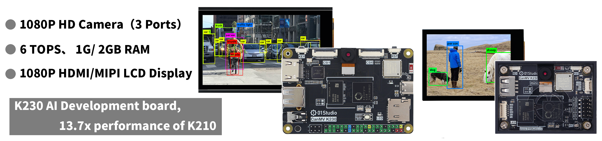

# Directory

- **CanMV K230 Development Kits Introduction**

    - [CanMV K230](./intro/canmv_k230.md)
    - [Accessories installation and use](./intro/module.md)
    - [Bracket assembly](./intro/bracket.md)

- [**Resource Downloads**](./download.md)

- [**Python3 Basics**](./python_learn.md)

- **Getting Start**

    - [CanMV K230 IDE installation](./getting_start/canmv_ide.md)
    - [Image burning and Power on](./getting_start/image.md)
    - [The first Demo test](./getting_start/demo.md)
    - [REPL（Read-Eval-Print Loop）](./getting_start/repl.md)
    - [File System](./getting_start/file_system.md)
    - [Run code offline](./getting_start/run_offline.md)

- **Basic Examples**

    - [GPIO Introduction](./basic_examples/gpio_intro.md) 
    - [Light up LED](./basic_examples/led.md) 
    - [KEY](./basic_examples/key.md) 
    - [Timer](./basic_examples/timer.md) 
    - [RTC（real time clock）](./basic_examples/rtc.md) 
    - [ADC（Voltage measurement）](./basic_examples/adc.md) 
    - [PWM（Beep）](./basic_examples/pwm_beep.md) 
    - [UART](./basic_examples/uart.md) 
    - [thread](./basic_examples/thread.md) 
    - [Watch Dog](./basic_examples/watchdog.md) 
    - [file](./basic_examples/file.md) 
    - [TouchScreen](./basic_examples/touchscreen.md) 
    - [record](./basic_examples/record.md) 
    - [Audio Play](./basic_examples/audio_play.md) 
    - [Chip Temperature](./basic_examples/chip_temp.md) 
    - [Chip ID](./basic_examples/chipid.md) 

- **Machine Vision**

    - [Camera](./machine_vision/camera.md) 
    - [Display in 3 ways](./machine_vision/display.md) 
    - [Draw](./machine_vision/draw.md) 
    - **Image Detection**
        - [find edges](./machine_vision/image_detection/find_edges.md) 
        - [find segments](./machine_vision/image_detection/find_segments.md) 
        - [find circles](./machine_vision/image_detection/find_circles.md) 
        - [find rectanglests](./machine_vision/image_detection/find_rects.md) 
        - [linear regression fast（Line patrol）](./machine_vision/image_detection/linear_regression_fast.md) 
    - **Color recognition**
        - [single color recognition](./machine_vision/color_recognition/single_color.md) 
        - [mutli color recognition](./machine_vision/color_recognition/mutli_color.md) 
        - [Object counting（same color）](./machine_vision/color_recognition/count.md) 
        - [Robot line patrol (solid line)](./machine_vision/color_recognition/line_follow.md) 
    - **Code recognition**
        - [barcode](./machine_vision/code/barcode.md) 
        - [QR code](./machine_vision/code/qr_code.md )
        - [AprilTag](./machine_vision/code/apriltag.md) 
    - **AI Vision（KPU）**
        - [AI Vision Development Framework](./machine_vision/ai_vision/ai_frame.md) 
        - **Face**
            - [face detection](./machine_vision/ai_vision/face/face_detection.md) 
            - [face landmark](./machine_vision/ai_vision/face/face_landmark.md) 
            - [face mesh](./machine_vision/ai_vision/face/face_mesh.md) 
            - [face pose](./machine_vision/ai_vision/face/face_pose.md) 
            - [face recognition](./machine_vision/ai_vision/face/face_recognition.md) 
        - **Body**
            - [person detection](./machine_vision/ai_vision/body/person_detection.md) 
            - [person keypoint](./machine_vision/ai_vision/body/person_keypoint.md) 
            - [falldown detection](./machine_vision/ai_vision/body/falldown_detection.md) 
        - **Hand**
            - [Hand detection](./machine_vision/ai_vision/hand/hand_detection.md) 
            - [Palm keypoint detection](./machine_vision/ai_vision/hand/hand_keypoint_det.md) 
            - [Palm keypoint classification](./machine_vision/ai_vision/hand/hand_keypoint_class.md) 
        - **License Plate**
            - [License Plate Detection](./machine_vision/ai_vision/license/license_det.md) 
            - [License Plate Recognition](./machine_vision/ai_vision/license/license_det_rec.md) 
        - [OCR](./machine_vision/ai_vision/ocr_rec.md) 
        - [Object Detection（YOLOv8n）](./machine_vision/ai_vision/object_detection.md) 
        - [Target Tracking](./machine_vision/ai_vision/tracker.md) 
        - [Self-classification learning](./machine_vision/ai_vision/self_learning.md) 
    - [Model Training](./machine_vision/train.md)
- **Network**

    - [WiFi Connect](./network/wifi_connect.md) 
    - [Socket](./network/socket.md) 
    - [MQTT](./network/mqtt.md) 
    - [Ethernet wired connection](./network/ethernet.md) 

- **Sensors & Modules**

    - [relay](./sensor_module/relay.md) 
    - [servo](./sensor_module/servo.md) 
    - [Multi-channel servo/motor module](./sensor_module/pyMotors.md) 

- [**Users DIY**](./diy.md)

- [**Updage Notes**](./update.md)

