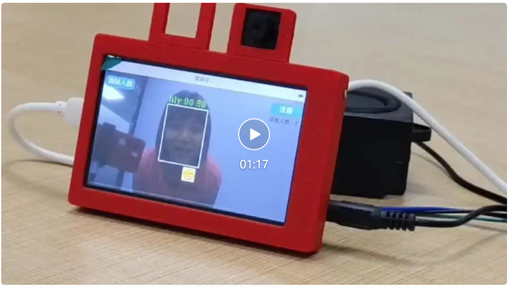
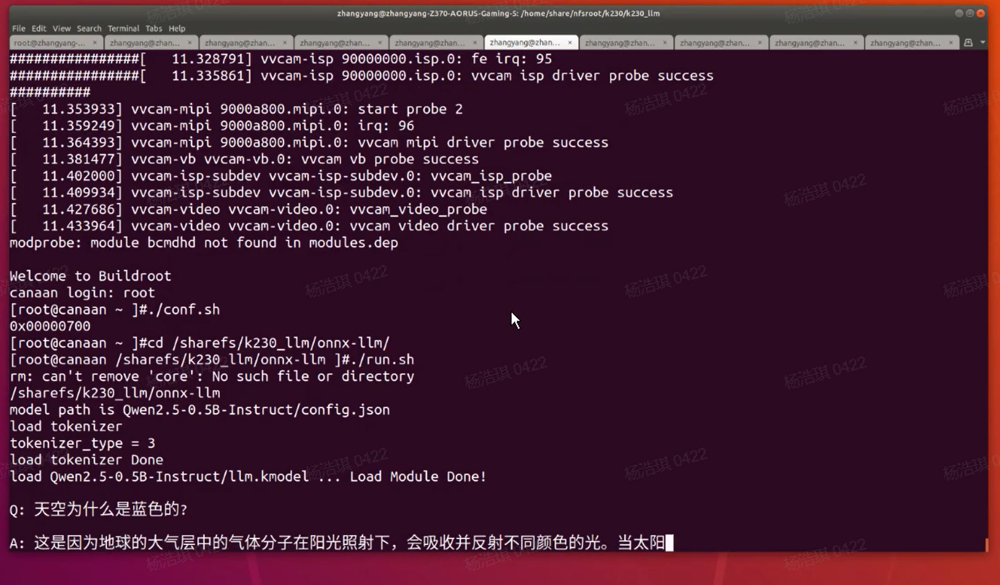

# Users DIY

Thanks to the following users for contributing to the 01Studio CanMV K230 open source ecosystem. If you also have related open source projects, you can contact us via QQ group or email (support@01studio.cc). We will give away 01Studio related products to users who contribute to the project from time to time.

## CanMV K230 小智AI语音助手 (融合视觉)

- `用户`：小楠

[K230×小智：大模型的 “视觉觉醒”（适配01Studio开发板）](https://mp.weixin.qq.com/s/C3Yi3eDz72wEbNVM4bkp_g)

## CanMV K230 部署Qwen2.5-0.5B大模型

- `用户`：小楠

[小设备也能玩大模型！K230 可以运行 Qwen2.5-0.5B 啦！](https://mp.weixin.qq.com/s/HCuQEqD2UzBD65I3eIbCow)

