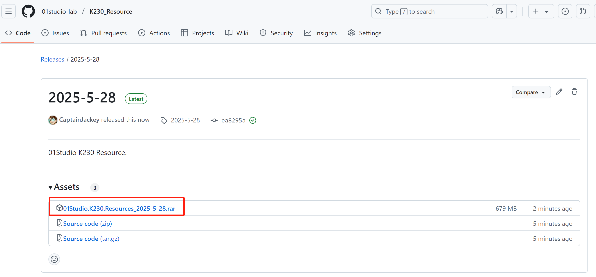
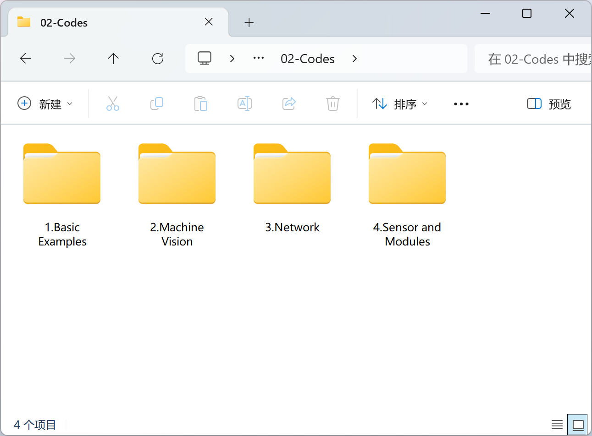

# Resource Downloads

## Download

- [Click to download](https://github.com/01studio-lab/K230_Resource/releases)

Please select the latest version to download.

## Information

CanMV K230 Online tutorials supporting software, source code, schematics, chip manuals, etc.

### Development tool software

Develop software and related drivers.

### Example Codes

All source code for this online tutorial.

### Firmware & Image

Development board image, burn it to SD card and insert it into the development board to start.(The online tutorial is used in conjunction with the image. Please use the image version provided in our data package)

### Schematic & Functional Description

Development board schematics and interface description pictures.

### Products Photos

Some pictures of the product, purely for appreciation.

