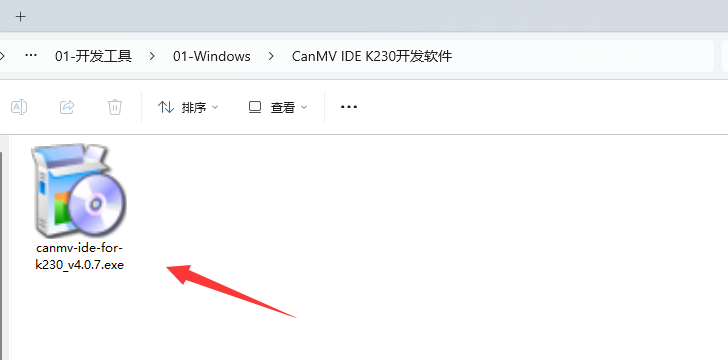
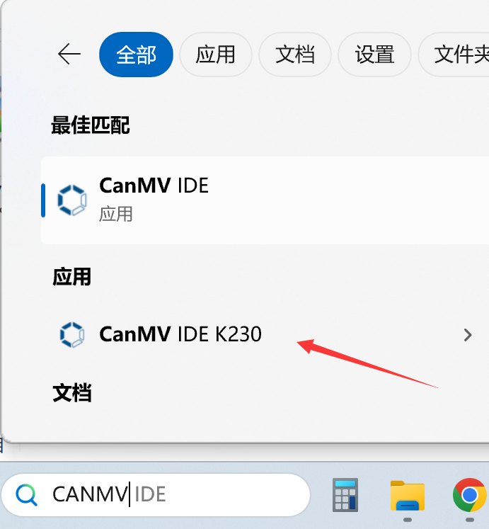
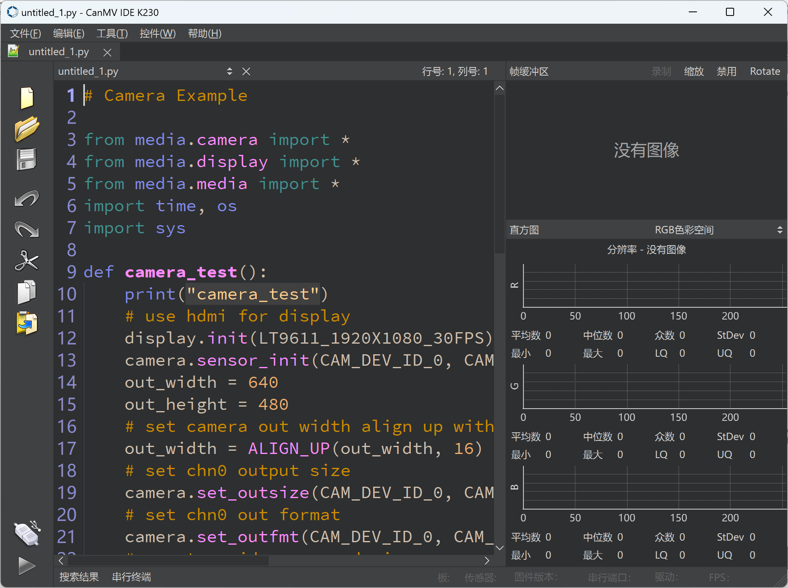

 
# CanMV K230 IDE installation

CanMV has its own official IDE. It should be noted that K210 and K230 use different IDEs for development. The CanMV K230 IDE installation package is located at **01Studio MicroPython Develop Kits (Base on CanMV K230) Resources\01-Tools\01-Windows\CanMV IDE K230 IDE** folder：

After opening, follow the prompts to install. If you cannot find the software on the desktop after installation, you can search for the CanMV keyword in the installation path or in the system search bar to find the software. Note that the name is:**CanMV IDE K230**

Open the software, as shown in the figure below, and the installation is complete.

