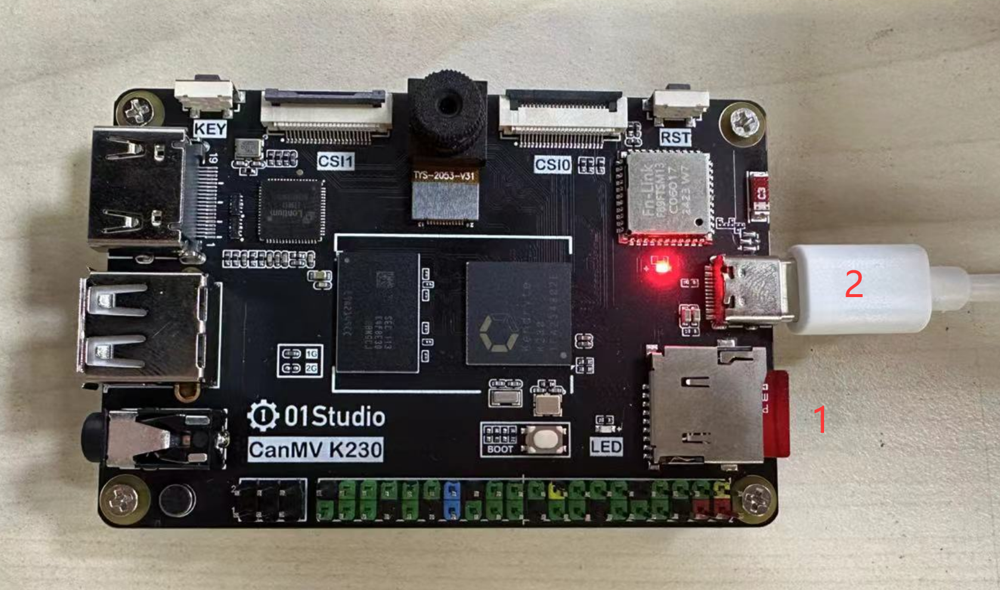
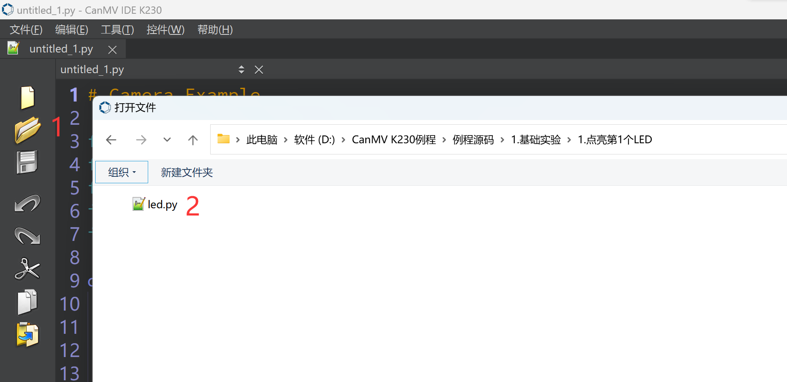
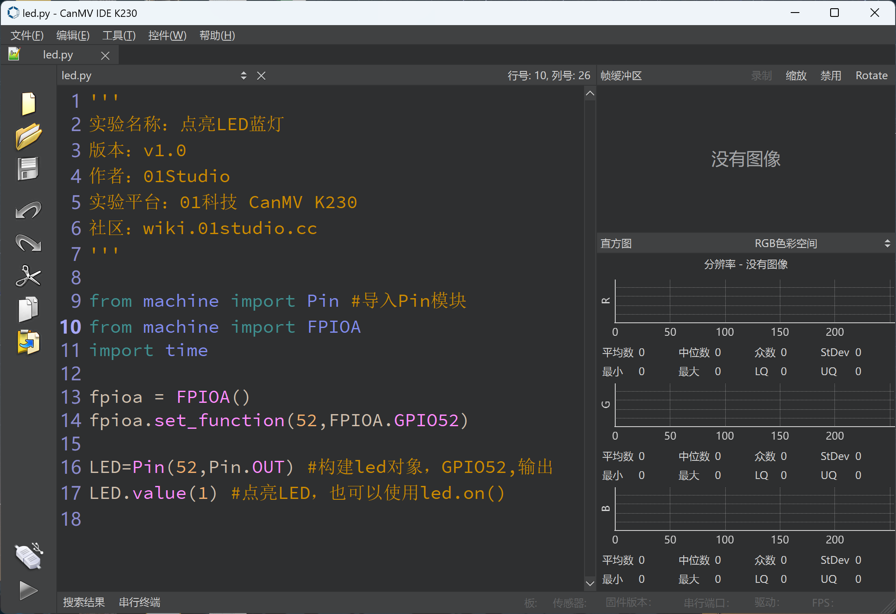
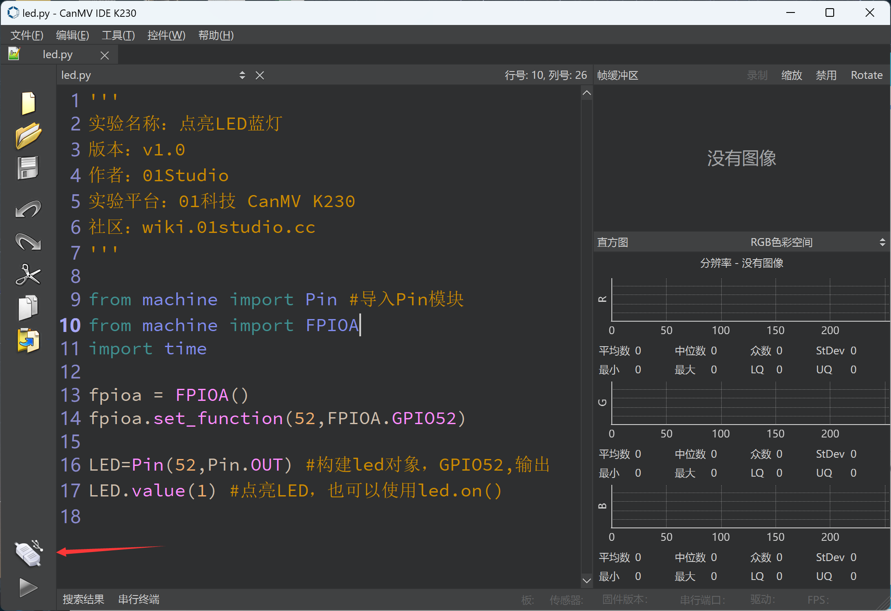
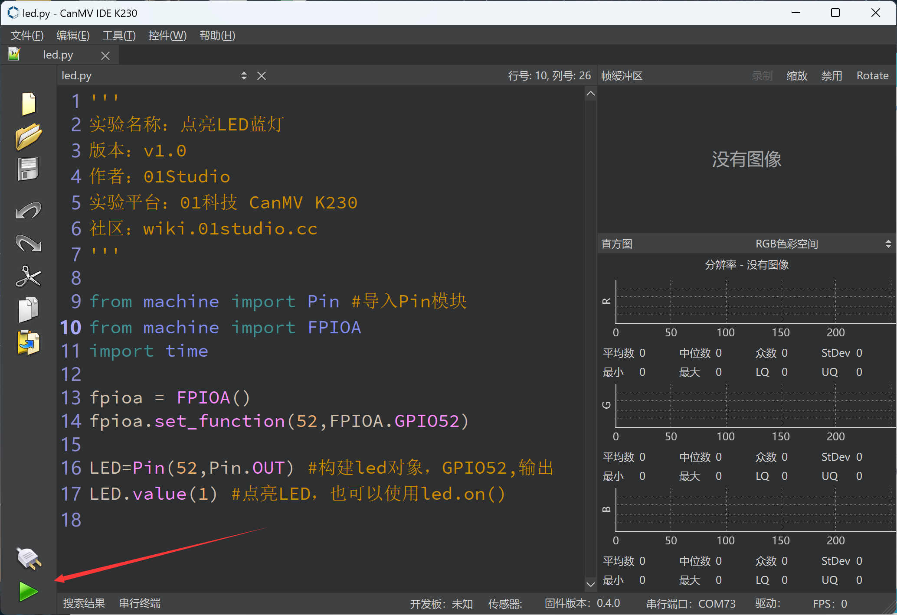
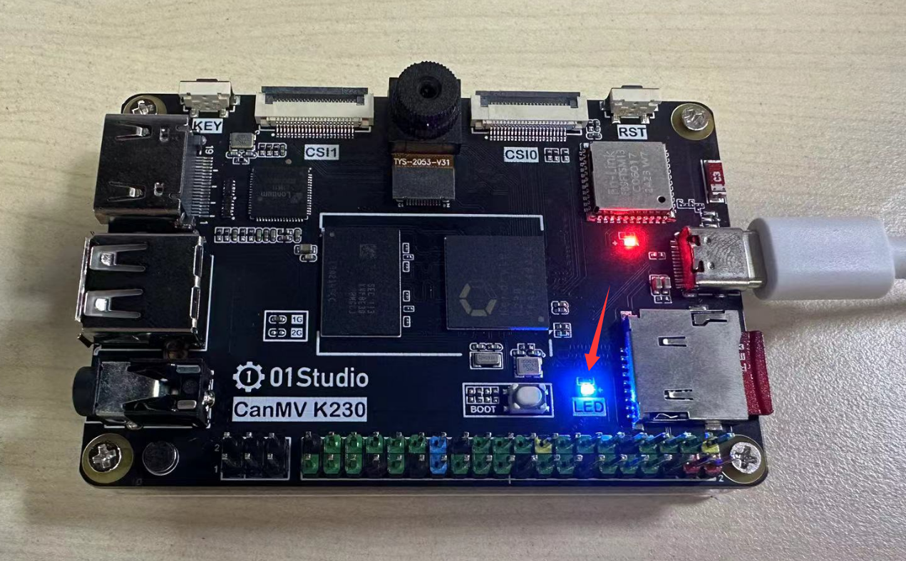
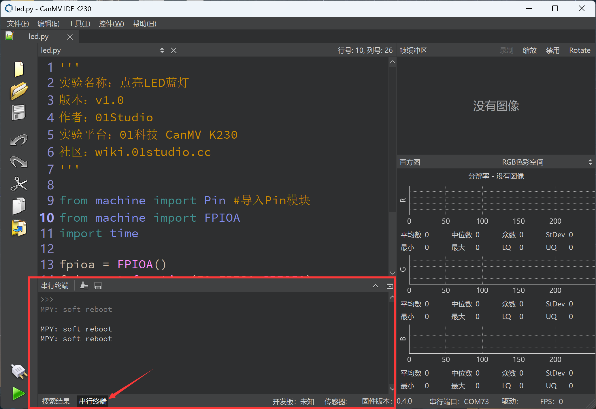

# The first Demo test

We use CanMV K230 IDE to conduct our first experiment to get familiar with the development environment. Insert the SD card with image and connect the CanMV K230 development board to the computer via a type-c cable.

- CanMV K230



- CanMV K230 mini


We use the simplest LED program to test, open it in CanMV K230 IDE **01Studio MicroPython Develop Kits (Base on CanMV K230) Resources_2024-11-8\02-Codes\1.Basic Examples\1.LED** led.py demo（You can also drag it to the IDE directly），As shown in the figure below：

（The code will not be explained here for the time being, and will be explained in detail in the following chapters）



```python
'''
'''
Demo Name：Light up the Blue LED
Version：v1.0
Author：01Studio
Platform：01Studio CanMV K230
Tutorial：wiki.01studio.cc
'''

from machine import Pin 
from machine import FPIOA
import time

#Configure GPIO52 as a normal GPIO
fpioa = FPIOA()
fpioa.set_function(52,FPIOA.GPIO52)

LED=Pin(52,Pin.OUT) #Construct LED object, GPIO52, output
LED.value(1) #To turn on the LED, you can also use led.on()
```



Next we need to connect the development board, click the connect button in the lower left corner:



After the connection is successful, the Run button turns green.



The current routine is to light up the blue LED. We click the green "Run" button. When the blue light on the CanMV K230 development board is on, it means the code is running successfully:

- CanMV K230



- CanMV K230 mini


Click the `Serial Terminal` window next to the Run button, where you can see the code debugging information.


