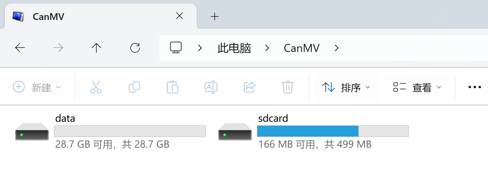

# File System

The CanMV K230 system has a built-in file system. The CanMV drive letter that appears on Computer after powering on is it.

After opening it, you can see that there are two drive letters, namely `sdcard` and `data`.

Some MicroPython library files and official sample program files are stored here. The official sample code is located in the `CanMV\sdcard\examples\` directory，**Due to the lag in the update of some codes in the USB flash drive, it may not work. Please refer to the code in the 01 technology data package for this online tutorial**::

- `data` is the remaining available space on the user's SD card.

The file system has a wide range of uses. It can store your own MicroPython code files, as well as pictures, audio, video and other materials.