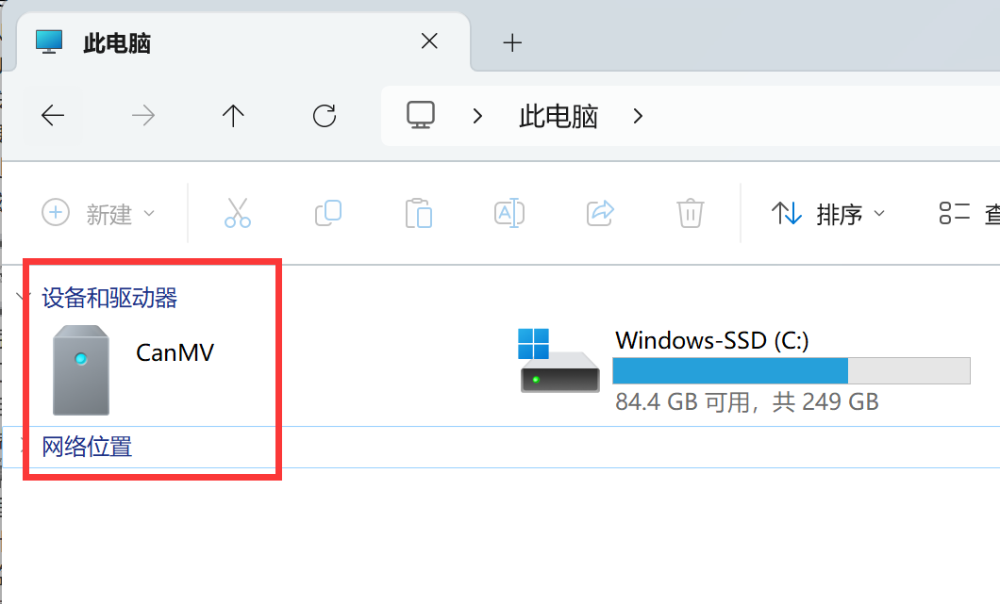

# File System

The CanMV K230 system has a built-in file system. The CanMV drive letter that appears on Computer after powering on is it.

Some MicroPython library files and official sample program files are stored here. The official sample code is located in the `CanMV\sdcard\app\tests` directory:

The file system has a wide range of uses. It can store your own MicroPython code files, as well as pictures, audio, video and other materials.