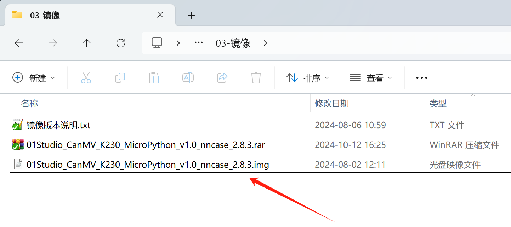
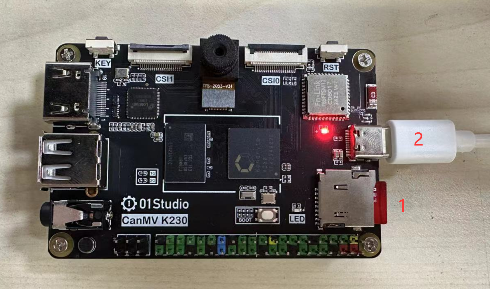

# Image burning and Power on

## Image burning

01Studio CanMV K230 development board uses SD card with image to boot. Users can get new functions by burning new image. The image file is located at **01Studio MicroPython Develop Kits (Base on CanMV K230) Resources_2024-11-8\03-Firmware & Image** folder。

（The data package is a rar compressed package by default. You need to decompress it yourself and use the image file ending with .img.）

:::tip Tips
01Studio CanMV K230 online tutorial is used with the image. Please use the image version provided in our data package. The nncase_2.8.3 in the image name refers to the nncase version used by the current image, which may be used in some occasions such as online training.
:::

Connect the MicroSD card to your computer via a card reader:

Open the image burning tool of the data package. The rufus burning tool is located at: **01Studio MicroPython Develop Kits (Base on CanMV K230) Resources_2024-11-8\01-Tools\01-Windows\image burn tool** folder:

Check the corresponding USB drive letter, then select the .img image file and click Start:

After the programming is completed, it will be shown as follows:

## Power on

Insert the burned SD card into the 01 Technology CanMV K230 development board, and then connect it to the computer via a type-c cable. (Note: Do not unplug or plug the SD card while it is powered on, as there is a risk of burning it.)

The CanMV drive letter pops up in my computer and the COM number appears in the device manager, indicating that the system boots normally. **(If it does not appear, you can try pressing the reset button of the development board.)**

