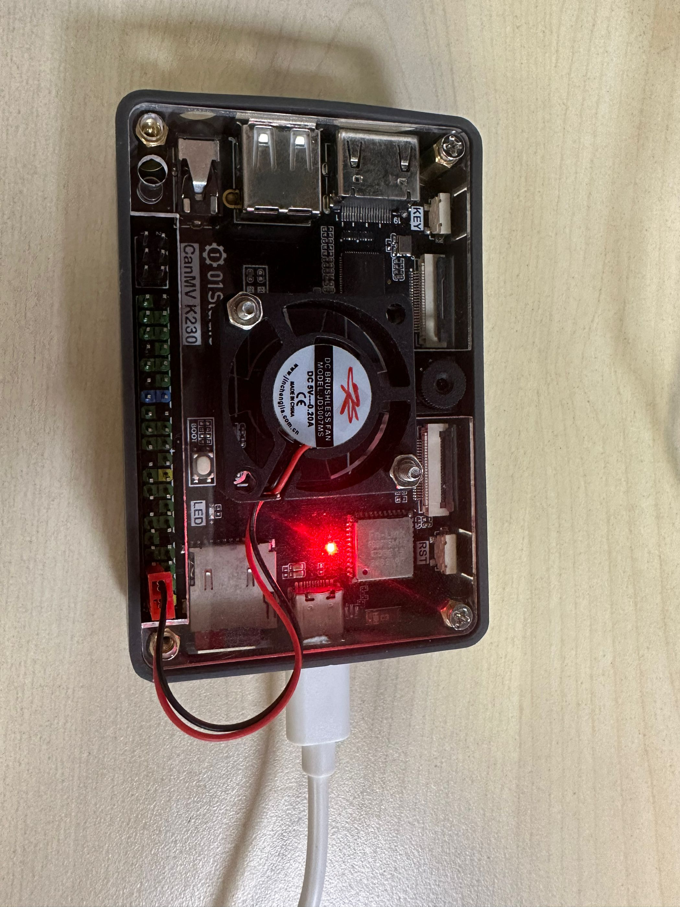
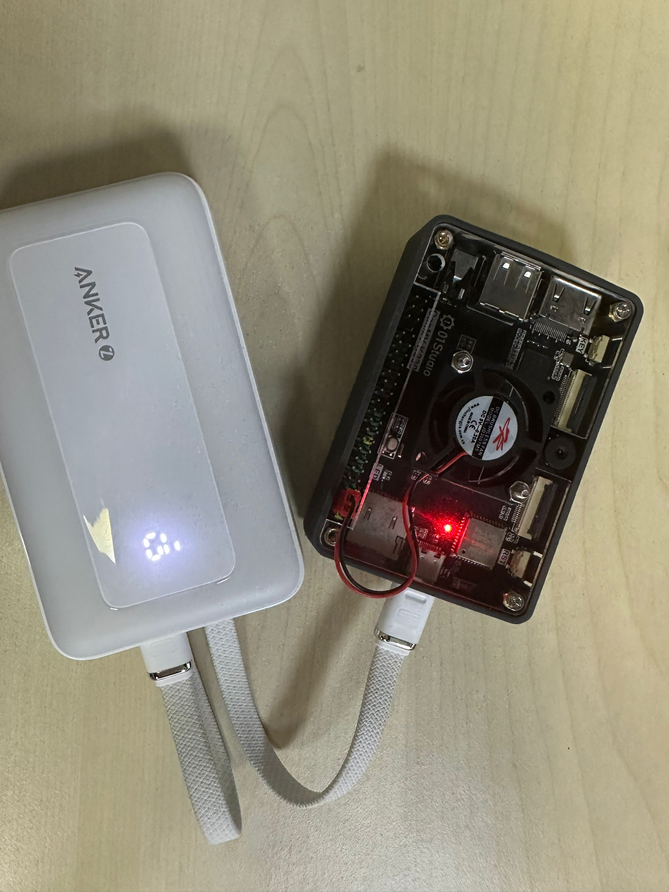
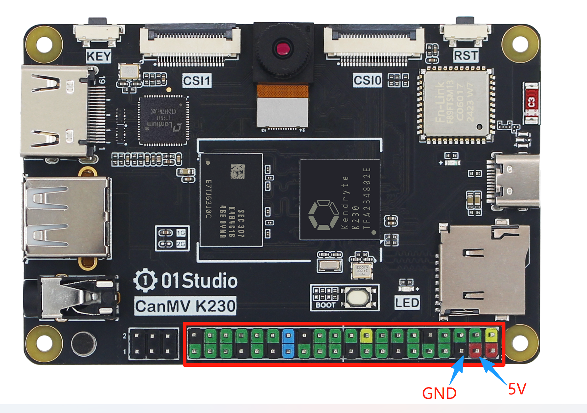
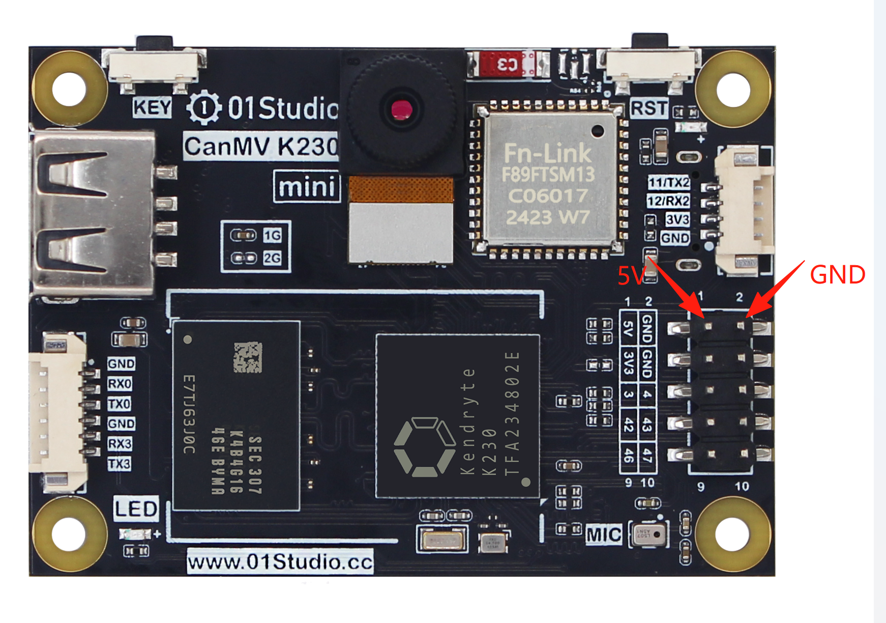

# Power Supply

CanMV K230 和 CanMV K230 mini 可以使用以下方式供电，要求电压为5V，电压超出会导致开发板烧坏。电流建议大于1A。

### 电脑或USB适配器

电脑和USB电源适配器的电压均为5V，可以直接接上TYEP-C线给开发板供电。红色指示灯亮表示供电正常。

### 充电宝

充电宝电压为5V，可以直接连接TYPE-C口给开发板供电。（带TYPE-C接口的5V锂电池也可以。）

### Dupont Line

用户自己有稳压电源，可以通过杜邦线连接到开发板5V和GND排针给开发板供电。**注意请勿接错3.3V。**

:::danger 警告
当使用杜邦线供电时，务必保证电压是5V，超出会烧坏开发板。
:::

- CanMV K230

CanMV K230 彩色排针黑色均为地（GND），2个红色排针为5V。

- CanMV K230 mini

CanMV K230 mini排针引脚1为5V，引脚2为GND。

