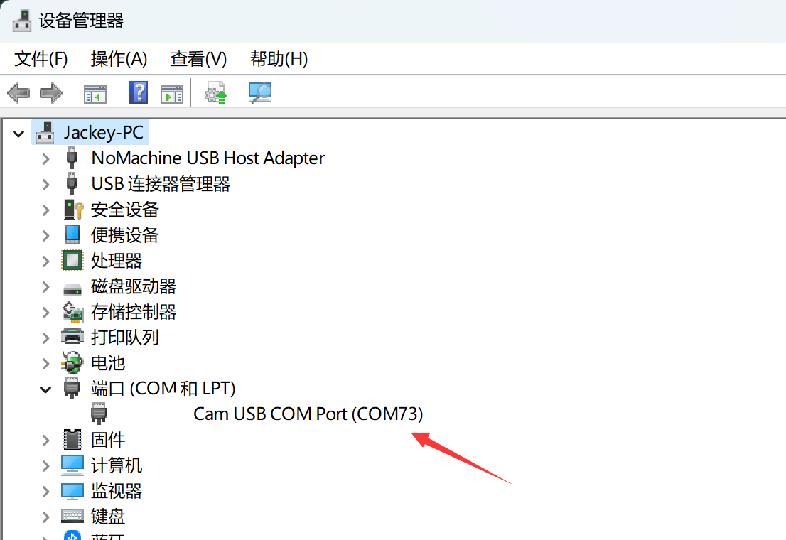
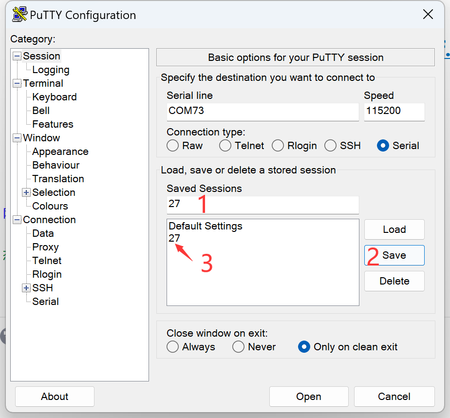
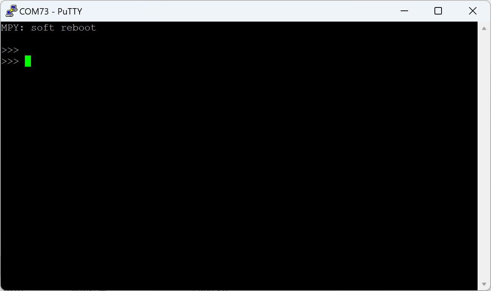
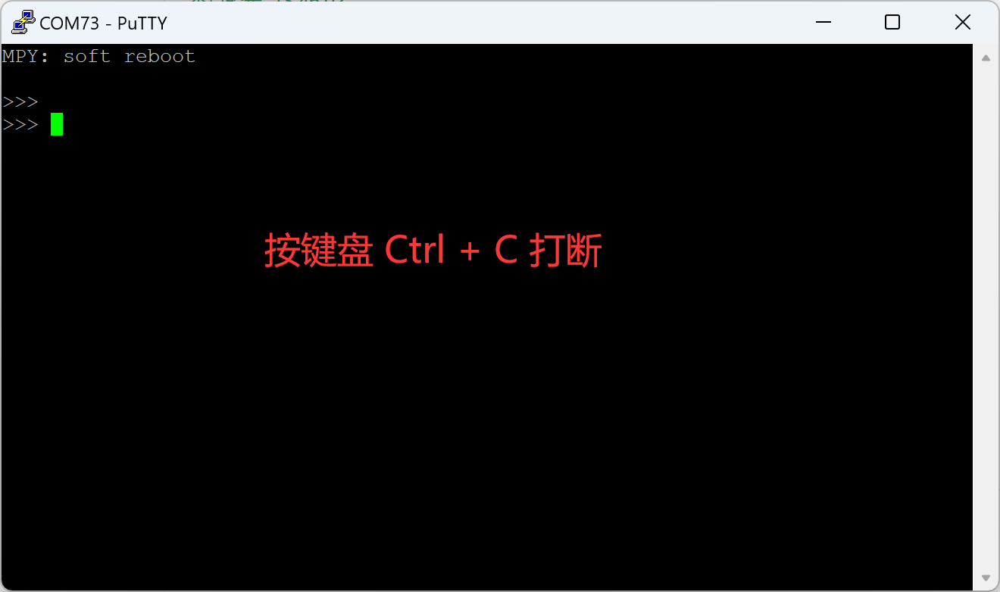
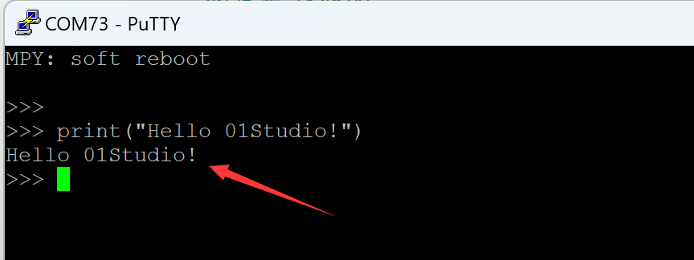
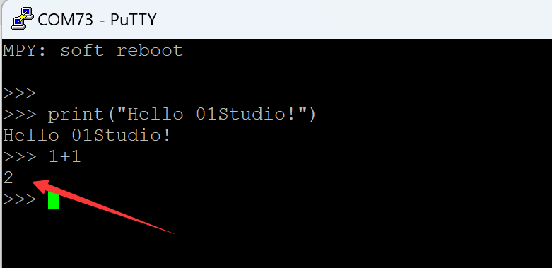

# REPL（Read-Eval-Print Loop）

:::tip Tips
REPL is a feature unique to MicroPython. Since most IDEs have integrated serial terminal information printing, this feature is generally not needed.
:::

The serial terminal mentioned in the previous section prints debugging data in the IDE, but cannot realize interaction. The MicroPython firmware of CanMV K230 integrates the interactive interpreter REPL [Read-Eval-Print-Loop], and developers can debug the CanMV K230 development board directly through the serial terminal. The software we use is a free serial terminal software putty.

Connect the development board to the computer and find the current serial port number from My Computer-Properties-Device Manager, which is COM73 here.



Open <u>**01Studio MicroPython Develop Kits (Base on CanMV K230) Resources_2024-11-8\01-Tools\01-Windows\Serial Terminal\Putty.exe**</u> 

The configuration information is as follows:

1. Select `Serial` on the right to indicate the serial port mode;

2. Fill in `COM73` according to your computer port;

3. Fill in `115200` for the baud rate.


The serial port number usually does not change. We enter `27` or a name we like under Save Session, click Save on the right, and the word `27` will appear in the blank box. You can double-click it to use it later.



After setting, we click Open. Press Enter and you can see `>>>` appears, indicating that it is waiting for input commands:



If you press Enter and no `>>>` appears, it means that there is an infinite loop code running in the development board, blocking the REPL. At this time, just press `Ctrl` + `C` on the keyboard to interrupt the running program.



Now the dialog box is equivalent to connecting to the development board. Since CanMV K230 integrates the MicroPython parser, we can debug and do simple programming here. Next, let's test it. Enter the following code in the dialog box and press Enter to see the code running.

```python
print("Hello 01Studio!")
```



Enter 1+1 again and press Enter to get the calculation result 2.



