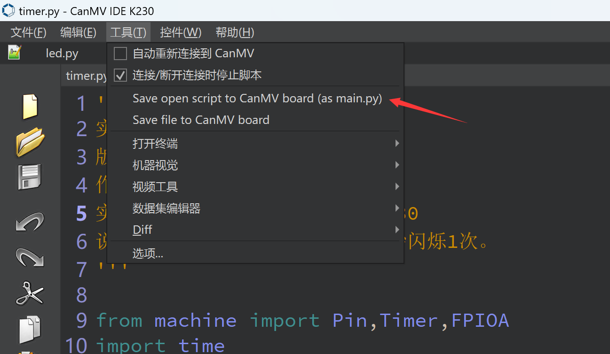
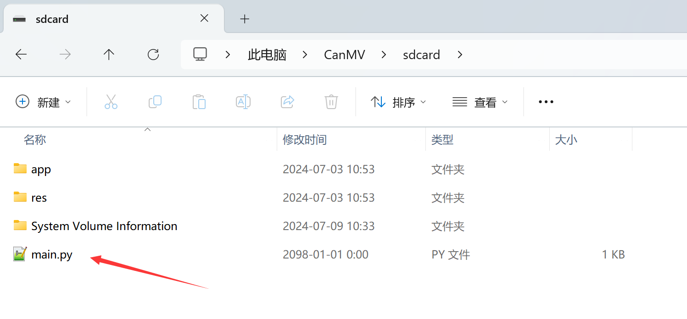

# Run code offline

Running the function code directly in the IDE is saved in the RAM (memory) of the development board, which is convenient for debugging, but it is lost after power failure. So how can we run our code when the development board is powered on? The method is as follows:

The Micropython mechanism is to run the boot.py file by default when powered on, and then run the main.py file. If there is no boot.py, then run main.py directly.

- `boot.py`: **When the first script is run after power-on, if the code has a while True block, the main.py below will not be run.**

- `main.py`：**Power on the second script to run.**

That is, we only need to send the code to the development board in the form of boot.py or main.py file, and then the development board can be powered on and run related programs.

:::tip Tips
Normally we only use main.py
:::

You can send the opened routine code to the development board as main.py after the current CanMV K230 IDE is connected to the development board:

After saving, open the CanMV drive letter and you can see that main.py is placed in the `CanMV\sdcard` directory. This means that we can copy main.py directly and run it offline.**（If main.py calls other python libraries, put them in this directory as well.）**

Then close the IDE and press the reset button on the development board to enable the code to run offline.
