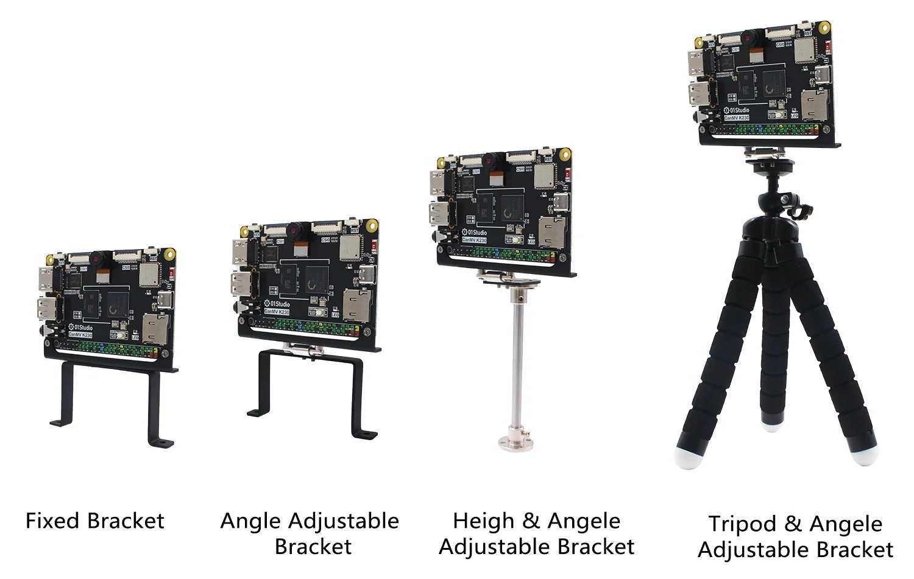

# Bracket assembly

01Studio CanMV K230 and CanMV K230 mini both support 4 types of bracket installation.They are **fixed bracket, angle adjustable bracket, height + angle adjustable bracket**, which are convenient for various scenes such as cars and gimbals that need to fix or adjust the height angle.

[**Click to Buy>>**](https://www.aliexpress.com/item/1005007584918864.html)

- Install on the car

## Installation Method

Since the bracket is shipped assembled, you only need to unscrew the M2.5x6 screws under the CanMV K230:

Align the bracket fixing holes with the development board fixing holes and tighten them with screws.

## Size

### CanMV K230 

### CanMV K230 mini

