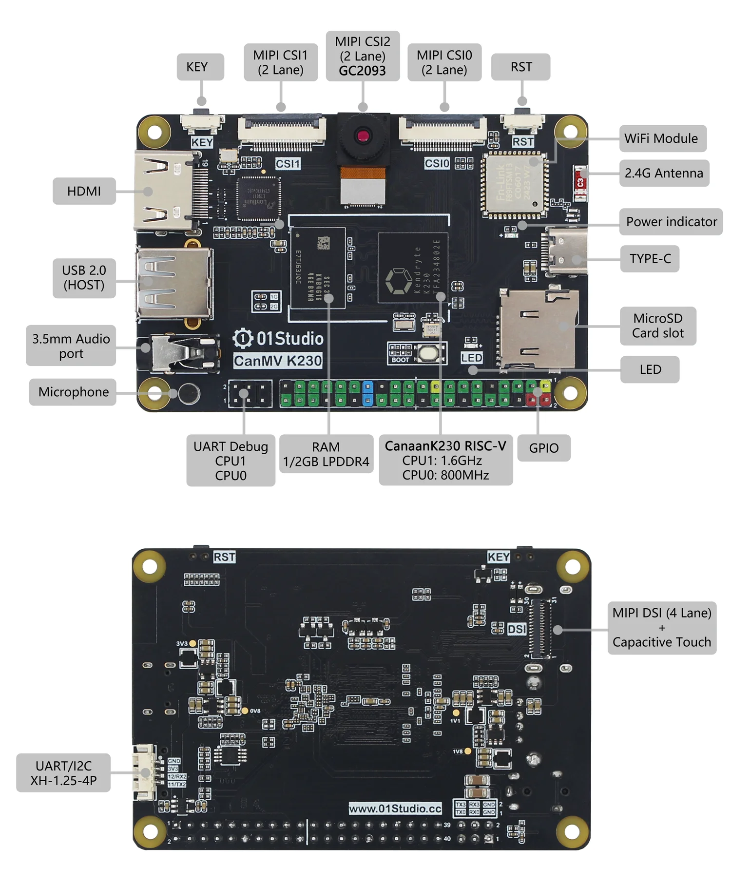

# CanMV K230

## What is CanMV? 

The CanMV open source project is officially created and maintained by Canaan. It is an open source project that ported MicroPython to Canaan's edge computing AI chip K210/K230 (a 64-bit dual-core RISC-V with hardware FPU and convolution accelerator). The project aims to create a low-cost, scalable, Python-driven AI artificial intelligence module.

In other words, if you are familiar with Micropython or Python, you can complete a large number of machine vision, machine hearing and deep learning applications through the CanMV project in a very short time.

## CanMV K230 Development Board

01Studio CanMV K230 AI development board is based on Canaan Technology's edge computing chip K230 (RSIC-V architecture, 64-bit dual-core) and the CanMV open source project.

### Hardware

### Product Parameters

|  Product Parameters |
|  :---:  | ---  |
| K230  | ● CPU1: RISC-V , 1.6GHz, Support RVV 1.0   ● CPU0: RISC-V , 800MHz |
| Neural Network  | KPU（6TOPS Equivalence），Support INT8 & INT16|
| RAM  | 1GBytes （LPDDR4） | 
| Storage  | MicroSD（512G max） |
| Camera  | ● GC2093(Standard) / OV5647   ● Support 3 interfaces（3 x 2 lane CSI） |
| Display  | ● MIPI LCD（1x4 lane DSI）, up to 1920x1080   ● HDMI Display, up to1920x1080   ● CanMV IDE, up to 1920x1080 |
| Network  | ● 2.4G WiFi（onboard antenna）   ● Ethernet（An external USB to Ethernet cable is required）|
| Audio Output  | 3.5mm Audio port (dual channel) |
| Audio Input  | Microphone |
| USB  | x1 USB 2.0 HOST |
| KEY  | x2 （Programmable Key，Reset Key） |
| LED  | x2 （Programmable LED，Power LED） |
| GPIO  | 40Pin GPIO Pin Header（compatible with Raspberry Pi） |
| UART/I2C  | XH-1.25mm-4P |
|  UART Debug  | ● CPU1（UART3）   ●  CPU0（UART0） |
| TYPE-C  | IDE connection development,code debugging,filetransferpowersupplyall-in-one |
| Power Supply  | 5V @ 1A |

|  Appearance Parameters |
|  :---:  | ---  |
| Size  | 85 x 56 x 15mm  (PCB Size) |
| Weight  | 31g |

### GPIO PinOut

### Size

## K230 Chip Parameters

|  K230 Chip Parameters |
|  :---:  | ---  |
| CPU  | ● CPU1: RISC-V , 1.6GHz, 32KB I-cache, 32KB D-cache, 256KB L2 Cache, 128bit RVV 1.0   ● CPU0: RISC-V , 800MHz, 32KB I-cache, 32KB D-cache, 128KB L2 Cache |
| KPU  | 6TOPS Equivalence，Support INT8 & INT16  Typical network performance：  Resnet50 ≥ 85fps @ INT8；Mobilenet_v2 ≥ 670fps @ INT8；YOLO V5s  ≥ 38fps @ INT8|
| DPU  | 3D structured light depth engine, supports up to 1920x1080 | 
| VPU  | H.264 and H.265 video codec, suports up to 4096x4096Encoder   Encoder performance：4K@20fps  Decoder performance：4K@40fps  JEPG codec：supports up to 8K(8192x8192) |
| Image Input  | Support 3 Interfaces MIPI CSI input：1x4 lane+1x2 lane or 3x2 lane |
| Display Output  | 1 x MIPI DSI (1x4lane or 1x2lane), up to 1920x1080 |
| Peripheral  | ● 5 x UART   ● 5 x I2C  ● 1 x I2S  ● 6 x PWM  ● 64 x GPIO + 8 x PMU GPIO  ● 2 x USB 2.0 OTG   ● 2 x SDxC: SD3.0, EMMC 5.0   ● 3 x SPI: 1 x OSPI + 2 x QSPI  ● Timer / RTC / WDT  |