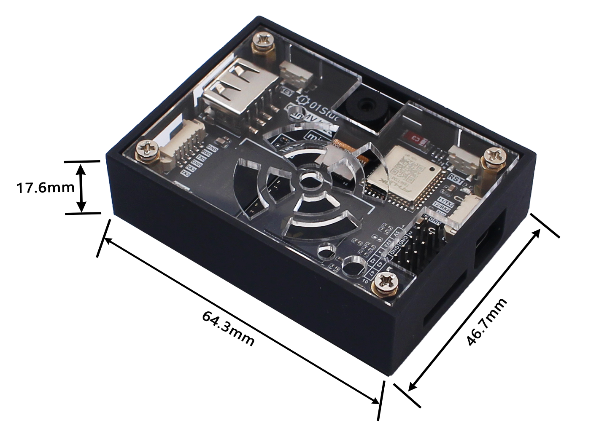

# CanMV K230

## What is CanMV? 

The CanMV open source project is officially created and maintained by Canaan. It is an open source project that ported MicroPython to Canaan's edge computing AI chip K210/K230 (a 64-bit dual-core RISC-V with hardware FPU and convolution accelerator). The project aims to create a low-cost, scalable, Python-driven AI artificial intelligence module.

In other words, if you are familiar with Micropython or Python, you can complete a large number of machine vision, machine hearing and deep learning applications through the CanMV project in a very short time.

## CanMV K230 Development Board

01Studio CanMV K230 AI development board is based on Canaan Technology's edge computing chip K230 (RSIC-V architecture, 64-bit dual-core) and the CanMV open source project.

### Hardware

### Product Parameters

|  Product Parameters |
|  :---:  | ---  |
| K230  | ● CPU1: RISC-V , 1.6GHz, Support RVV 1.0   ● CPU0: RISC-V , 800MHz |
| Neural Network  | KPU（6TOPS Equivalence），Support INT8 & INT16|
| RAM  | ● 1GBytes（LPDDR4）   ● 2GBytes（LPDDR4） | 
| Storage  | MicroSD（512G max） |
| Camera  | ● GC2093(Standard) / OV5647   ● Support 3 interfaces（3 x 2 lane CSI） |
| Display  | ● MIPI LCD（1x4 lane DSI）, up to 1920x1080   ● HDMI Display, up to1920x1080   ● CanMV IDE, up to 1920x1080 |
| Network  | ● 2.4G WiFi（onboard antenna）   ● Ethernet（An external USB to Ethernet cable is required）|
| Audio Output  | 3.5mm Audio port (dual channel) |
| Audio Input  | Microphone |
| USB  | x1 USB 2.0 HOST |
| KEY  | x2 （Programmable Key，Reset Key） |
| LED  | x2 （Programmable LED，Power LED） |
| GPIO  | 40Pin GPIO Pin Header（compatible with Raspberry Pi） |
| UART/I2C  | XH-1.25mm-4P |
|  UART Debug  | ● CPU1（UART3）   ●  CPU0（UART0） |
| TYPE-C  | IDE connection development,code debugging,filetransferpowersupplyall-in-one |
| Power Supply  | 5V @ 1A |

|  Appearance Parameters |
|  :---:  | ---  |
| Size  | 85 x 56 x 15mm  (PCB Size) |
| Weight  | 31g |

### GPIO PinOut

### Size

## CanMV K230 mini Development Board

CanMV K230 mini is a streamlined version of CanMV K230 hardware with a smaller size and fully universal images and codes.

### Hardware

### Product Parameters

|  Product Parameters |
|  :---:  | ---  |
| K230  | ● CPU1: RISC-V , 1.6GHz, Support RVV 1.0   ● CPU0: RISC-V , 800MHz |
| Neural Network  | KPU（6TOPS Equivalence），Support INT8 & INT16|
| RAM (Optional)  | ● 1GBytes（LPDDR4）   ● 2GBytes（LPDDR4） | 
| Storage  |● MicroSD（512G max）   ● SD NAND (reserved pad, located below the SD card slot, can be soldered by yourself) |
| Camera  | ● GC2093(Standard) / OV5647   ● Support 2 interfaces CSI（1 x 2lane + 1 x 4lane） |
| Display  | ● MIPI LCD（1x4 lane DSI）, up to 1920x1080   ● HDMI Display, up to1920x1080 (Need to use with adapter plate)   ● CanMV IDE, up to 1920x1080 |
| Network  | ● 2.4G WiFi（onboard antenna）   ● Ethernet（An external USB to Ethernet cable is required）|
| Audio Output  | xh-1.25mm-3P Audio port (dual channel) |
| Audio Input  | Microphone |
| USB  | x1 USB 2.0 HOST |
| KEY  | x2 （Programmable Key，Reset Key） |
| LED  | x2 （Programmable LED，Power LED） |
| GPIO  | 2x5P 2.54mm Pin Header|
| UART/I2C  | XH-1.25mm-4P |
|  UART Debug  | ● CPU1（UART3）   ●  CPU0（UART0） |
| TYPE-C  | IDE connection development,code debugging,filetransferpowersupplyall-in-one |
| Power Supply  | 5V @ 1A |

|  Appearance Parameters |
|  :---:  | ---  |
| Size  | ● 60.3 x 42.7 x 17.6mm  (PCB Size)    ● 64.3 x 46.7 x 17.6 mm (including case) |
| Weight  | ● 16g    ● 40g (including case) |

### GPIO PinOut

#### Bare board size

#### Including shell size

## CM-K230 Core Module

CM-K230 is the core board for stamp-hole encapsulation.[**Click to Buy>>**](https://www.aliexpress.com/item/1005010255216044.html)

  

### Hardware

### PinOUT

|  Pin | Name | Function |  Pin | Name | Function |
|  :---:  | :---:  | --- |  :---:  | :---:  | --- |
| 1 | GND | Power GND | 71 | GND  | Power GND |
| 2 | GND | Power GND | 72 | CSI1_D2_N  | CSI1/Camera |
| 3 | GND | Power GND | 73 | CSI1_D2_P  | CSI1/Camera | 
| 4 | VIN_5V | Power In/5V | 74 | CSI1_CLK_P  | CSI1/Camera | 
| 5 | VIN_5V | Power In/5V | 75 | CSI1_CLK_N  | CSI1/Camera | 
| 6 | VIN_5V | Power In/5V | 76 | CSI1_D3_P  | CSI1/Camera | 
| 7 | VOUT_3V3   | Power Out/3V3/I(max)=300mA | 77 | CSI1_D3_N  | CSI1/Camera | 
| 8 | VOUT_1V8  | Power Out/1V8/I(max)=100mA | 78 | GND  | Power GND |
| 9 | GPIO18  | OSPI_D2/QSPI1_CS2/QSPI0_D2 | 79 | DSI_D3_P  | Display |
| 10 | GPIO19  | OSPI_D3/QSPI1_CS1/QSPI0_D3 | 80 | DSI_D3_N  | Display |
| 11 | GPIO20  | OSPI_D4/QSPI1_CS0/PULSE_CNTR0 | 81 | DSI_D2_N  | Display |
| 12 | GPIO21  | OSPI_D5/QSPI1_CLK/PULSE_CNTR1 | 82 | DSI_D2_P  | Display |
| 13 | GPIO22  | OSPI_D6/QSPI1_D0/PULSE_CNTR2 | 83 | DSI_CLK_P  | Display |
| 14 | GPIO23  | OSPI_D7/QSPI1_D1/PULSE_CNTR3 | 84 | DSI_CLK_N  | Display |
| 15 | GPIO24  | OSPI_DQS/QSPI1_D2/PULSE_CNTR4 | 85 | DSI_D0_N  | Display |
| 16 | GPIO25  | PWM5/QSPI1_D3/PULSE_CNTR5 | 86 | DSI_D0_P  | Display |
| 17 | TFCARD_D0  | MMC0_D0 | 87 | DSI_D1_P  | Display |
| 18 | TFCARD_D1  | MMC0_D1 | 88 | DSI_D1_N  | Display |
| 19 | TFCARD_D2  | MMC0_D2 | 89 | GND  | Power GND |
| 20 | TFCARD_D3  | MMC0_D3 | 90 | BANK2_VDDIO  | BANK2 IO Reference voltage |
| 21 | TFCARD_CLK  | MMC0_CLK | 91 | GPIO26  | MMC1_CLK/PDM_CLK |
| 22 | TFCARD_CMD  | MMC0_CMD | 92 | GPIO27  | MMC1_CMD/PULSE_CNTR5/PDM_IN0 |
| 23 | BANK4_VDDIO  | BANK4 IO Reference voltage | 93 | GPIO28  | MMC1_D0/UART3_TXD/PDM_IN1 |
| 24 | GPIO50  | UART3_TXD/IIC2_SCL/QSPI0_CS4 | 94 | GPIO29  | MMC1_D1/UART3_RXD/3D_CTRL_IN |
| 25 | GPIO51  | UART3_RXD/IIC2_SDA/QSPI0_CS3 | 95 | GPIO30  | MMC1_D2/UART3_RTS/3D_CTRL_OUT1 |
| 26 | GPIO52  | UART3_RTS/PWM4/IIC3_SCL | 96 | GPIO31  | MMC1_D3/UART3_CTS/3D_CTRL_OUT2 |
| 27 | GPIO53  | UART3_CTS/PWM5/IIC3_SDA | 97 | GPIO32  | IIC0_SCL/IIS_CLK/UART3_TXD |
| 28 | GPIO54  | QSPI0_CS0/MMC1_CMD/PWM0 | 98 | GPIO33  | IIC0_SDA/IIS_WS/UART3_RXD |
| 29 | GPIO55  | QSPI0_CLK/MMC1_CLK/PWM1 | 99 | GPIO34  | IIC1_SCL/IIS_D_IN0/PDM_IN3/UART3_RTS |
| 30 | GPIO56  | QSPI0_D0/MMC1_D0/PWM2 | 100 | GPIO35  | IIC1_SDA/IIS_D_OUT0/PDM_IN1/UART3_CTS |
| 31 | GPIO57  | QSPI0_D1/MMC1_D1/PWM3 | 101 | GPIO36  | IIC3_SCL/IIS_D_IN1/PDM_IN2/UART4_TXD |
| 32 | GPIO58  | QSPI0_D2/MMC1_D2/PWM4 | 102 | GPIO37  | IIC3_SDA/IIS_D_OUT1/PDM_IN0/UART4_RXD |
| 33 | GPIO59  | QSPI0_D3/MMC1_D3/PWM5 | 103 | BANK5_VDDIO  | BANK5 IO Reference voltage |
| 34 | GPIO60  | PWM0/IIC0_SCL/QSPI0_CS2    /HSYNC1 | 104 | GPIO62  | M_CLK2/UART3_DE |
| 35 | GPIO61  | PWM1/IIC0_SDA/QSPI0_CS1   /VSYNC1 | 105 | GPIO63  | M_CLK3/UART3_RE |
| 36 | GND | Power GND | 106 | GND  | Power GND |
| 37 | USB1_N | USB1- | 107 | BANK0_VDDIO  | BANK0 IO Reference voltage |
| 38 | USB1_P | USB1+ | 108 | GPIO2  | JTAG_TCK/PULSE_CNTR0 |
| 39 | USB1_ID | USB1 ID | 109 | GPIO3  | JTAG_TDI/PULSE_CNTR1/UART1_TXD |
| 40 | USB0_P | USB0+ | 110 | GPIO4 | JTAG_TDO/PULSE_CNTR2/UART1_RXD |
| 41 | USBO_N | USB0- | 111 | GPIO5  | JTAG_TMS/PULSE_CNTR3/UART2_TXD |
| 42 | USBO_ID | USB0 ID | 112 | GPIO6  | JTAG_TMS/PULSE_CNTR3/UART2_RXD |
| 43 | ADC0 | ADC0/range 1.8V | 113 | GPIO7  | PWM2/IIC4_SCL |
| 44 | ADC1 | ADC1/range 1.8V | 114 | GPIO8  | PWM3/IIC4_SDA |
| 45 | ADC2 | ADC2/range 1.8V | 115 | GPIO9  | PWM4/UART1_TXD/IIC1_SCL |
| 46 | ADC3 | ADC3/range 1.8V | 116 | GPIO10  | 3D_CTRL_IN/UART1_RXD/IIC1_SDA |
| 47 | ADC4 | ADC4/range 1.8V | 117 | GPIO11  | 3D_CTRL_OUT1/UART2_TXD/IIC2_SCL |
| 48 | ADC5 | ADC5/range 1.8V | 118 | GPIO12  | 3D_CTRL_OUT2/UART2_RXD/IIC2_SDA |
| 49 | GND | Power GND | 119 | GPIO23  | M_CLK1 |
| 50 | MIC_BIAS | Microphone power supply/1.8V | 120 | BOOT0  | MMC0 Boot default |
| 51 | MIC_NL | MIC/L- | 121 | BOOT1  | MMC0 BOOT default |
| 52 | MIC_PL | MIC/L+ | 122 | RSTN  | Reset/1.8V |
| 53 | MIC_NR | MIC/R- | 123 | BANK3_VDDIO  | BANK3 IO Reference voltage |
| 54 | MIC_PR | MIC/R+ | 124 | GPIO38  | UART0_TXD/QSPI1_CS0/HSYNC0 |
| 55 | HP_OUTL | Audio/L | 125 | GPIO39  | UART0_RXD/QSPI1_CLK/VSYNC0 |
| 56 | HP_OUTR | Audio/R | 126 | GPIO40  | UART1_TXD/IIC1_SCL/QSPI1_D0 |
| 57 | GND | Power GND | 127 | GPIO41  | UART1_RXD/IIC1_SDA/QSPI1_D1 |
| 58 | CSI2_CLK_P | CSI2/Camera | 128 | GPIO42  | UART1_RXD/UART1_RTS/PWM0/QSPI1_D2 |
| 59 | CSI2_CLK_N | CSI2/Camera | 129 | GPIO43  | UART1_CTS/PWM1/QSPI1_D3 |
| 60 | CSI2_D4_N | CSI2/Camera | 130 | GPIO44  | UART2_TXD/IIC3_SCL/SPI2AXI_CLK |
| 61 | CSI2_D4_P | CSI2/Camera | 131 | GPIO45  | UART2_RXD/IIC3_SDA/SPI2AXI_CS |
| 62 | CSI2_D5_P | CSI2/Camera | 132 | GPIO46  | UART2_RTS/PWM2/IIC4_SCL |
| 63 | CSI2_D5_N | CSI2/Camera | 133 | GPIO47  | UART2_CTS/PWM3/IIC4_SDA |
| 64 | GND | Power GND | 134 | GPIO48  | UART4_TXD/IIC0_SCL/SPI2AXI_DIN |
| 65 | CSI0_D1_N | CSI0/Camera | 135 | GPIO49  | UART4_RXD/IIC0_SDA/SPI2AXI_DOUT |
| 66 | CSI2_D1_P | CSI0/Camera | 136 | BANK1_VDDIO  | BANK1 IO Reference voltage |
| 67 | CSI2_CLK_N | CSI0/Camera | 137 | GPIO14  | OSPI_CS/QSPI0_CS0 |
| 68 | CSI2_CLK_P | CSI0/Camera | 138 | GPIO15  | OSPI_CLK/QSPI0_CLK |
| 69 | CSI2_D0_P | CSI0/Camera | 139 | GPIO16  | OSPI_D0/QSPI1_CS4/QSPI0_D0 |
| 70 | CSI2_D0_N | CSI0/Camera | 140 | GPIO17  | OSPI_D1/QSPI1_CS3/QSPI0_D1 |

### Size

#### CM-K230 Size

#### Recommended package

### CM-K230 Base Board

Reference project for base PCB: [Click to Open>>](https://oshwhub.com/01keji/cm-k230-di-ban)

The CM-K230 core board kit LCD and camera assembly is shown in the picture below. **All ribbon cables with gold fingers facing down are installed.**

## K230 Chip Parameters

|  K230 Chip Parameters |
|  :---:  | ---  |
| CPU  | ● CPU1: RISC-V , 1.6GHz, 32KB I-cache, 32KB D-cache, 256KB L2 Cache, 128bit RVV 1.0   ● CPU0: RISC-V , 800MHz, 32KB I-cache, 32KB D-cache, 128KB L2 Cache |
| KPU  | 6TOPS Equivalence，Support INT8 & INT16  Typical network performance：  Resnet50 ≥ 85fps @ INT8；Mobilenet_v2 ≥ 670fps @ INT8；YOLO V5s  ≥ 38fps @ INT8|
| DPU  | 3D structured light depth engine, supports up to 1920x1080 | 
| VPU  | H.264 and H.265 video codec, suports up to 4096x4096Encoder   Encoder performance：4K@20fps  Decoder performance：4K@40fps  JEPG codec：supports up to 8K(8192x8192) |
| Image Input  | Support 3 Interfaces MIPI CSI input：1x4 lane+1x2 lane or 3x2 lane |
| Display Output  | 1 x MIPI DSI (1x4lane or 1x2lane), up to 1920x1080 |
| Peripheral  | ● 5 x UART   ● 5 x I2C  ● 1 x I2S  ● 6 x PWM  ● 64 x GPIO + 8 x PMU GPIO  ● 2 x USB 2.0 OTG   ● 2 x SDxC: SD3.0, EMMC 5.0   ● 3 x SPI: 1 x OSPI + 2 x QSPI  ● Timer / RTC / WDT  |