# Accessories installation and use

This section introduces the installation and use of 01Studio CanMV K230 related accessory modules.

## Heat sink

The heat sink can help CanMV K230 dissipate heat more effectively, especially in high temperature environments to achieve stable operation. Installation is also very simple. Tear off the 3M adhesive at the bottom of the heat sink and stick it on the silk screen frame of K230 and memory chip. Because the heat sink is conductive, be careful not to contact other components (capacitors, resistors) on the circuit board during installation to avoid short circuits.

## Acrylic protection plate

The function of the acrylic base plate is to prevent the bottom of the PCB from short-circuiting with other metal objects and to prevent the solder pins from scratching the desktop. At the same time, the space created at the bottom also improves the heat dissipation effect.

The installation method of the CanMV K230 acrylic base plate is very simple. Tear off the acrylic protective film, embed the copper column in the middle, and tighten the upper and lower ends with M2.5 screws.

## shell

The function of the shell is to completely wrap and effectively protect the development board. Users can purchase: [Click to Buy>>](https://www.aliexpress.com/item/1005008584060443.html)

:::tip 提示
The assembly method of CanMV K230 and CanMV K230 mini is the same.
:::

- CanMV K230

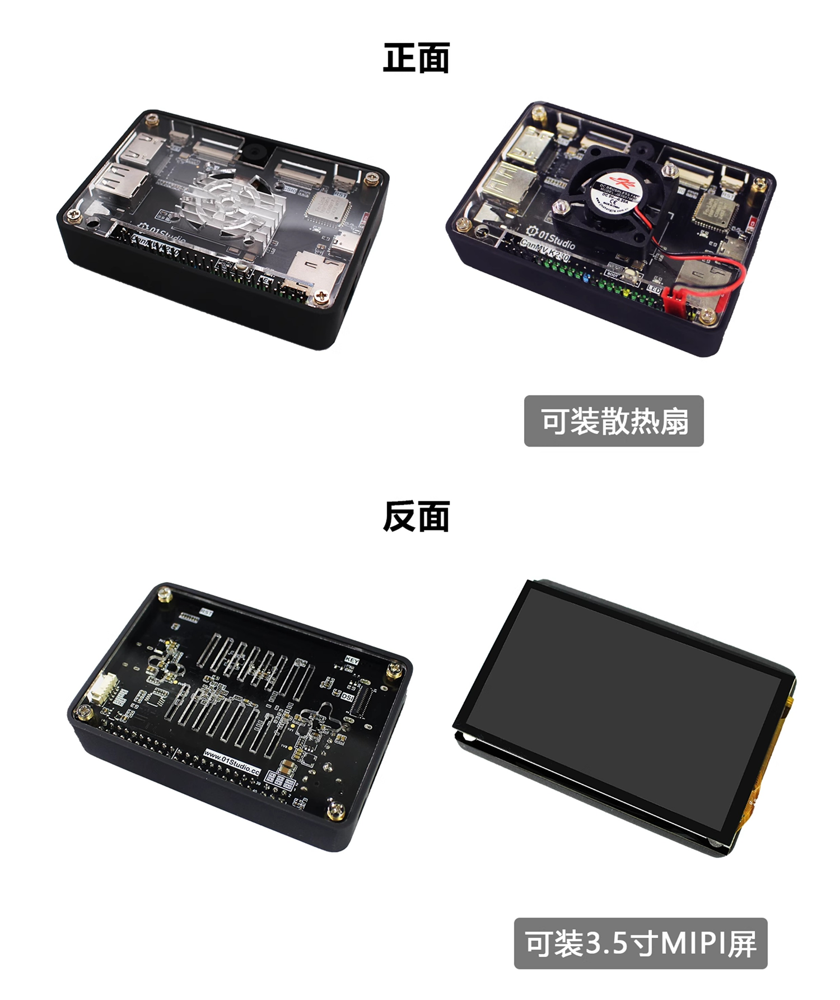

- CanMV K230 mini

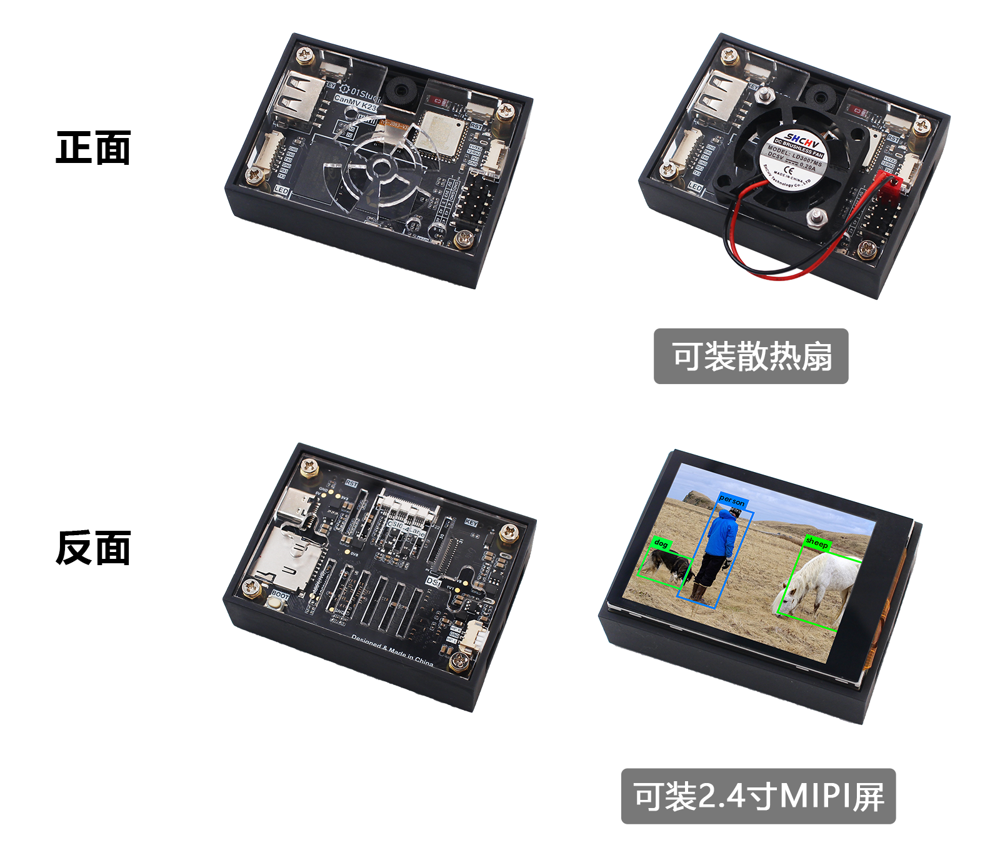

**Here is the assembly tutorial:**

First make sure you have the following:

- 01Studio CanMV K230 motherboard x1
- Shell x1
- Acrylic top cover x1
- Acrylic bottom plate x1
- M2.5*8+3 single-pass copper column x4
- M2.5*4 double-pass copper column x4
- M2.5*5 cross flat head screw x8

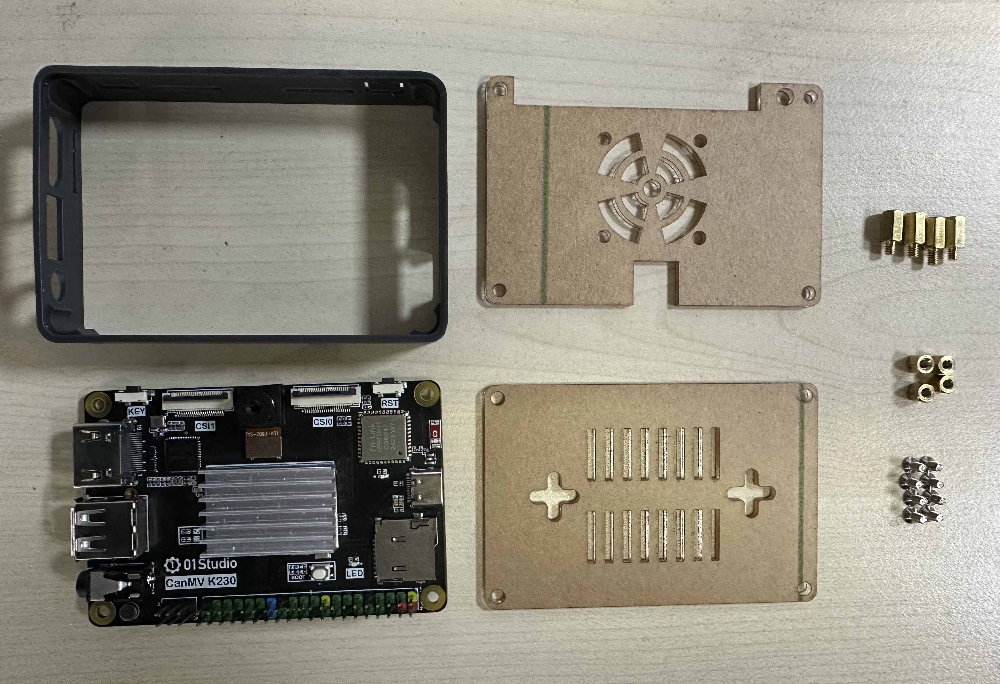

Step 1: Install the two copper pillars into the 4 holes as shown in the figure below and tighten them:
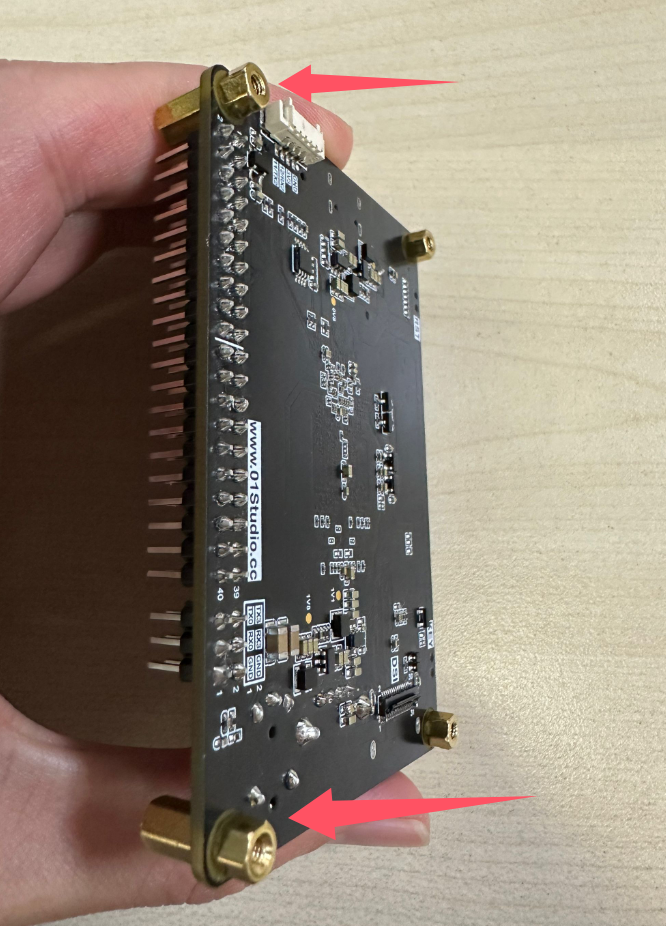

Then install the board into the shell from bottom to top:
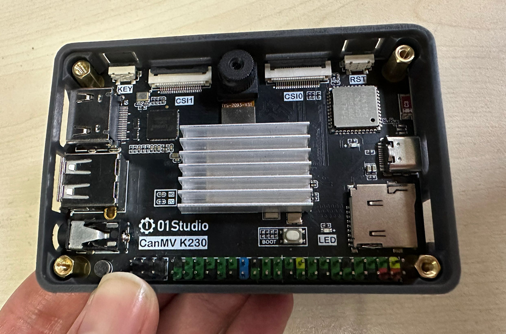

Tear off the transparent acrylic protective film on the top cover:
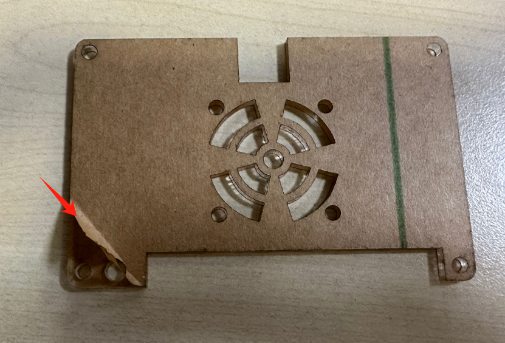

Fix it to the top with screws:
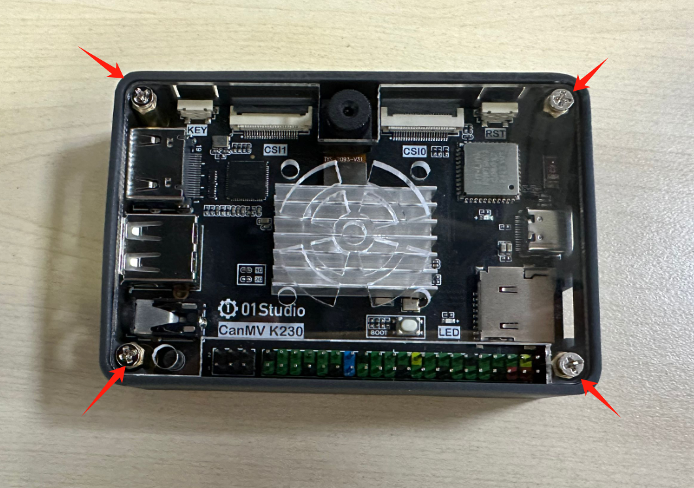

The bottom cover acrylic is also operated in the same way:
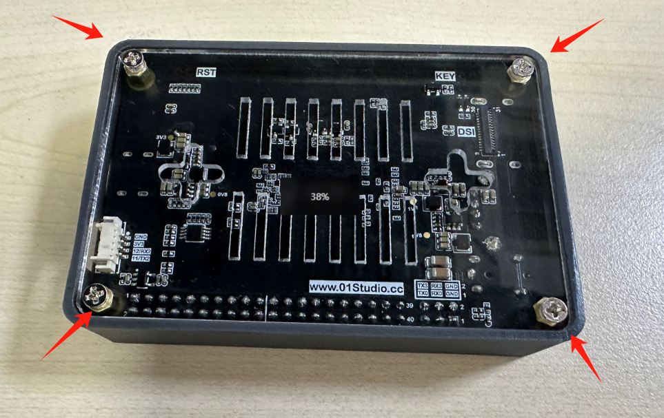

At this point, the assembly is complete:
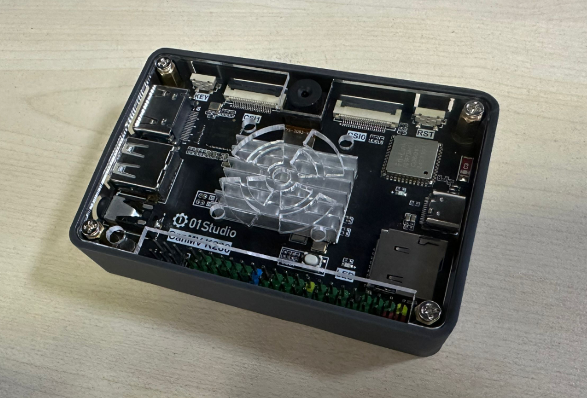

A 3.5-inch LCD MINI screen can also be installed on the back. First assemble the screen from the back of the development board, then put it into the shell and screw on the top cover.

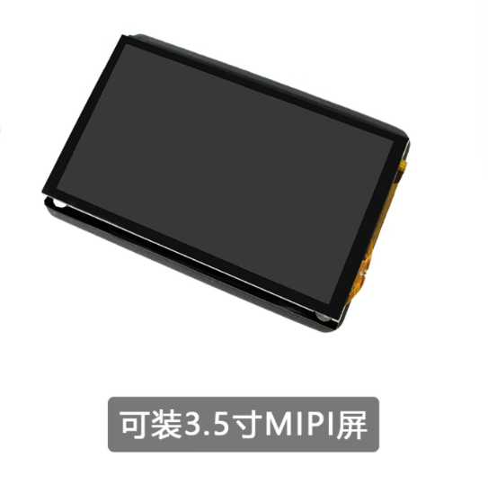

## Cooling fan

The top cover can be equipped with a cooling fan. Note that the fan screws are installed from bottom to top. The installation method of the two development boards is the same.

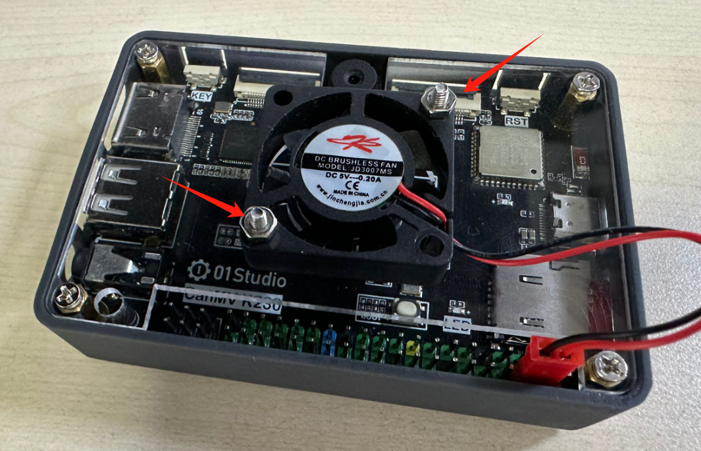

The power cable of the CanMV K230 cooling fan is connected to the red and black pin headers shown in the figure below, and 5V power is supplied.

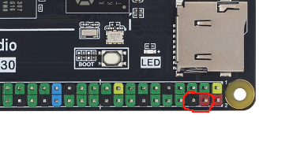

The power cable of the CanMV K230 mini cooling fan is connected to the pin headers shown in the figure below. You can choose to use 5V power supply or 3.3V power supply. 3.3V power supply is quieter (the black fan lead is GND, and the red is the positive pole of the power supply).

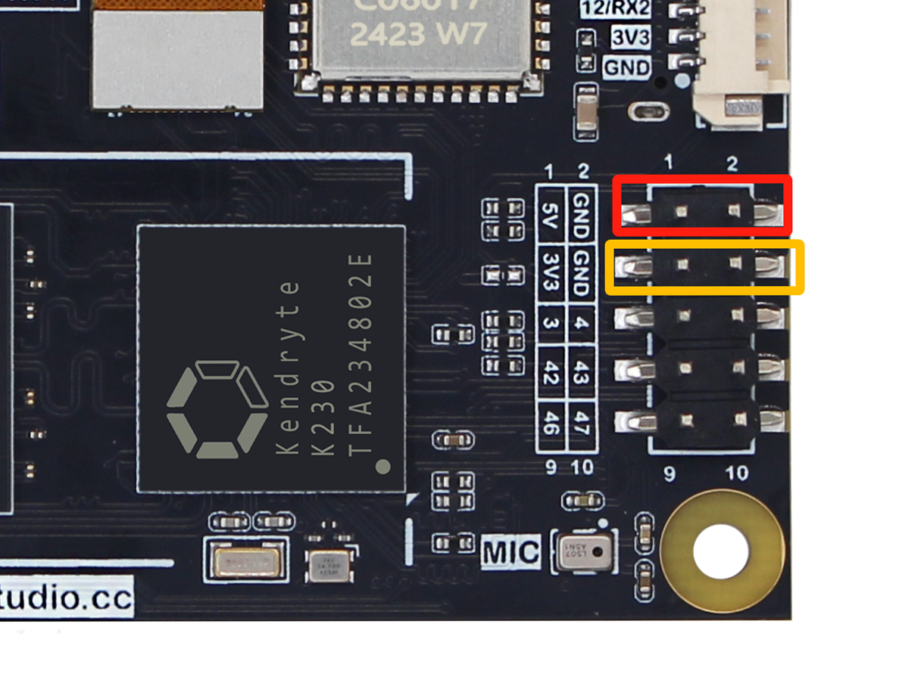

## MIPI display

### 3.5 inch MIPI display

[Click to Buy>>](https://www.aliexpress.com/item/1005007579014355.html)

:::tip Tips
Since the LCD backlight is turned off by default after power-on, it looks like nothing is happening. You need to burn the image and run the LCD-related code to see the LCD light up. You can run the drawing code for testing [**Drawing Example>>**](../machine_vision/draw.md#codes)
:::

#### Function Introduction

#### Product Parameters

|  Product Parameters |
|  :---:  | ---  |
| Resolution  | 800 x 480（Pixel） |
| Interface | MIPI 2lane|
| Driver IC  | ST7701S | 
| Touch  | FT53xx (Capacitive touch) |
| Operating Temperature  | -20℃ ~ 70℃ |

|  Appearance Parameters |
|  :---:  | ---  |
| Size  | 87 x 56 mm |
| weight  | 52g |

### 2.4 inch MIPI display

[Click to Buy>>](https://www.aliexpress.com/item/1005008986294698.html)

:::tip Tips
Since the LCD backlight is turned off by default after power-on, it looks like nothing is happening. You need to burn the image and run the LCD-related code to see the LCD light up. You can run the drawing code for testing [**Drawing Example>>**](../machine_vision/draw.md#codes)
:::

#### Function Introduction

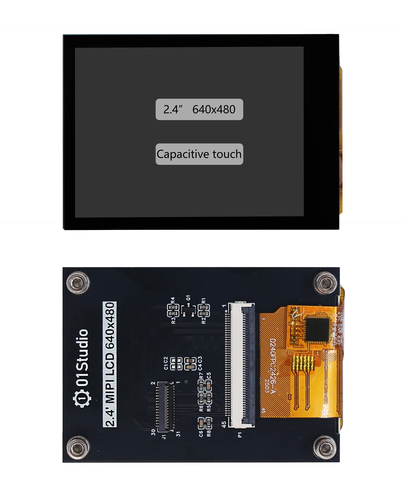

#### Product Parameters

|  Product Parameters |
|  :---:  | ---  |
| Resolution  | 640 x 480（Pixel） |
| Interface | MIPI 2lane|
| Driver IC  | ST7701S | 
| Touch  | CST128 (Capacitive touch) |
| Operating Temperature  | -20℃ ~ 70℃ |

|  Appearance Parameters |
|  :---:  | ---  |
| Size  | 60.3 x 42.7 mm |
| weight  | 26.7g |

### Assembly

The CanMV K230 development board and the 3.5-inch MIPI screen can be connected using the matching 31P cable. **The gold finger contacts of the cable are inserted downwards, as show in the following figure:**

After insertion, press down to lock the buckle:

It can be used in the same direction:

It can also be fixed on the back of the development board using studs:

## Camera

### GC2093
01Studio CanMV K230 development board comes standard with a GC2093 camera (70° viewing angle), and a 140° wide-angle lens version can be purchased additionally.[**Click to Buy>>**](https://www.aliexpress.com/item/3256807959778168.html)

|  Product Parameters |
|  :---:  | ---  |
| Sensor  | GC2093 |
| Resolution | 1920X1080（1080P） |
| viewing angle | 70° (140° Available) | 
| Interface  | 24P |

|  Appearance Parameters |
|  :---:  | ---  |
| Size  | 17mm (Total length) |

### Camera extension cable

The standard GC2093 camera can be extended using an FPC extension cable. 24P, length 15cm.[**Clikc to Buy>>**](https://www.aliexpress.com/item/1005008146010210.html)

### OV5647

[**Click to Buy>>**](https://www.aliexpress.com/item/1005007707000572.html)

01Studio CanMV K230 can connect to the OV5647 camera with CSI0 and CSI1 interfaces. [Tutorial on how to use the multi-channel camera interface>>](../machine_vision/camera.md#multi-channel-camera-interface-usage)

#### Product Parameters

|  Product Parameters |
|  :---:  | ---  |
| Sensor  | OV5647 |
| Resolution | 500万（K230 support up to 1080P with AI）|
| viewing angle   | 72° / 120° | 
| Interface  | 22P-0.5mm FPC |

|  Appearance Parameters |
|  :---:  | ---  |
| Szie  | 6cm/15cm/30cm (Optional length)  |

## USB to Ethernet Cable

Optional accessory, suitable for scenarios where Ethernet connection is required. [Click to Buy>>](https://www.aliexpress.com/item/1005007591736465.html)

[Ethernet Wired Connection Usage Tutorial](../network/ethernet.md)

## Audio adapter cable

CanMV K230 mipi can be converted to a standard 3.5mm audio interface (female) through the matching audio adapter cable. So as to connect to audio playback devices such as speakers. [**Click to Buy>>**](https://www.aliexpress.com/item/1005009040115849.html)

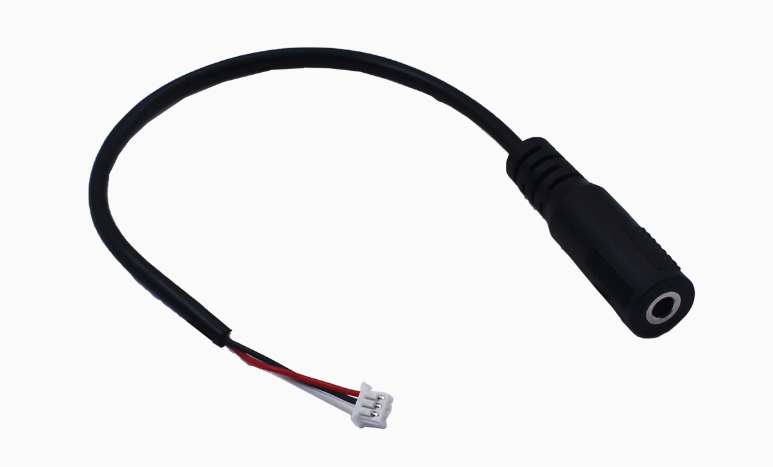

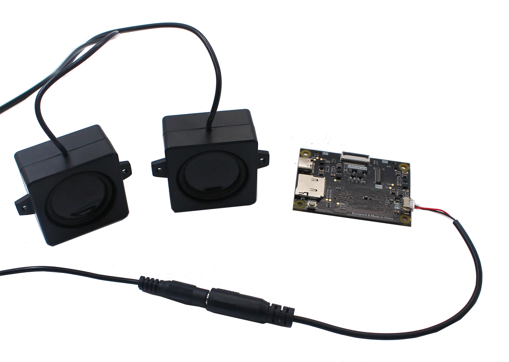