# Accessories installation and use

This section introduces the installation and use of 01Studio CanMV K230 related accessory modules.

## Heat sink

The heat sink can help CanMV K230 dissipate heat more effectively, especially in high temperature environments to achieve stable operation. Installation is also very simple. Tear off the 3M adhesive at the bottom of the heat sink and stick it on the silk screen frame of K230 and memory chip. Because the heat sink is conductive, be careful not to contact other components (capacitors, resistors) on the circuit board during installation to avoid short circuits.

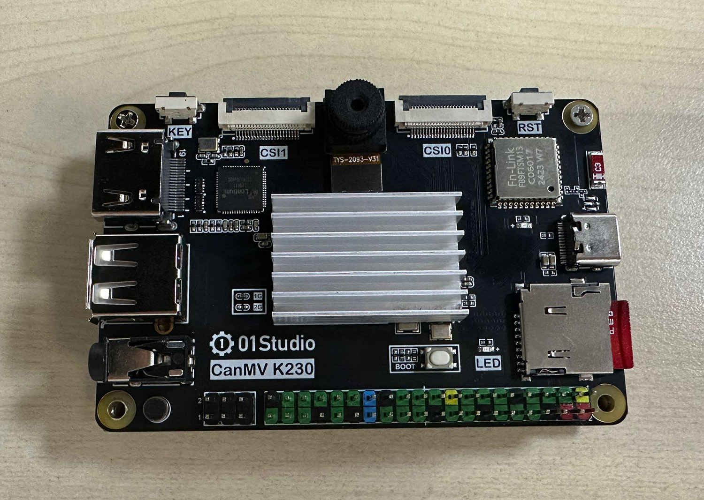

## Acrylic protection plate

The function of the acrylic base plate is to prevent the bottom of the PCB from short-circuiting with other metal objects and to prevent the solder pins from scratching the desktop. At the same time, the space created at the bottom also improves the heat dissipation effect.

The installation method of the CanMV K230 acrylic base plate is very simple. Tear off the acrylic protective film, embed the copper column in the middle, and tighten the upper and lower ends with M2.5 screws.

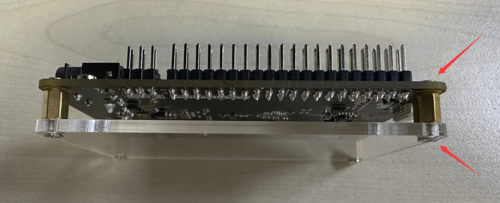

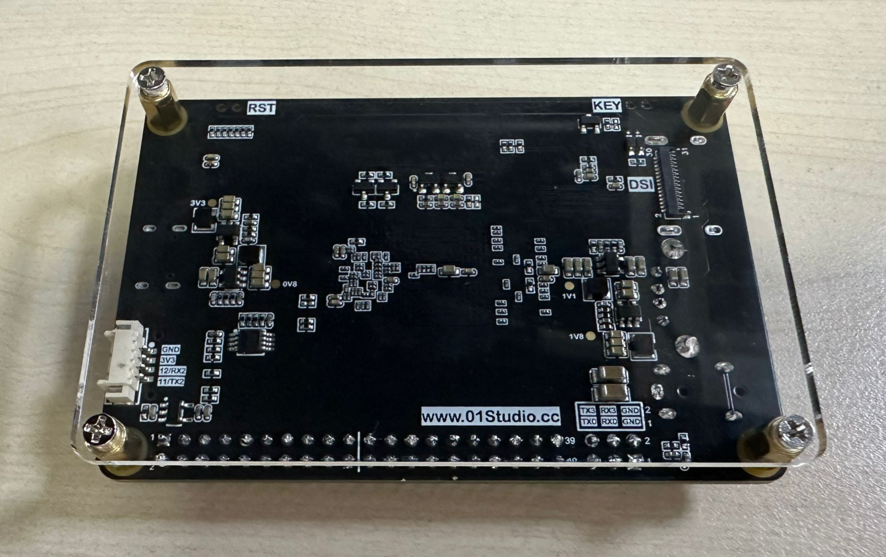

## 3.5 inch MIPI display

[Click to Buy>>](https://www.aliexpress.com/item/1005007579014355.html)

### Function Introduction

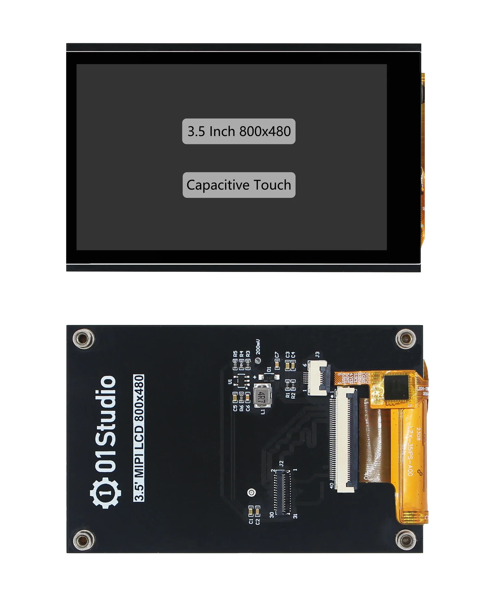

### Product Parameters

|  Product Parameters |
|  :---:  | ---  |
| Resolution  | 800 x 480（Pixel） |
| Interface | MIPI 2lane|
| Driver IC  | ST7701S | 
| Touch  | FT53xx (Capacitive touch) |
| Operating Temperature  | -20℃ ~ 70℃ |

|  Appearance Parameters |
|  :---:  | ---  |
| Size  | 87 x 56 mm |
| weight  | 52g |

### Assembly

The CanMV K230 development board and the 3.5-inch MIPI screen can be connected using the matching 31P cable. **The gold finger contacts of the cable are inserted downwards, as show in the following figure:**

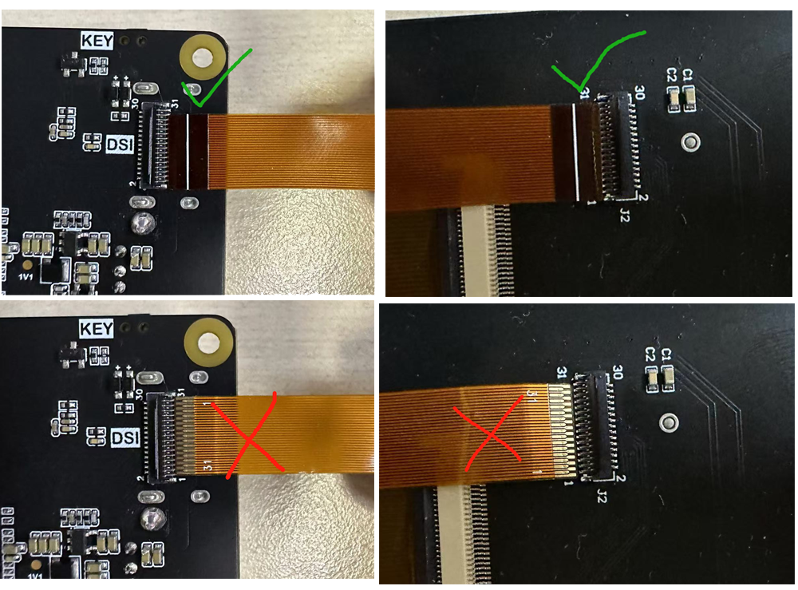

After insertion, press down to lock the buckle:

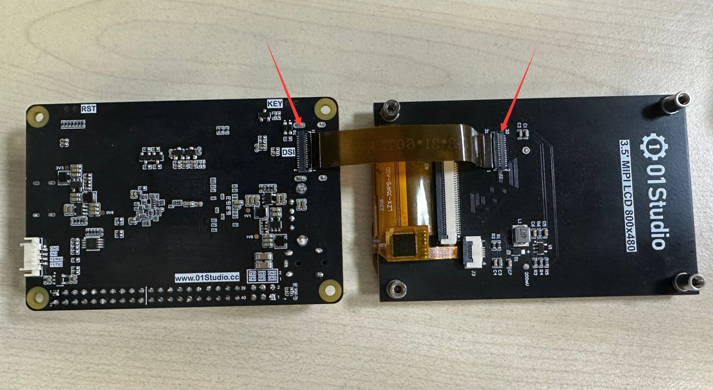

It can be used in the same direction:

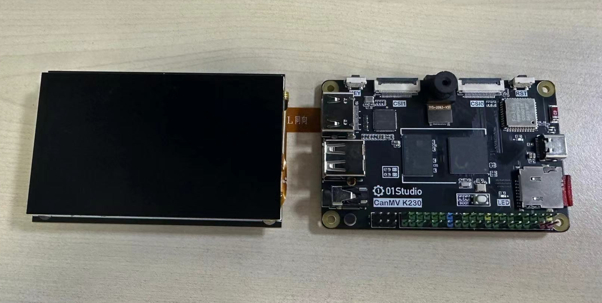

It can also be fixed on the back of the development board using studs:

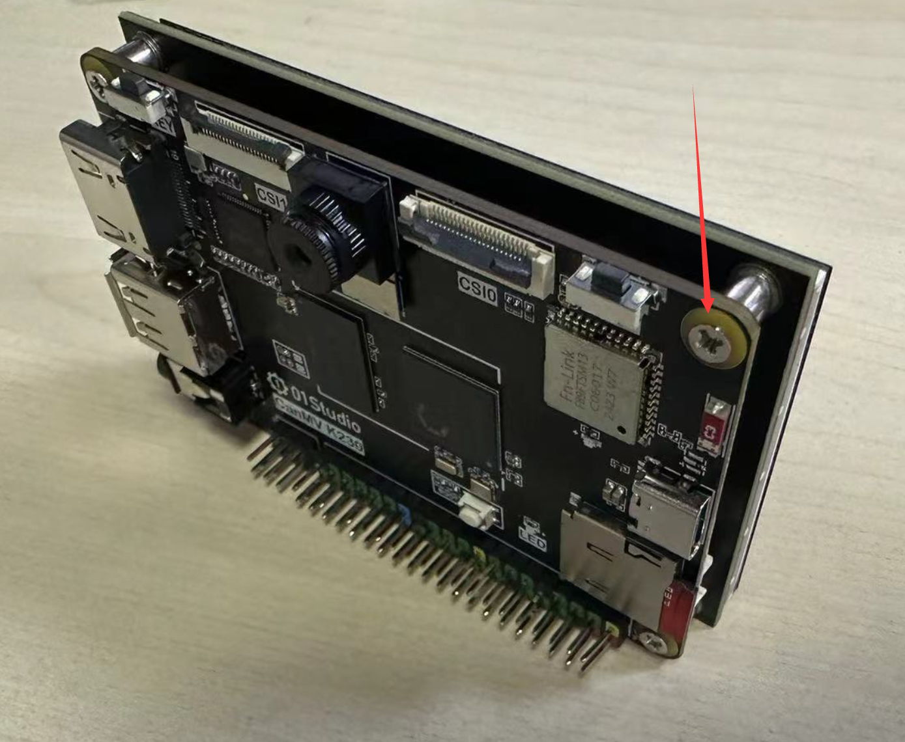

## Camera

### GC2093
01Studio CanMV K230 development board comes standard with a GC2093 camera (70° viewing angle), and a 140° wide-angle lens version can be purchased additionally.[**Click to Buy>>**](https://item.taobao.com/item.htm?id=841926094725)

|  Product Parameters |
|  :---:  | ---  |
| Sensor  | GC2093 |
| Resolution | 1920X1080（1080P） |
| viewing angle | 70° (140° Available) | 
| Interface  | 24P |

|  Appearance Parameters |
|  :---:  | ---  |
| Size  | 17mm (Total length) |

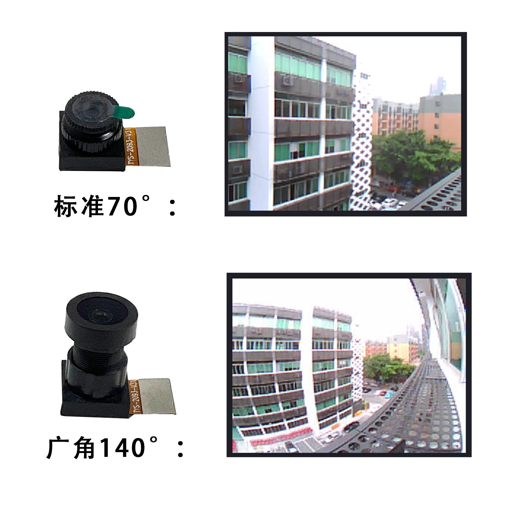

### Camera extension cable

The standard GC2093 camera can be extended using an FPC extension cable. 24P, length 15cm.[**Clikc to Buy>>**](https://item.taobao.com/item.htm?id=843993980296)

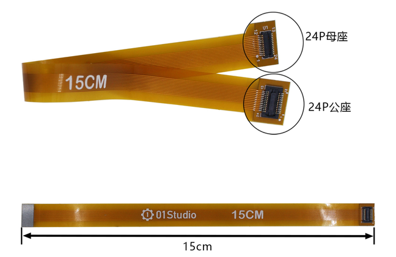

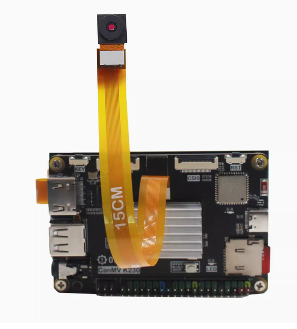

### OV5647

[**Click to Buy>>**](https://www.aliexpress.com/item/1005007707000572.html)

01Studio CanMV K230 can connect to the OV5647 camera with CSI0 and CSI1 interfaces. [Tutorial on how to use the multi-channel camera interface>>](../machine_vision/camera.md#multi-channel-camera-interface-usage)

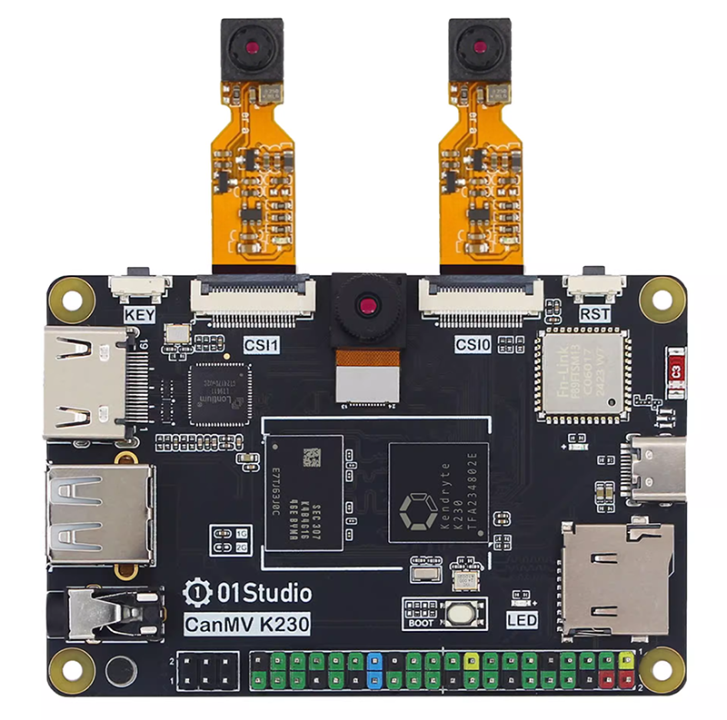

#### Product Parameters

|  Product Parameters |
|  :---:  | ---  |
| Sensor  | OV5647 |
| Resolution | 500万（K230 support up to 1080P with AI）|
| viewing angle   | 72° | 
| Interface  | 22P-0.5mm FPC |

|  Appearance Parameters |
|  :---:  | ---  |
| Szie  | 6cm/15cm/30cm (Optional length)  |

## USB to Ethernet Cable

Optional accessory, suitable for scenarios where Ethernet connection is required. [Click to Buy>>](https://www.aliexpress.com/item/1005007591736465.html)

[Ethernet Wired Connection Usage Tutorial](../network/ethernet.md)

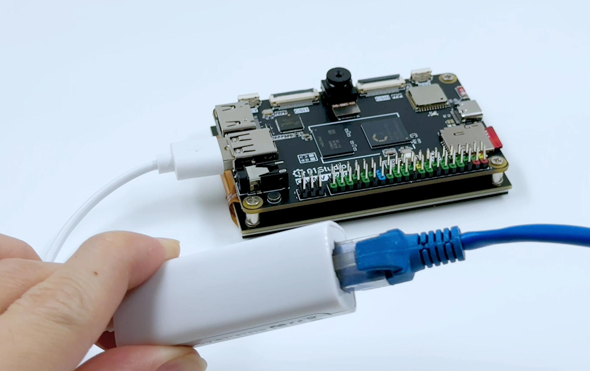