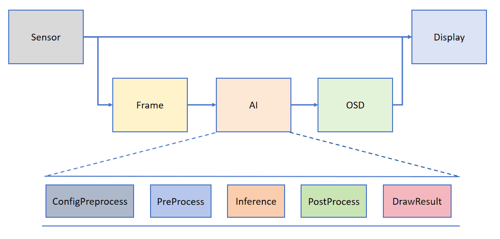

# AI Vision Development Framework

The previous color recognition and QR code recognition all use some simple image processing functions, while more advanced machine vision requires the use of KPU. It can be simply classified as a computer GPU (graphics card), which essentially realizes high-speed image data calculation.

Let's briefly introduce the KPU of K230. KPU is a neural network processor inside K230. It can realize convolutional neural network calculation under low power consumption, obtain the size, coordinates and type of the detected target in real time, and detect and classify faces or objects. **K230 KPU supports INT8 and INT16. The measured reasoning ability under typical networks can reach 13.7 times that of K210, and the MAC utilization rate exceeds 70%. **

In order to help users simplify the development of the AI ​​part, CanMV officially built a matching AI vision development framework based on K230. The framework structure is shown in the figure below:

In simple terms, this framework outputs two images by default from the sensor (camera), one in YUV420 format, which is directly displayed on the display; the other in RGB888 format, which is processed by the AI ​​part. AI mainly implements the pre-processing, reasoning and post-processing processes of the task. After obtaining the post-processing results, it is drawn on the osd image instance and sent to the display for superposition. Finally, the recognition results are displayed on the HDMI, LCD or IDE buffer.

The advantage of this framework is that users can directly implement their own functions based on the processing results. At the same time, AI mainly implements the pre-processing, reasoning and post-processing processes of the task through Python code, which is convenient for users to conduct in-depth secondary development. It fully meets the needs of different users and developers.

The main API interfaces of the AI ​​visual development framework are:

- `PineLine` : Encapsulate the sensor and display into a fixed interface for image acquisition, drawing, and result image display.[Click to view detailed description](https://www.kendryte.com/k230_canmv/main/zh/example/ai/AI_Demo%E8%AF%B4%E6%98%8E%E6%96%87%E6%A1%A3.html#pipeline)

- `Ai2d` : Preprocessing related interfaces. [Click to view detailed introduction](https://www.kendryte.com/k230_canmv/main/zh/example/ai/AI_Demo%E8%AF%B4%E6%98%8E%E6%96%87%E6%A1%A3.html#ai2d)

- `AIBase` : Main interface for model reasoning. [Click here for detailed description](https://www.kendryte.com/k230_canmv/main/zh/example/ai/AI_Demo%E8%AF%B4%E6%98%8E%E6%96%87%E6%A1%A3.html#aibase)

The AI ​​vision routines in this chapter all implement their main functions through the above interfaces.