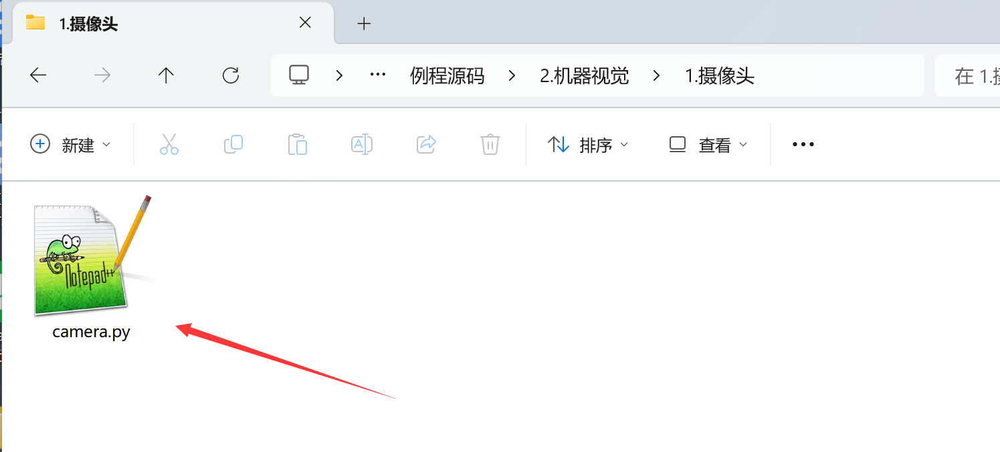
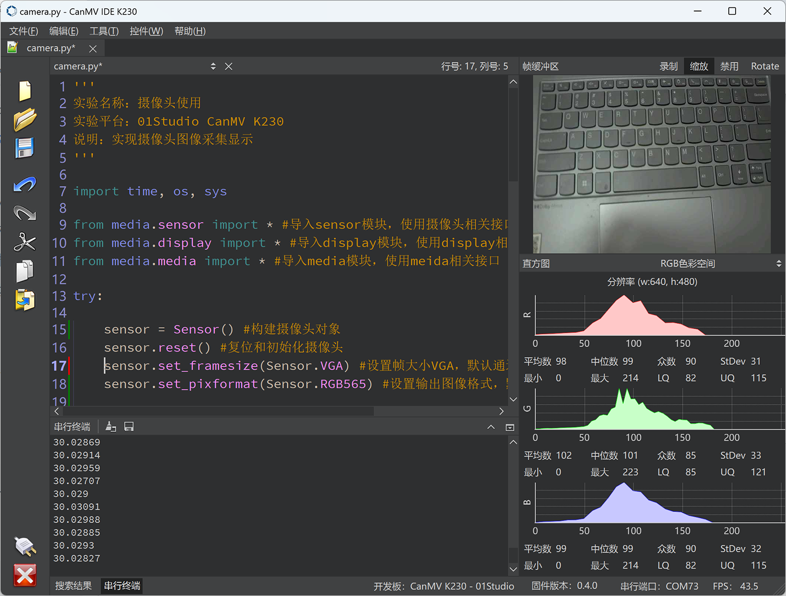
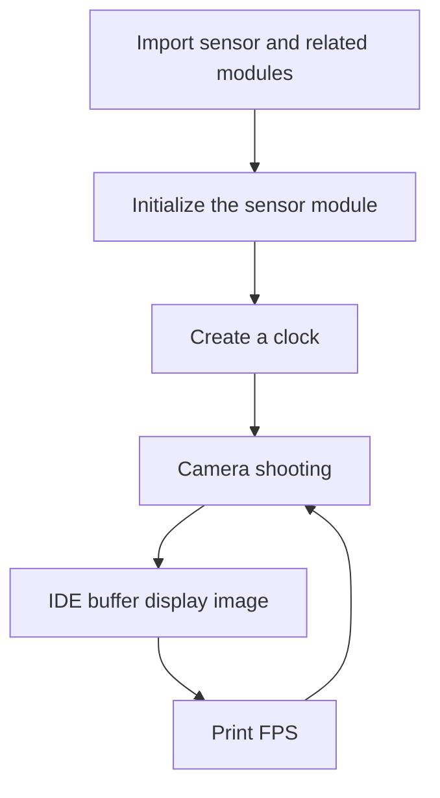
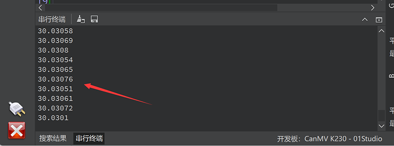
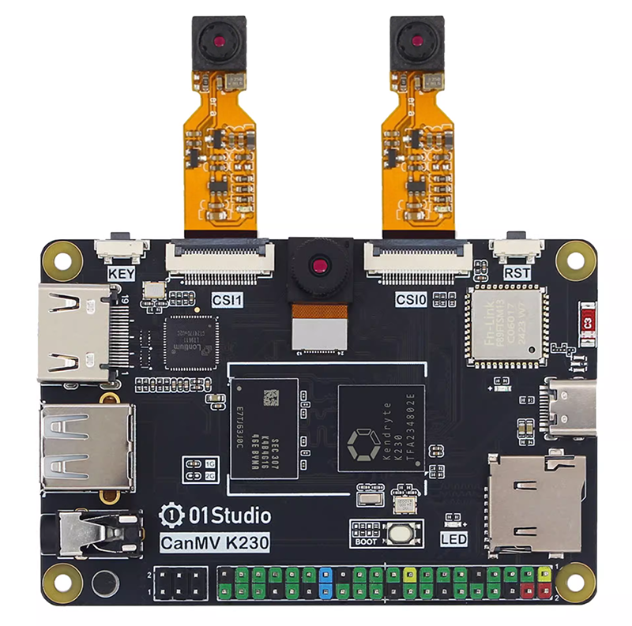
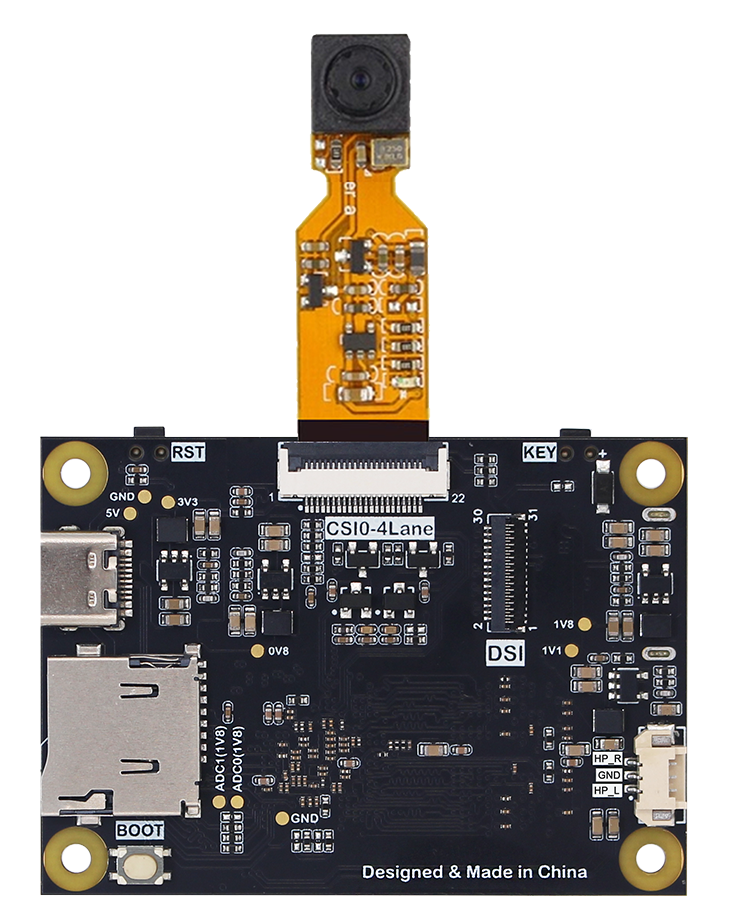

# Camera

## Foreword
From the previous basic experiments, we are familiar with the programming method of K230 based on MicroPython, but that can be said to be only the tip of the iceberg of K230's performance application. The camera is the basis of the entire machine vision application. Today we will use the sample code to see how CanMV K230 uses the camera.

## Experiment Purpose
Learn how to use the K230 camera.

## Experimental Explanation

In CanMV IDE, open the `camera.py` file in the directory of <u>01Studio MicroPython Develop Kits (Base on CanMV K230) Resources_2024-11-8\02-Codes\2.Machine Vision\1.Camera</u>



After opening, we can find relevant codes in the edit box. We can run the code directly to see the experimental phenomenon. Connect CanMV K230 and click Run. The image collected by the camera in real time will appear above the right picture.



CanMV K230 uses the camera module to realize the camera image acquisition function. The K230 hardware supports 3-way sensor input (CSI interface). Each sensor device can independently complete the image data acquisition and capture processing, and can output 3-way image data at the same time. As shown below:


`sensor 0，sensor 1，sensor 2`: 3 Physical Sensors；

`Camera Device 0，Camera Device 1，Camera Device 2`: 3 Sofeware Sensors；

`output channel 0，output channel 1，output channel 2`:sensor's 3 channel to Output.

The 3 sensors can be mapped to different sensor devices through software configuration.


## class Sensor

### Constructors
```python
from media.sensor import * #Import the sensor module and use the camera API

sensor = Sensor(id,[width, height, fps])
```
Construct a camera object. Currently supported camera models are: GC2093、OV5647
- `id`: CSI ID。
    - `0` : CSI0；
    - `1` : CSI1；
    - `2` : CSI2；Default, the camera on the development board.

- `width`: Optional parameter, the width of the image collected by the sensor. default: 1920；
- `height`: Optional parameter, sensor acquisition image height. Default: 1080；
- `fps`: Optional parameter, sensor maximum frame rate. Default: 30；

### Methods

```python
sensor.reset()
```
reset the Camera.

<br></br>

```python
sensor.set_framesize(framesize = FRAME_SIZE_INVAILD, [width, height],chn = CAM_CHN_ID_0, alignment=0, **kwargs)
```
Set the output image size for each channel.

- `framesize`: Channel image output size. Some common sizes are listed below. Custom sizes can be set via the `[width, height]` parameters, such as:** width=800, height=480** 。Note that `framesize` and `[width, height]` can only be set in one or the other way.
    - `sensor.QQVGA` : 320x240
    - `sensor.QVGA` : 320x240
    - `sensor.VGA` : 640x480;
    - `Sensor.FHD` : 1920x1080;
    - `Sensor.HD` : 1280x720;

- `chn`: Channel number. Each camera device has 3 channels.
    - `CAM_CHN_ID_0` : channel 0；
    - `CAM_CHN_ID_1` : channel 1；
    - `CAM_CHN_ID_2` : channel 2；

<br></br>

```python
sensor.set_pixformat(pixformat, chn = CAM_CHN_ID_0)
```
Sets the image pixel format.
- `pixformat`: format。
    - `sensor.GRAYSCALE` : Grayscale images, 8 bits (1 byte) per pixel, are fast to process.
    - `sensor.RGB565` : Each pixel is 16 bits (2 bytes), 5 bits for red, 6 bits for green, and 5 bits for blue, and the processing speed is slower than grayscale images.
    - `sensor.RGB888` 
    - `sensor.RGBP888` 
    - `sensor.YUV420SP` 

- `chn`: Channel number. Each camera device has 3 channels.
    - `CAM_CHN_ID_0` : channel 0；
    - `CAM_CHN_ID_1` : channel 1；
    - `CAM_CHN_ID_2` : channel 2；

<br></br>

```python
sensor.set_hmirror(enable)
```
Set the camera image to mirror horizontally.
- `enable`: set value.
    - `1` : enable horizontal mirroring；
    - `0` : disable horizontal mirroring.

<br></br>

```python
sensor.set_vflip(enable)
```
Set the camera image to flip vertically.
- `enable`: set value.
    - `1` : enable vertical flip;
    - `0` : disable vertical flip;

**Tip: You can achieve any image transformation by setting the camera's horizontal mirroring and vertical flipping combination. **

<br></br>

```python
sensor.run()
```
Start the Sensor.

<br></br>


```python
sensor.snapshot()
```
Take a picture and return an image object.


For more usage, please refer to:[CanMV K230 Docs](https://www.kendryte.com/k230_canmv/main/zh/api/mpp/K230_CanMV_Sensor%E6%A8%A1%E5%9D%97API%E6%89%8B%E5%86%8C.html#)

## class clock

Let's take a look at the clock module used in this example to calculate FPS (frames per second).

### Constructors
```python
clock=time.clock()
```
Construct a clock object.

### Methods
```python
clock.tick()
```
Start tracking run time.

<br></br>

```python
clock.fps()
```
Stops tracking elapsed time and returns the current FPS (frames per second). **Always call clock.tick() before calling this function.**

<br></br>

This section also contains the CanMV IDE buffer image display code, which will be explained in detail in the next section. This section mainly describes the use of the camera. Let's take a look at the code writing flow chart:




## Codes

```python
'''
Demo Name：Camera
Platform：01Studio CanMV K230
Description: Realize camera image acquisition and display
Tutorial：wiki.01studio.cc
'''

import time, os, sys

from media.sensor import * #Import the sensor module and use the camera API
from media.display import * #Import the display module and use display API
from media.media import * #Import the media module and use meida API

sensor = Sensor() #Constructing a camera object
sensor.reset() #reset the Camera
sensor.set_framesize(Sensor.FHD) #Set frame size to FHD (1920x1080), default channel 0
sensor.set_pixformat(Sensor.RGB565) #Set the output image format, channel 0

#Use IDE buffer to output images, the display size is consistent with sensor configuration.
Display.init(Display.VIRT, sensor.width(), sensor.height())

MediaManager.init() #Initialize the media resource manager

sensor.run() #Start the camera

clock = time.clock()

while True:

    ####################
    ## Write codes here
    ####################
    clock.tick()

    img = sensor.snapshot() #Take a picture

    Display.show_image(img) #Show the Picture

    print(clock.fps()) #FPS

```

## Experimental Results

Click to run the code, and you can see the real-time camera shooting status displayed on the right and the RGB color histogram displayed below.


Click the serial terminal in the lower left corner, and you can see the current FPS (frames per second) value is about 30 frames in real time.




Through this experiment, we understand the principles and applications of the camera sensor module and the time module. We can see that CanMV encapsulates the camera function into a sensor module, and users can use it easily without having to pay attention to the underlying code.

## Multi-channel camera interface usage

In addition to the GC2093 (60FPS) camera that comes stand ard with the CSI2 interface, the 01Tech CanMV K230 can also connect external cameras via the CSI0 and CSI1 interfaces. The currently supported external cameras are:

- OV5647 (1080P 30FPS). 3 lengths are available: 6cm/15cm/30cm. [**Click to Buy>>**](https://www.aliexpress.com/item/1005007707000572.html)

**CanMV K230 supports CSI0 (2lane) and CSI1 (2lane) two-way expansion. **


**CanMV K230 mini supports CSI0 (4lane, compatible with 2lane) 1-way expansion. **


The usage is very simple. You only need to configure the `id` parameter during initialization based on the above sample code.

# CSI0 interface
```python
    ...
    sensor = Sensor(id=0) #id=0 means using the camera on the CSI0 interface
    ...
```
# CSI1 interface

```python
    ...
    sensor = Sensor(id=1) #id=1 means using the camera on the CSI1 interface
    ...
```

