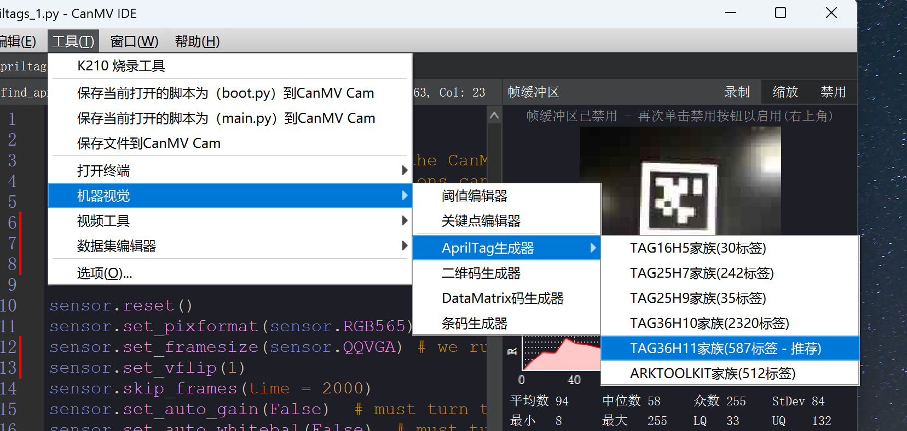
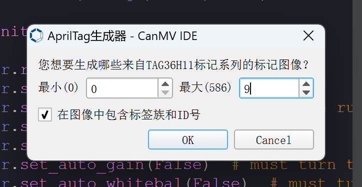
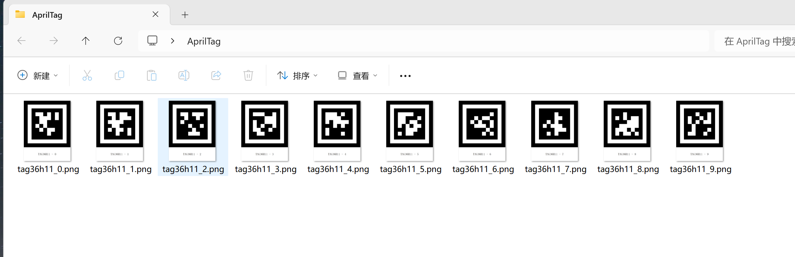
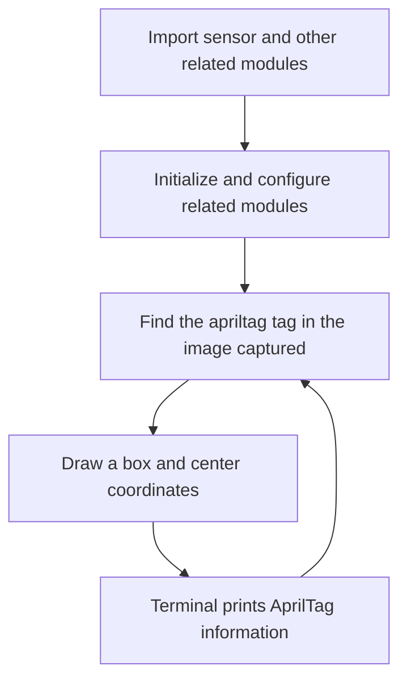
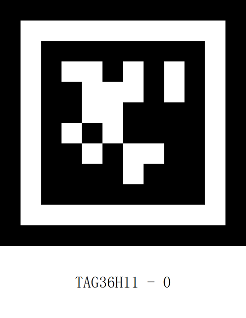
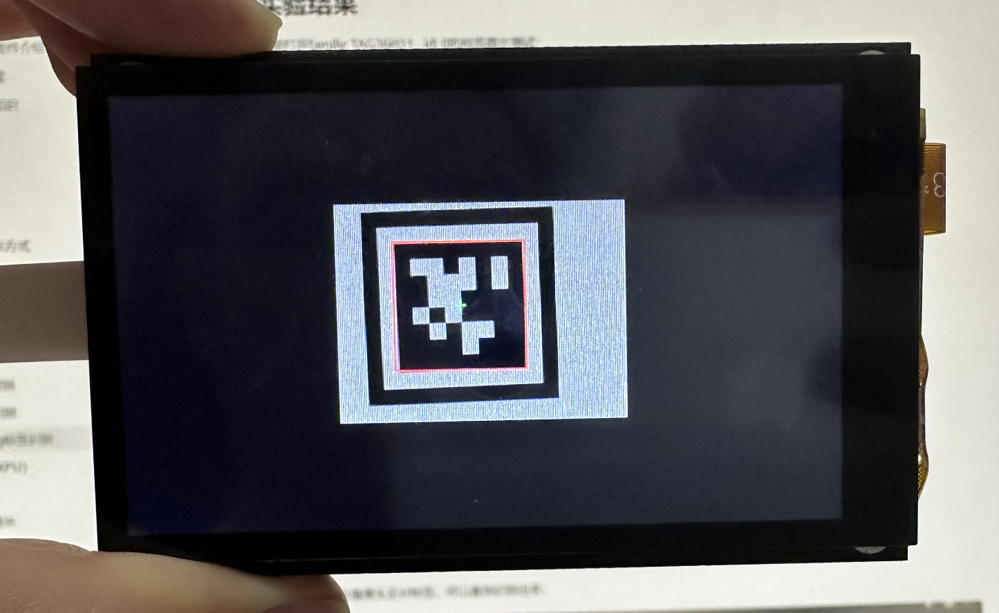
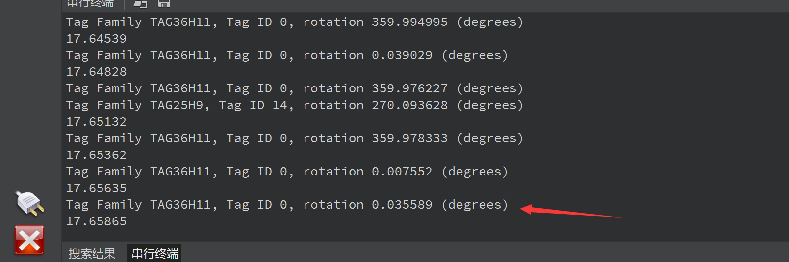

# AprilTag recognition

## Foreword
**AprilTag** is a visual fiducial system that can be used for a variety of tasks, including augmented reality, robotics, and camera calibration. Targets can be created with a regular printer, and the AprilTag inspection software calculates the tag's precise 3D position, orientation, and identity relative to the camera.

AprilTag official website introduction：https://april.eecs.umich.edu/software/apriltag.html

## Experiment Purpose
Program to recognize AprilTag and print the recognized information through the serial terminal.

## Experimental Explanation

### AprilTag Types

AprilTag can be simply understood as a **QR code** of specific information, with two concepts: `family` and `ID`:

- `TAG16H5` → 0 to 29
- `TAG25H7` → 0 to 241
- `TAG25H9` → 0 to 34
- `TAG36H10` → 0 to 2319
- `TAG36H11` → 0 to 586 (CanMV K230 is recommended)
- `ARTOOLKIT` → 0 to 511

Taking [`TAG36H11` → 0 to 586] as an example, the family information is: TAG36H11, and the ID can be "0 to 586", which means there are 587 marker codes in total.

**Differences between different families: **The effective area of ​​TAG16H5 is a 4x4 square, so it can see farther than TAG36H11 (because it has 6x6 squares). But the content is less, so the error rate of TAG16H5 is much higher than that of TAG36H11, because TAG36H11 has more verification information. CanMV K210 recommends using the marker code of the TAG36H11 family.

### AprilTag Generation

You can generate AprilTag in CanMV IDE. Click **Tools--Machine Vision--AprilTag Generator--TAG36H11 Family:**



The minimum input is 0 and the maximum input is 9. Create 10 labels with IDs from 0 to 9.



Click OK and select the location folder to be generated:



## class find_apriltags

To identify apriltag, use the find_apriltags object function. The specific instructions are as follows:

### Constructors
```python
image.find_apriltags([roi[, families=image.TAG36H11[, fx[, fy[, cx[, cy]]]]]])
```
Find all apriltags in the roi area and return a list of `image.apriltags` objects.

### Methods

The above function returns a list of `image.apriltags` objects.

```python
tag.rect()
```
Returns a rectangle tuple (x, y, w, h) that represents the border of the QR code. You can get a single value by indexing [0-3] .

<br></br>

```python
tag.cx()
```
Returns the center x coordinate.

<br></br>

```python
tag.cy()
```
Returns the center y coordinate
<br></br>

```python
tag.family()
```
Family information.

<br></br>

```python
tag.id()
```
ID information.

<br></br>

```python
tag.rotation()
```
direction.

<br></br>

The code writing process is shown in the figure below:



## Codes

```python
'''
Demo Name：AprilTags recognition
Platform：01Studio CanMV K230
Tutorial：wiki.01studio.cc/en
Note: It is recommended to use QVGA (320x240) resolution. If the resolution is too high, the frame rate will drop.
'''

import time, math, os, gc

from media.sensor import * #Import the sensor module and use the camera API
from media.display import * #Import the display module and use display API
from media.media import * #Import the media module and use meida API


# The apriltag code supports processing up to 6 tag families at the same time.
# The returned tag object will have its tag family and its id within the tag family.

tag_families = 0
tag_families |= image.TAG16H5 # Comment out to disable this family
tag_families |= image.TAG25H7 # Comment out to disable this family
tag_families |= image.TAG25H9 # Comment out to disable this family
tag_families |= image.TAG36H10 # Comment out to disable this family
tag_families |= image.TAG36H11 # Comment out to disable this family (default family)
tag_families |= image.ARTOOLKIT # Comment out to disable this family

#What is the difference between tag families? So, for example, the TAG16H5 family is actually a 4x4 square tag.
#So, this means that it can be seen at a longer distance than the 6x6 TAG36H11 tag.
#However, the lower H value (H5 vs. H11), means that the false positive rate of the 4x4 tag is much higher than the 6x6 tag.
# So, unless you have a reason to use another tag family, use the default family TAG36H11.

def family_name(tag):
    if(tag.family() == image.TAG16H5):
        return "TAG16H5"
    if(tag.family() == image.TAG25H7):
        return "TAG25H7"
    if(tag.family() == image.TAG25H9):
        return "TAG25H9"
    if(tag.family() == image.TAG36H10):
        return "TAG36H10"
    if(tag.family() == image.TAG36H11):
        return "TAG36H11"
    if(tag.family() == image.ARTOOLKIT):
        return "ARTOOLKIT"


sensor = Sensor(width=1280, height=960) #Build a camera object and set the camera's length and width to 4:3
sensor.reset() # reset the Camera
sensor.set_framesize(width=320, height=240) # Set the frame size to LCD resolution, channel 0
sensor.set_pixformat(Sensor.RGB565) # Set the output image format, channel 0

#Use 3.5-inch mipi screen and IDE buffer to display images at the same time
Display.init(Display.ST7701, to_ide=True) 
#Display.init(Display.VIRT, sensor.width(), sensor.height()) ##Use only the IDE buffer to display images

MediaManager.init() #Initialize the media resource manager

sensor.run() #Start the camera

clock = time.clock()

while True:

    ####################
    ## Write codes here
    ####################
    clock.tick()

    img = sensor.snapshot() # Take a picture


    for tag in img.find_apriltags(families=tag_families): # If no family is given, TAG36H11 is the default.

            img.draw_rectangle(tag.rect(), color = (255, 0, 0), thickness=4)
            img.draw_cross(tag.cx(), tag.cy(), color = (0, 255, 0), thickness=2)
            print_args = (family_name(tag), tag.id(), (180 * tag.rotation()) / math.pi) #Print label information
            print("Tag Family %s, Tag ID %d, rotation %f (degrees)" % print_args)
            
    #Display.show_image(img) # Display images

    #Display pictures, LCD centered display
    Display.show_image(img, x=round((800-sensor.width())/2),y=round((480-sensor.height())/2)) #显示图片

    print(clock.fps()) #FPS
```

## Experimental Results

Here we open the tag image test of family: TAG36H11, id: 0:



Run the program and point the camera at the tag, and you can see that it is recognized:



The IDE serial terminal displays the recognition result:

