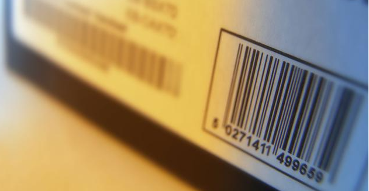
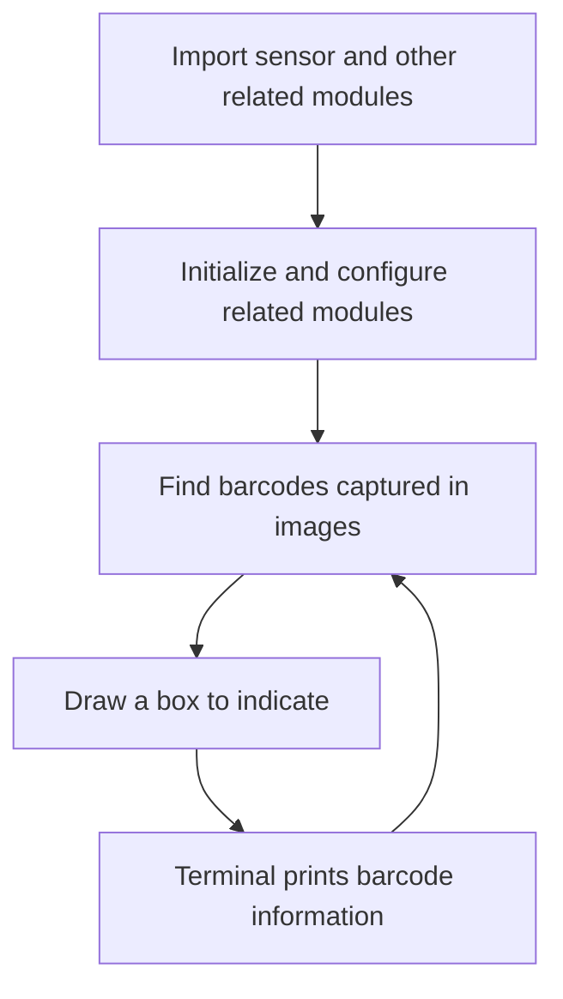
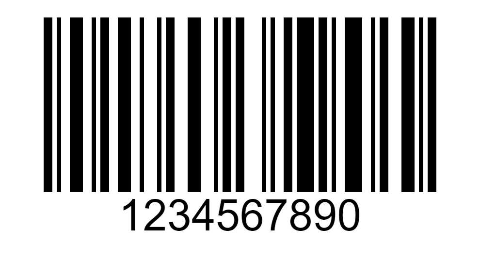
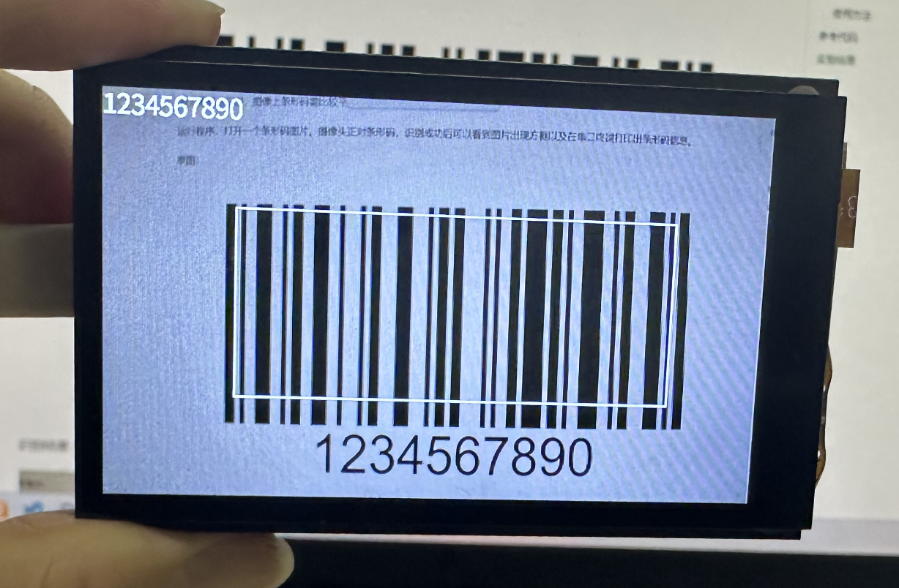

# Barcode recognition

## Foreword

A barcode is a graphic identifier that expresses a set of information by arranging multiple black bars and spaces of varying widths according to certain coding rules. Common barcodes are parallel lines formed by black bars (referred to as bars) and white bars (referred to as spaces) with very different reflectivity. Barcodes can indicate a lot of information such as the country of production, manufacturer, product name, production date, book classification number, mail origin and destination, category, date, etc., and are therefore widely used in many fields such as commodity circulation, book management, postal management, and banking systems.



## Experiment Purpose

Program to realize barcode recognition and print the recognized information through the serial port terminal.

## Experimental Explanation

For CanMV K230, you can directly use find_barcodes() in MicroPython to obtain relevant information about the barcode in the image captured by the camera. This function supports all one-dimensional barcodes:

image.EAN2 <br></br>
image.EAN5 <br></br>
image.EAN8 <br></br>
image.UPCE <br></br>
image.ISBN10 <br></br>
image.UPCA <br></br>
image.EAN13 <br></br>
image.ISBN13 <br></br>
image.I25 <br></br>
image.DATABAR (RSS-14) <br></br>
image.DATABAR_EXP (RSS-Expanded) <br></br>
image.CODABAR image.CODE39 <br></br>
image.PDF417 image.CODE93 <br></br>
image.CODE128 <br></br>

The specific instructions are as follows:

## class find_barcodes

### Constructors
```python
image.find_barcodes([roi])
```
Find all barcodes within the roi region and return a list of image.barcode objects.

### Methods

The above function returns a list of image.barcode objects.

```python
barcode.rect()
```
Returns a rectangle tuple (x, y, w, h) that represents the border of the barcode. You can get a single value by indexing [0-3].

<br></br>

```python
barcode.payload()
```
Returns the barcode string information. You can get this value by indexing [4].

<br></br>

```python
barcode.type()
```
Returns the barcode type.

<br></br>

For more usage, please read the official documentation:：<br></br>
https://developer.canaan-creative.com/k230_canmv/main/zh/api/openmv/image.html#find-barcodes

<br></br>

As can be seen from the table above, using MicroPython programming we only need to simply call the find_barcodes() function and process the results, which is very convenient. The code writing process is shown in the figure below:



## Codes

```python
'''
Demo Name：Barcode recognition
Platform：01Studio CanMV K230
Tutorial：wiki.01studio.cc
'''

import time, math, os, gc

from media.sensor import * #Import the sensor module and use the camera API
from media.display import * #Import the display module and use display API
from media.media import * #Import the media module and use meida API

#Define barcode type
def barcode_name(code):
    if(code.type() == image.EAN2):
        return "EAN2"
    if(code.type() == image.EAN5):
        return "EAN5"
    if(code.type() == image.EAN8):
        return "EAN8"
    if(code.type() == image.UPCE):
        return "UPCE"
    if(code.type() == image.ISBN10):
        return "ISBN10"
    if(code.type() == image.UPCA):
        return "UPCA"
    if(code.type() == image.EAN13):
        return "EAN13"
    if(code.type() == image.ISBN13):
        return "ISBN13"
    if(code.type() == image.I25):
        return "I25"
    if(code.type() == image.DATABAR):
        return "DATABAR"
    if(code.type() == image.DATABAR_EXP):
        return "DATABAR_EXP"
    if(code.type() == image.CODABAR):
        return "CODABAR"
    if(code.type() == image.CODE39):
        return "CODE39"
    if(code.type() == image.PDF417):
        return "PDF417"
    if(code.type() == image.CODE93):
        return "CODE93"
    if(code.type() == image.CODE128):
        return "CODE128"


sensor = Sensor() #Constructing a camera object
sensor.reset() # reset the Camera
sensor.set_framesize(width=800, height=480) # Set the frame size to LCD resolution (800x480), channel 0
sensor.set_pixformat(Sensor.RGB565) # Set the output image format, channel 0

#Use 3.5-inch mipi screen and IDE buffer to display images at the same time, 800x480 resolution
Display.init(Display.ST7701, to_ide=True) 
#Display.init(Display.VIRT, sensor.width(), sensor.height()) ##Use only the IDE buffer to display images

MediaManager.init() #Initialize the media resource manager

sensor.run() #Start the camera

clock = time.clock()

while True:

    ####################
    ## Write codes here
    ####################
    clock.tick()

    img = sensor.snapshot() # Take a picture

    codes = img.find_barcodes() # Find all barcodes in an image

    for code in codes:

        #Draw a rectangle to represent the barcode
        img.draw_rectangle(code.rect(),thickness=2)

        #Print related information
        print_args = (barcode_name(code), code.payload(), (180 * code.rotation()) / math.pi, code.quality())
        print("Barcode %s, Payload \"%s\", rotation %f (degrees), quality %d" % print_args)

        img.draw_string_advanced(0, 0, 30, code.payload(), color = (255, 255, 255)) #Image display barcode information

    Display.show_image(img) #Display images

    print(clock.fps()) #FPS
```

## Experimental Results

For better recognition, the barcode on the image needs to be relatively flat and not too small.

Run the program and open a barcode image. The camera faces the barcode. After successful recognition, you can see a box appear in the image and the barcode information is printed on the serial terminal.

Original image:



Identification results:



Detailed information of barcode printed by serial terminal:


Barcodes are widely used in daily life. With the experimental skills learned in this section, we can easily create a barcode scanner of our own.