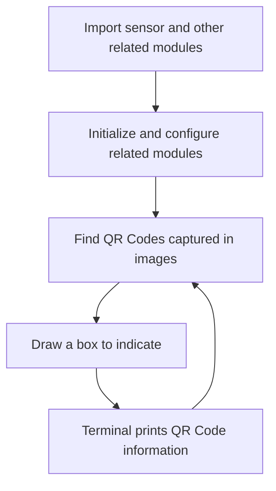
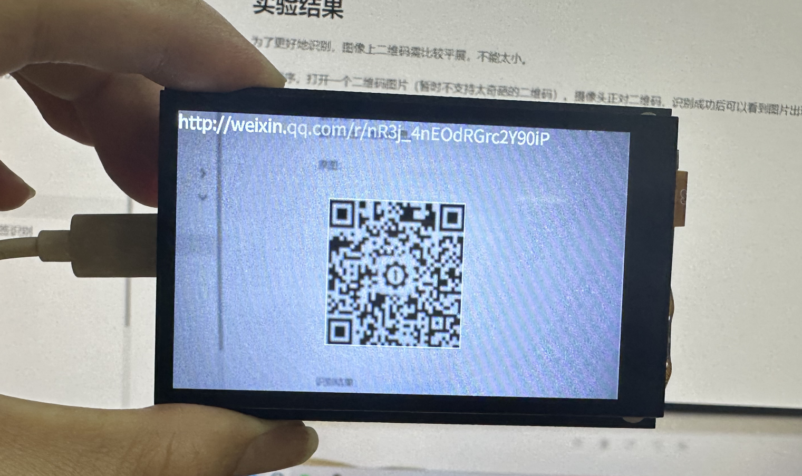
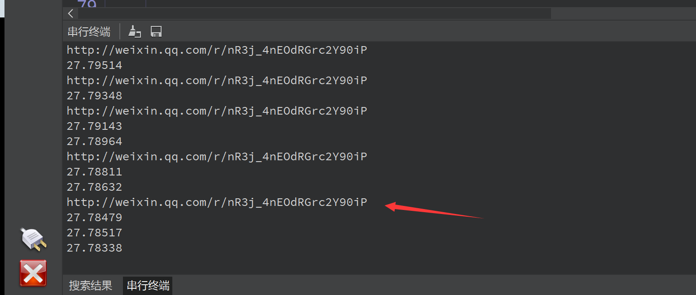

# QR Code recognition

## Foreword
I believe everyone knows about QR codes, especially nowadays when scanning code for payment is becoming more and more popular, QR codes are widely used. Today we will learn how to use the CanMV K230 development kit to realize QR code information recognition.

## Experiment Purpose
Program to realize QR code recognition and print out the recognized information through the serial port terminal.

## Experimental Explanation

QR code is also called two-dimensional barcode. QR stands for Quick Response. It is a very popular encoding method on mobile devices in recent years. It can store more information than traditional Bar Code and can also represent more data types.

Two-dimensional barcode/two-dimensional code (2-dimensional bar code) is a black and white graphic that records data symbol information distributed in a plane (two-dimensional direction) according to a certain pattern with a certain geometric figure; in the code compilation, the concept of "0" and "1" bit streams that constitute the internal logic basis of the computer is cleverly used, and several geometric figures corresponding to binary are used to represent text numerical information. It is automatically read by image input devices or photoelectric scanning devices to realize automatic information processing: it has some common features of barcode technology: each code system has its own specific character set; each character occupies a certain width; it has certain verification functions, etc. At the same time, it also has the function of automatically identifying information in different rows and processing graphic rotation change points.

For CanMV K230, directly use find_qrcodes() in MicroPython to obtain the relevant information of the QR code in the image captured by the camera. The specific instructions are as follows:

## class find_qrcodes

### Constructors
```python
image.find_qrcodes([roi])
```
Find all QR codes in the roi area and return a list of `image.qrcode` objects

### Methods

The above function returns a list of image.qrcode objects.

```python
qrcode.rect()
```
Returns a rectangle tuple (x, y, w, h) that represents the border of the QR code. You can get a single value by indexing [0-3].

<br></br>

```python
qrcode.payload()
```
Returns the QR code string information. You can get this value by indexing [4].

<br></br>

```python
qrcode.verison()
```
Returns the QR code version number.

<br></br>

For more usage, please read the official documentation: <br></br>
https://developer.canaan-creative.com/canmv/main/canmv/library/canmv/image.html#find-qrcodes

<br></br>

As can be seen from the table above, using MicroPython programming we only need to simply call the find_qrcodes() function and process the results, which is very convenient. The code writing process is shown in the figure below:



## Codes

```python
'''
Demo Name：QR Code recognition
Platform：01Studio CanMV K230
Tutorial：wiki.01studio.cc
'''

import time, math, os, gc

from media.sensor import * #Import the sensor module and use the camera API
from media.display import * #Import the display module and use display API
from media.media import * #Import the media module and use meida API

try:

    sensor = Sensor() #Constructing a camera object
    sensor.reset() # reset the Camera
    sensor.set_framesize(width=800, height=480) # Set the frame size to LCD resolution (800x480), channel 0
    sensor.set_pixformat(Sensor.RGB565) # Set the output image format, channel 0
    
    #Use 3.5-inch mipi screen and IDE buffer to display images at the same time, 800x480 resolution
    Display.init(Display.ST7701, to_ide=True) 
    #Display.init(Display.VIRT, sensor.width(), sensor.height()) ##Use only the IDE buffer to display images

    MediaManager.init() #Initialize the media resource manager

    sensor.run() #Start the camera

    clock = time.clock()

    while True:

        os.exitpoint() #Detect IDE interrupts

        ####################
        ## Write codes here
        ####################
        clock.tick()

        img = sensor.snapshot() # Take a picture


        res = img.find_qrcodes() #Find QR Code

        if len(res) > 0: 
        
            #Display QR code information in images and terminals
            img.draw_rectangle(res[0].rect(), thickness=2)
            img.draw_string_advanced(0, 0, 30, res[0].payload(), color = (255, 255, 255))

            print(res[0].payload()) #Print QR code information on the serial terminal

        Display.show_image(img) #Display images

        print(clock.fps()) #FPS

##############################################
# IDE interrupts the release of resource code
##############################################
except KeyboardInterrupt as e:
    print(f"user stop")
except BaseException as e:
    print(f"Exception '{e}'")
finally:
    # sensor stop run
    if isinstance(sensor, Sensor):
        sensor.stop()
    # deinit display
    Display.deinit()

    os.exitpoint(os.EXITPOINT_ENABLE_SLEEP)
    time.sleep_ms(100)

    # release media buffer
    MediaManager.deinit()

```

## Experimental Results

For better recognition, the QR code on the image needs to be relatively flat and not too small.

Run the program and open a QR code image (complex QR codes are not supported for the time being). The camera faces the QR code. After successful recognition, a box will appear on the image and the QR code information will be printed on the serial terminal.

Original image:


Identification results:



Detailed information of the QR code printed by the serial terminal:



QR codes are widely used in daily life. With the experimental skills in this section, we can easily create a QR code scanner of our own.