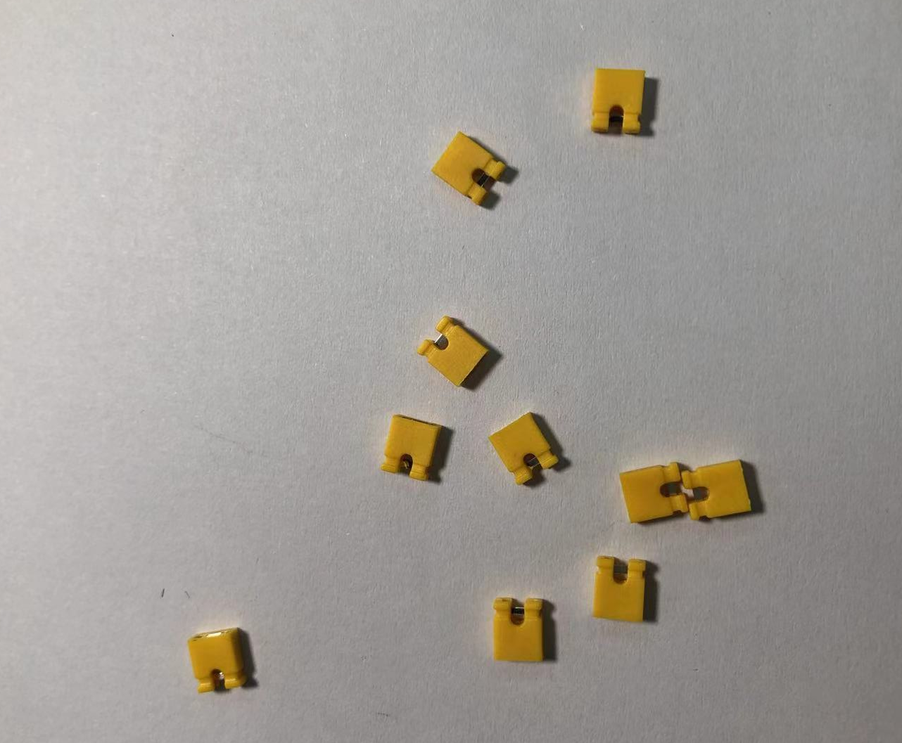
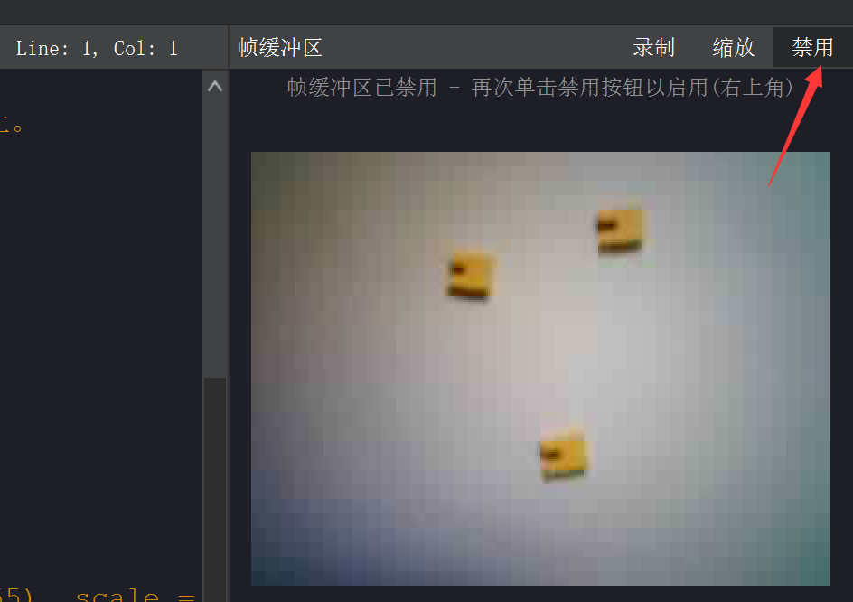
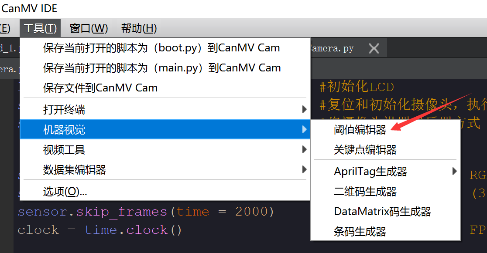
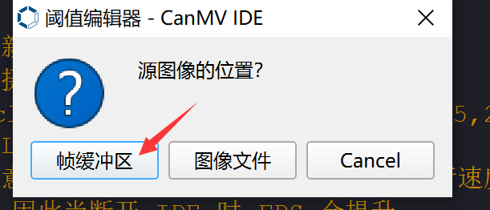
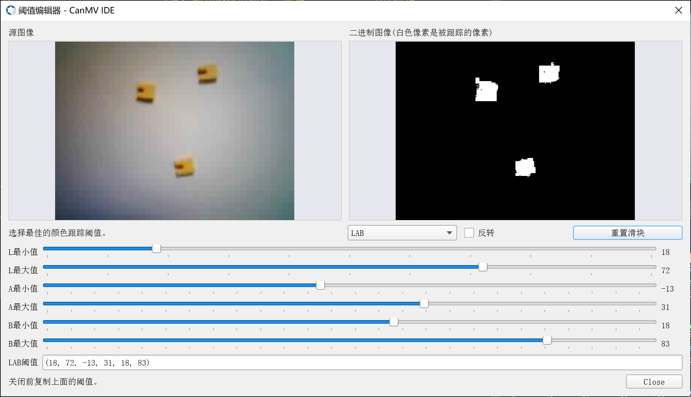
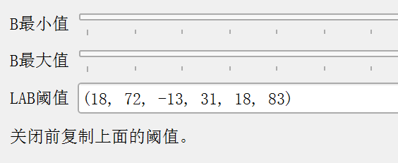
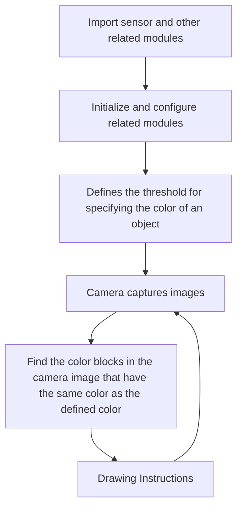
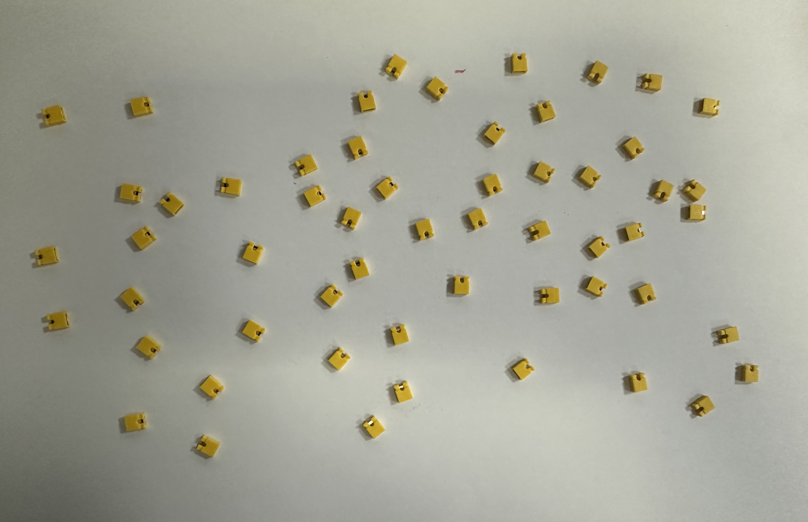
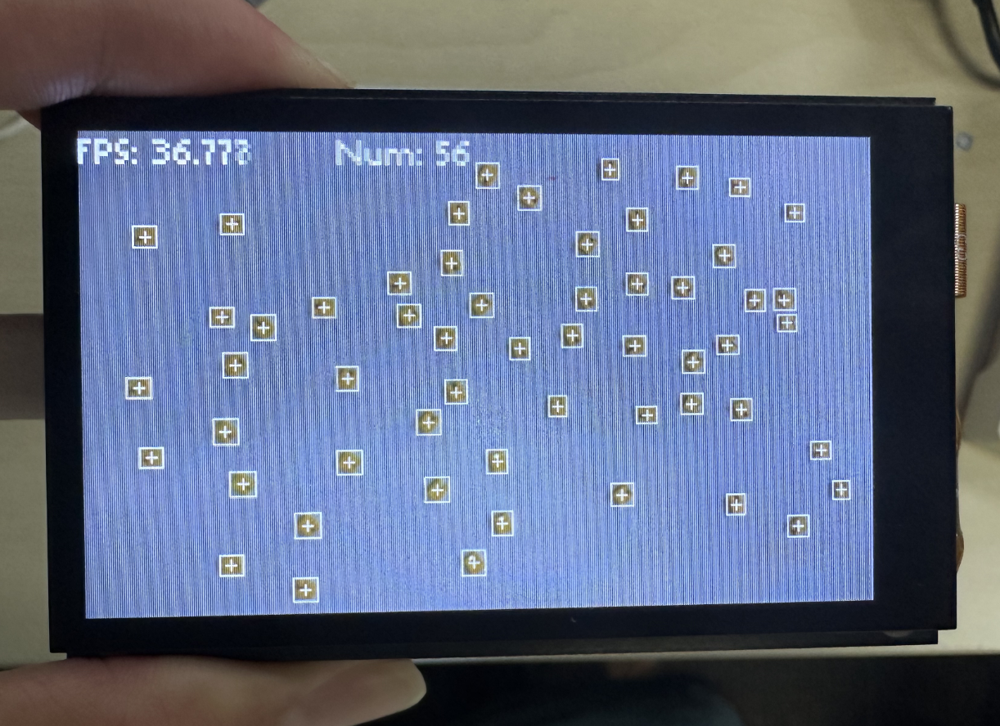

# Object counting（same color）

## Foreword
In the previous section on color recognition, we saw that we can identify the number of color blocks. In this section, we will learn how to identify objects of a specified color and calculate their number based on the previous section on color recognition.

## Experiment Purpose

Through programming, CanMV K230 can recognize the colors preset by the program and count the number of objects.

## Experimental Explanation

The usage of find_blobs has been explained in the previous section **Color Recognition**, so I will repeat it here. It is mainly based on the LAB color model (each color is represented by a set of LAB thresholds, and interested users can refer to the relevant model information by themselves). It is located under the image module, so we can directly process the captured pictures. Then, as usual, we look at the description of the objects and functions related to this experiment, as follows:


## class find_blobs

### Constructors
```python
image.find_blobs(thresholds[, invert=False[, roi[, x_stride=2[, y_stride=1[, area_threshold=10
                 [, pixels_threshold=10[, merge=False[, margin=0[, threshold_cb=None[, 
                 merge_cb=None]]]]]]]]]])
```
Find the specified color block in the image. Returns a list of `image.blog` objects; parameter description:
- `thresholds`: Must be a list of tuples. [(lo, hi), (lo, hi), ..., (lo, hi)] defines the color range you want to track. For grayscale images, each tuple needs to contain two values ​​- the minimum grayscale value and the maximum grayscale value. Only pixel regions that fall between these thresholds are considered. For RGB565 images, each tuple needs to have six values ​​(l_lo, l_hi, a_lo, a_hi, b_lo, b_hi) - the minimum and maximum values ​​of the LAB L, A and B channels, respectively.
- `area_threshold`: If the bounding box area of ​​the color block is smaller than this parameter value, it will be filtered out;
- `pixels_threshold`: If the number of pixels in a color block is less than this parameter value, it will be filtered out;
- `merge`: If True, merge all unfiltered color blocks;
- `margin`: Adjusts the edges of merged patches.

### Methods

The above function returns an `image.blob` object.

```python
blob.rect()
```
Returns a rectangle tuple (x, y, w, h), such as the blob boundary. These values ​​can be obtained by indexing [0-3].

<br></br>

```python
blob.cx()
```
Returns the center x position of the blob (int). You can get this value by using [5] on the object.

<br></br>

```python
blob.cy()
```
Returns the center y position of the blob (int). You can get this value by using [6] on the object.

<br></br>

For more usage, please read: [CanMV K230 Docs](https://developer.canaan-creative.com/k230_canmv/main/zh/api/openmv/image.html#find-blobs)

<br></br>

## Get color threshold

How do we get the threshold value for objects of different colors? Here we take the yellow jumper cap as an example.



First use the [camera](../../machine_vision/camera.md) code to collect the object image, and click "**Disable**" in the buffer in the upper right corner of the IDE to confirm the object to be recognized:



Click **Tools—Machine Vision—Threshold Editor** .



In the pop-up dialog box, select "Frame Buffer".



By adjusting the 6 LAB values ​​below, the object color on the right is white, and the rest of the background is black. (It takes a little time to find the critical value for better results.)



Record the LAB value of the color, which will be used in the following code.



After learning the color block finding function and color threshold acquisition method, we can sort out the programming ideas. The code writing process is as follows:



## Codes

```python
'''
Demo Name：Object counting（same color）
Platform：01Studio CanMV K230
Tutorial：wiki.01studio.cc
'''

import time, os, sys

from media.sensor import * #Import the sensor module and use the camera API
from media.display import * #Import the display module and use display API
from media.media import * #Import the media module and use meida API

thresholds = [(18, 72, -13, 31, 18, 83)] # Yellow jumper cap threshold

sensor = Sensor() #Constructing a camera object
sensor.reset() # reset the Camera
sensor.set_framesize(width=800, height=480) # Set the frame size to LCD resolution (800x480), channel 0
sensor.set_pixformat(Sensor.RGB565) # Set the output image format, channel 0

#Use 3.5-inch mipi screen and IDE buffer to display images at the same time, 800x480 resolution
Display.init(Display.ST7701, to_ide=True)
#Display.init(Display.VIRT, sensor.width(), sensor.height()) ##Use only the IDE buffer to display images

MediaManager.init() #Initialize the media resource manager

sensor.run() #Start the camera

clock = time.clock()

while True:

    ####################
    ## Write codes here
    ####################
    clock.tick()

    img = sensor.snapshot() # Take a picture

    blobs = img.find_blobs([thresholds[0]]) # Looking for yellow jumper cap

    if blobs:
        for b in blobs:
            tmp=img.draw_rectangle(b[0:4])
            tmp=img.draw_cross(b[5], b[6])

    #Display calculation information
    img.draw_string_advanced(0, 0, 30, 'FPS: '+str("%.3f"%(clock.fps()))+'       Num: '
                             +str(len(blobs)), color = (255, 255, 255))

    Display.show_image(img) # Display image

    print(clock.fps()) #FPS

```

## Experimental Results

Run the code in the IDE and try to identify multiple jumper caps. You can see that the accuracy is very high:

Objects to be identified:



Identification results:



