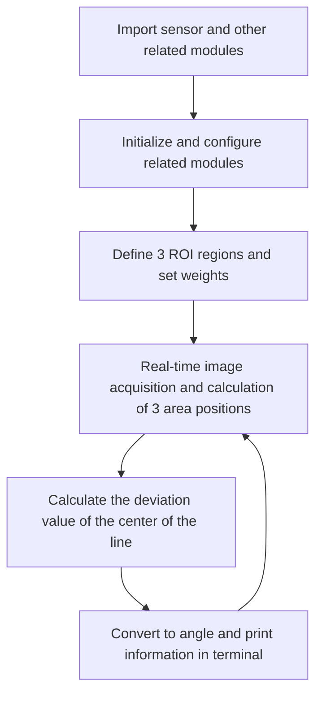
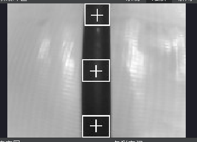
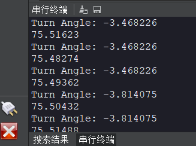
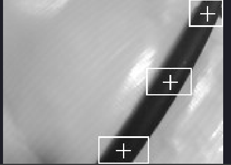
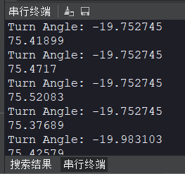
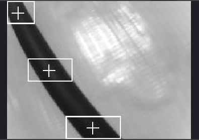
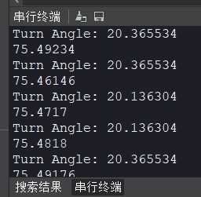

# Robot line patrol (solid line)

## Foreword

The line inspection case in this section is still based on color recognition. The principle is to calculate the deviation angle based on the position of the straight line of the image captured by the camera and the deviation from the center. This method makes line inspection easier. If your CanMV K230 is connected to a robot (or related equipment), the robot (equipment) can directly calculate the angle deviation result and make corresponding adjustments.


## Experiment Purpose

The deviation angle of the black line in the CanMV K230 camera image is achieved through programming.

## 实验讲解

This experiment has certain requirements for the screen, that is, the camera must capture an image with only one continuous black straight line. The program cuts the screen into three parts, calculates the X coordinate of the center point of the black line in each part, and then uses the weighted average algorithm to estimate the deviation position of the straight line. Generally, the closer to the bottom, the closer to the camera, and the top represents the distant line segment. Therefore, the weight of the bottom figure is high. The following is a schematic diagram for explanation:

Assume that the pixel of the current screen of the camera is the QQVGA resolution of the routine: 160 (width) X120 (height), the upper left corner coordinate is (0,0), and then the current straight line coordinate is (80,120) to (160,0) to the right. The weights of the upper, middle and lower parts are 0.1, 0.3, and 0.7 respectively (the bottom image is close to the robot, the weight is large, and the sum of the weights may not be 1). Let's calculate its center value.


The midpoint coordinate of the Y axis in the above figure is 60, and the weighted average of the X coordinate is calculated as follows:

X’=（80*0.7+120*0.3+160*0.1）/（0.7+0.3+0.1）=98

Then the straight line deviation coordinate can be considered as (98,60), the green "+" position in the figure. Then the inverse tangent function can be used to calculate the deviation angle: a = atan((98-80)/60)=16.7°. The robot is equivalent to the position of the solid line deviating to the left, so a minus sign is added, that is, -16.7°; the deviation angle is calculated in this way. **After obtaining the deviation angle, you can program yourself to adjust the motion state of the car or robot until 0° means no deviation. **

This experiment mainly uses the find_blobs function programming, which has been described in the previous section. The specific usage is as follows:

## class find_blobs

### Constructors
```python
image.find_blobs(thresholds[, invert=False[, roi[, x_stride=2[, y_stride=1[, area_threshold=10
                 [, pixels_threshold=10[, merge=False[, margin=0[, threshold_cb=None[, 
                 merge_cb=None]]]]]]]]]])
```
Find the specified color block in the image. Returns a list of `image.blog` objects; parameter description:
- `thresholds`: Must be a list of tuples. [(lo, hi), (lo, hi), ..., (lo, hi)] defines the color range you want to track. For grayscale images, each tuple needs to contain two values ​​- the minimum grayscale value and the maximum grayscale value. Only pixel regions that fall between these thresholds are considered. For RGB565 images, each tuple needs to have six values ​​(l_lo, l_hi, a_lo, a_hi, b_lo, b_hi) - the minimum and maximum values ​​of the LAB L, A and B channels, respectively.
- `area_threshold`: If the bounding box area of ​​the color block is smaller than this parameter value, it will be filtered out;
- `pixels_threshold`: If the number of pixels in a color block is less than this parameter value, it will be filtered out;
- `merge`: If True, merge all unfiltered color blocks;
- `margin`: Adjusts the edges of merged patches.

### Methods

The above function returns an `image.blob` object.

```python
blob.rect()
```
Returns a rectangle tuple (x, y, w, h), such as the blob boundary. These values ​​can be obtained by indexing [0-3].

<br></br>

```python
blob.cx()
```
Returns the center x position of the blob (int). You can get this value by using [5] on the object.

<br></br>

```python
blob.cy()
```
Returns the center y position of the blob (int). You can get this value by using [6] on the object.

<br></br>

For more usage, please read: [CanMV K230 Docs](https://developer.canaan-creative.com/k230_canmv/main/zh/api/openmv/image.html#find-blobs)

<br></br>

The code writing process is as follows:


  
## Codes

```python
'''
Demo Name：Robot line patrol (solid line)
Platform：01Studio CanMV K230
Tutorial：wiki.01studio.cc

# Black Grayscale Line Following Example
#
# Making a robot that follows a robot takes a lot of effort. This example script
# demonstrates how to make a line following robot for the machine vision part. You
# can use the output of this script to drive a differential drive robot
# to follow a line. This script only generates a rotation value (angle of deviation) that indicates
# your robot is pointing left or right.
#
# For this example to work properly, you should aim the camera at a straight line (solid line)
# and adjust the camera to a 45 degree position on the horizontal plane. Make sure there is only 1 straight line in the
# picture.
'''

import time, os, sys, math

from media.sensor import * #Import the sensor module and use the camera API
from media.display import * #Import the display module and use display API
from media.media import * #Import the media module and use meida API

# Trace the black line. Use [(128, 255)] to trace the white line.
GRAYSCALE_THRESHOLD = [(0, 64)]

# Below is a list of roi [region] tuples. Each roi is a rectangle represented by (x, y, w, h).

'''
# The Sampling image QQVGA 160*120, the list divides the image into 3 rectangles of roi, the rectangle closer to the camera
# field of view (usually below the image) has a greater weight.
ROIS = [ # [ROI, weight]
        (0, 100, 160, 20, 0.7), # It can be adjusted according to different robot situations.
        (0,  50, 160, 20, 0.3),
        (0,   0, 160, 20, 0.1)
       ]
'''

# The sampled image is QVGA 320*240. The list divides the image into three rectangles using roi. The rectangles closer to
# the camera's field of view (usually below the image) have greater weights.
ROIS = [ # [ROI, weight]
        (0, 200, 320, 40, 0.7), # It can be adjusted according to different robot situations.
        (0,  100, 320, 40, 0.3),
        (0,   0, 320, 40, 0.1)
       ]

# Calculate the sum of the weights of the above three rectangles. The sum does not necessarily need to be 1.
weight_sum = 0
for r in ROIS: weight_sum += r[4] # r[4] is the rectangle weight value.


sensor = Sensor(width=1280, height=960) #Build a camera object and set the camera's length and width to 4:3
sensor.reset() # reset the Camera
sensor.set_framesize(width=320, height=240) # Set the frame size to LCD resolution, channel 0
sensor.set_pixformat(Sensor.RGB565) # Set the output image format, channel 0

#Use 3.5-inch mipi screen and IDE buffer to display images at the same time
Display.init(Display.ST7701, to_ide=True)
#Display.init(Display.VIRT, sensor.width(), sensor.height()) ##Use only the IDE buffer to display images

MediaManager.init() #Initialize the media resource manager

sensor.run() #Start the camera

clock = time.clock()

while True:

    ####################
    ## Write codes here
    ####################
    clock.tick()

    img = sensor.snapshot() # Take a picture

    centroid_sum = 0

    for r in ROIS:
        blobs = img.find_blobs(GRAYSCALE_THRESHOLD, roi=r[0:4], merge=True) # r[0:4] is the roi tuple defined above.

        if blobs:
            # Find the blob with the most pixels.
            largest_blob = max(blobs, key=lambda b: b.pixels())

            # Draw a rect around the blob.
            img.draw_rectangle(largest_blob.rect())
            img.draw_cross(largest_blob.cx(),
                           largest_blob.cy())

            centroid_sum += largest_blob.cx() * r[4] # r[4] is the weight value of each roi.

    center_pos = (centroid_sum / weight_sum) # Determine the center of the line.

    # Convert the center position of the line into an angle for easier robot processing.
    deflection_angle = 0

    # Use the inverse tangent function to calculate the deviation angle of the center of the line. You can draw a
    # picture to understand it yourself.
    # The weight X coordinate falls on the left half of the image and is recorded as a positive deviation, and falls on
    # the right half and is recorded as a negative deviation, so the calculation result is added with a negative sign.

    #deflection_angle = -math.atan((center_pos-80)/60) #Use when the image is QQVGA 160*120

    deflection_angle = -math.atan((center_pos-160)/120) #Use when the image is QVGA 320*240

    # Convert the deviation value to a deviation angle.
    deflection_angle = math.degrees(deflection_angle)

    # After calculating the deviation angle, the robot can be controlled to make adjustments.
    print("Turn Angle: %f" % deflection_angle)

    # LCD displays the offset angle, and the scale parameter can change the font size
    img.draw_string_advanced(2,2,20, str('%.1f' % deflection_angle), color=(255,255,255))

    #Display.show_image(img) #Dispaly images

    #Display images, only used for LCD center display
    Display.show_image(img, x=round((800-sensor.width())/2),y=round((480-sensor.height())/2))

    print(clock.fps()) #FPS
```

## Experimental Results

Run the code in CanMV IDE and observe the experimental results of the straight lines captured by the camera with no deviation, left deviation, and right deviation.

### No offset

It can be seen that the offset angle is close to 0°;

Screen image:



Terminal result:



### Left deviation

When the car or robot deviates to the left, the angle is negative;

Screen image:



Terminal result:



### Right deviation

The angle is positive when the car or robot deviates to the left;

Screen image:



Terminal result:



After obtaining the offset angle, you can perform specified actions or combine the contents of the [UART (Serial Communication)](../../basic_examples/uart.md) section to inform other peripherals or the main control.