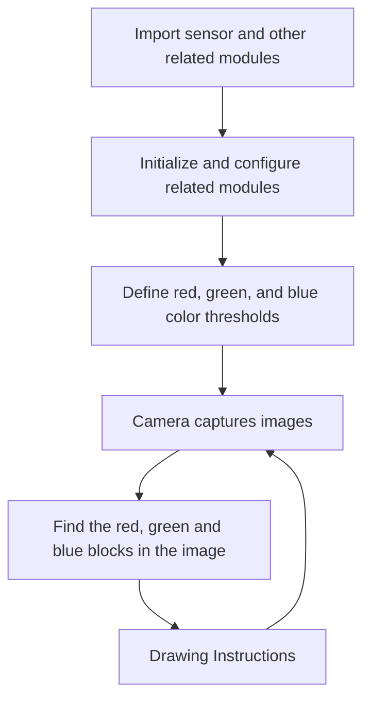
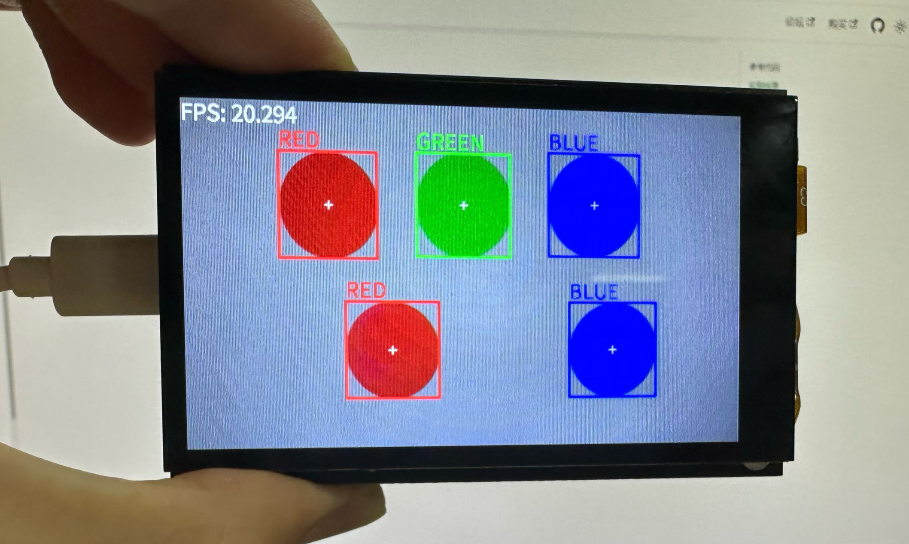

# Multiple color recognition

In the previous section, we learned [**Single Color Recognition**](../color_recognition/single_color.md). We only need to modify the code slightly on this basis to achieve multiple color recognition.

The code writing process is as follows:



### Codes

```python
'''
Demo Name：Multiple color recognition
Platform：01Studio CanMV K230
Tutorial：wiki.01studio.cc
'''

import time, os, sys

from media.sensor import * #Import the sensor module and use the camera API
from media.display import * #Import the display module and use display API
from media.media import * #Import the media module and use meida API

# Color recognition threshold (L Min, L Max, A Min, A Max, B Min, B Max) LAB model
# The following threshold tuple is used to identify the three colors red, green, and blue. Of course, 
# you can also adjust it to make the recognition better.
thresholds = [(30, 100, 15, 127, 15, 127), # Red Threshold
              (30, 100, -64, -8, 50, 70), # Green Threshold
              (0, 40, 0, 90, -128, -20)] # Blue Threshold

colors1 = [(255,0,0), (0,255,0), (0,0,255)]
colors2 = ['RED', 'GREEN', 'BLUE']

try:

    sensor = Sensor() #Constructing a camera object
    sensor.reset() # reset the Camera
    sensor.set_framesize(width=800, height=480) # Set the frame size to LCD resolution (800x480), channel 0
    sensor.set_pixformat(Sensor.RGB565) # Set the output image format, channel 0
    
    #Use 3.5-inch mipi screen and IDE buffer to display images at the same time, 800x480 resolution
    Display.init(Display.ST7701, to_ide=True) 
    #Display.init(Display.VIRT, sensor.width(), sensor.height()) ##Use only the IDE buffer to display images

    MediaManager.init() #Initialize the media resource manager

    sensor.run() #Start the camera

    clock = time.clock()

    while True:


        os.exitpoint() #Detect IDE interrupts

        ####################
        ## Write codes here
        ####################
        clock.tick()

        img = sensor.snapshot() # Take a picture

        for i in range(3):

            blobs = img.find_blobs([thresholds[i]]) #0, 1, and 2 represent red, green, and blue respectively.

            if blobs:

                for b in blobs: #Draw rectangles, crosses and string to represent
                    tmp=img.draw_rectangle(b[0:4], thickness = 4, color = colors1[i])
                    tmp=img.draw_cross(b[5], b[6], thickness = 2)
                    tmp=img.draw_string_advanced(b[0], b[1]-35, 30, colors2[i],color = colors1[i])


        img.draw_string_advanced(0, 0, 30, 'FPS: '+str("%.3f"%(clock.fps())), color = (255, 255, 255))

        Display.show_image(img) # Display image

        print(clock.fps()) #FPS


##############################################
# IDE interrupts the release of resource code
##############################################
except KeyboardInterrupt as e:
    print("user stop: ", e)
except BaseException as e:
    print(f"Exception {e}")
finally:
    # sensor stop run
    if isinstance(sensor, Sensor):
        sensor.stop()
    # deinit display
    Display.deinit()
    os.exitpoint(os.EXITPOINT_ENABLE_SLEEP)
    time.sleep_ms(100)
    # release media buffer
    MediaManager.deinit()

```

Compared with the single color recognition routine, the modified code is as follows. A for loop is added before color recognition to recognize the three preset colors:
```python
        ...
        for i in range(3):

            blobs = img.find_blobs([thresholds[i]]) #0, 1, and 2 represent red, green, and blue respectively.

            if blobs:

                for b in blobs: #Draw rectangles, crosses and string to represent
                    tmp=img.draw_rectangle(b[0:4], thickness = 4, color = colors1[i])
                    tmp=img.draw_cross(b[5], b[6], thickness = 2)
                    tmp=img.draw_string_advanced(b[0], b[1]-35, 30, colors2[i],color = colors1[i])
        ...
```

## Experimental Results

Running various color recognition codes, we can see the following experimental results, all colors are recognized:

Original image:


Identification results:

