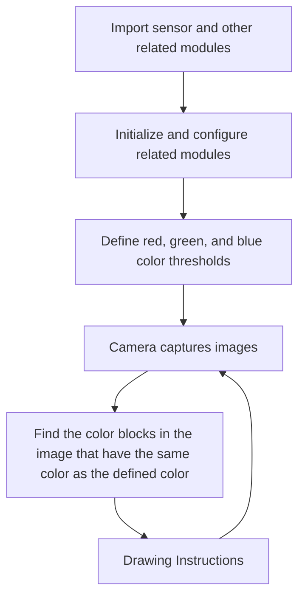
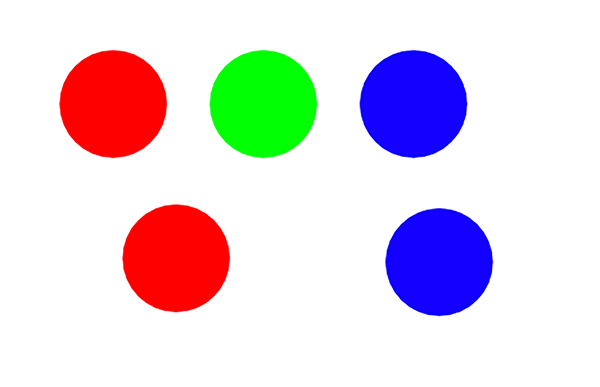
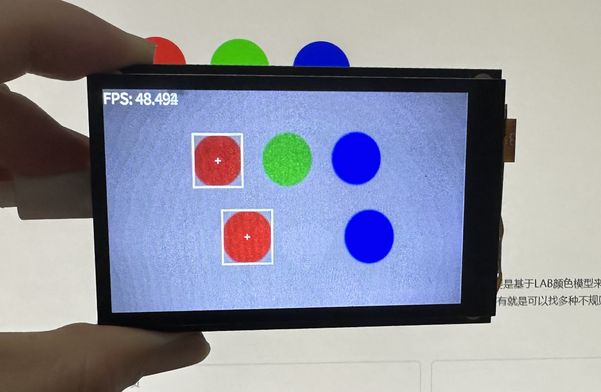

# single color recognition

## Foreword

We live in a colorful world. In this section, we will learn color recognition in machine vision. We will pre-set color thresholds, such as red, green, and blue. This way, the K230 camera can automatically recognize the image after capturing it.

## Experiment Purpose

Through programming, CanMV K230 can recognize the color blocks preset by the program, which are red, green and blue.

## Experimental Explanation

CanMV integrates the find_blobs function for RGB565 color block recognition, which is mainly based on the LAB color model (each color is represented by a set of LAB thresholds, and interested users can refer to the relevant model information by themselves). It is located under the image module, so we can directly process the captured images. Then, as usual, we look at the description of the objects and functions related to this experiment, as follows:


## class find_blobs

### Constructors
```python
image.find_blobs(thresholds[, invert=False[, roi[, x_stride=2[, y_stride=1[, area_threshold=10
                 [, pixels_threshold=10[, merge=False[, margin=0[, threshold_cb=None[, 
                 merge_cb=None]]]]]]]]]])
```
Find the specified color block in the image. Returns a list of `image.blog` objects; parameter description:
- `thresholds`: Must be a list of tuples. [(lo, hi), (lo, hi), ..., (lo, hi)] defines the color range you want to track. For grayscale images, each tuple needs to contain two values ​​- the minimum grayscale value and the maximum grayscale value. Only pixel regions that fall between these thresholds are considered. For RGB565 images, each tuple needs to have six values ​​(l_lo, l_hi, a_lo, a_hi, b_lo, b_hi) - the minimum and maximum values ​​of the LAB L, A and B channels, respectively.
- `area_threshold`: If the bounding box area of ​​the color block is smaller than this parameter value, it will be filtered out;
- `pixels_threshold`: If the number of pixels in a color block is less than this parameter value, it will be filtered out;
- `merge`: If True, merge all unfiltered color blocks;
- `margin`: Adjusts the edges of merged patches.

### Methods

The above function returns an `image.blob` object.

```python
blob.rect()
```
Returns a rectangle tuple (x, y, w, h), such as the blob boundary. These values ​​can be obtained by indexing [0-3].

<br></br>

```python
blob.cx()
```
Returns the center x position of the blob (int). You can get this value by using [5] on the object.

<br></br>

```python
blob.cy()
```
Returns the center y position of the blob (int). You can get this value by using [6] on the object.

<br></br>

For more usage, please read: [CanMV K230 Docs](https://developer.canaan-creative.com/k230_canmv/main/zh/api/openmv/image.html#find-blobs)

<br></br>

After understanding the application method of the color block finding function, we can sort out the programming ideas. The code writing process is as follows:


   

## Codes

```python
'''
Demo Name：single color recognition
Platform：01Studio CanMV K230
Tutorial：wiki.01studio.cc
'''

import time, os, sys

from media.sensor import * #Import the sensor module and use the camera API
from media.display import * #Import the display module and use display API
from media.media import * #Import the media module and use meida API

# Color recognition threshold (L Min, L Max, A Min, A Max, B Min, B Max) LAB model
# The following threshold tuple is used to identify the three colors red, green, and blue. Of course, 
# you can also adjust it to make the recognition better.
thresholds = [(30, 100, 15, 127, 15, 127), # Red Threshold
              (30, 100, -64, -8, 50, 70), # Green Threshold
              (0, 40, 0, 90, -128, -20)] # Blue Threshold

try:

    sensor = Sensor() #Constructing a camera object
    sensor.reset() # reset the Camera
    sensor.set_framesize(width=800, height=480) # Set the frame size to LCD resolution (800x480), channel 0
    sensor.set_pixformat(Sensor.RGB565) # Set the output image format, channel 0
    
    #Use 3.5-inch mipi screen and IDE buffer to display images at the same time, 800x480 resolution
    Display.init(Display.ST7701, to_ide=True) 
    #Display.init(Display.VIRT, sensor.width(), sensor.height()) ##Use only the IDE buffer to display images

    MediaManager.init() #Initialize the media resource manager

    sensor.run() #Start the camera

    clock = time.clock()

    while True:

        os.exitpoint() #Detect IDE interrupts

        ####################
        ## Write codes here
        ####################
        clock.tick()

        img = sensor.snapshot() # Take a picture

        blobs = img.find_blobs([thresholds[0]]) #0, 1, and 2 represent red, green, and blue respectively.

        if blobs:

            for b in blobs: #Draw rectangles and crosses to represent
                tmp=img.draw_rectangle(b[0:4], thickness = 4)
                tmp=img.draw_cross(b[5], b[6], thickness = 2)


        img.draw_string_advanced(0, 0, 30, 'FPS: '+str("%.3f"%(clock.fps())), color = (255, 255, 255))

        Display.show_image(img) # Display image

        print(clock.fps()) # FPS


##############################################
# IDE interrupts the release of resource code
##############################################
except KeyboardInterrupt as e:
    print("user stop: ", e)
except BaseException as e:
    print(f"Exception {e}")
finally:
    # sensor stop run
    if isinstance(sensor, Sensor):
        sensor.stop()
    # deinit display
    Display.deinit()
    os.exitpoint(os.EXITPOINT_ENABLE_SLEEP)
    time.sleep_ms(100)
    # release media buffer
    MediaManager.deinit()

```

## Experimental Results

When running the code in CanMV IDE, the code detects red by default. Users can modify the threshold array number of the find_blobs() parameter to switch the recognition color, as follows:

**Red identification:**

Original image:



Identification results:



In this section, we learned how to implement single color recognition on CanMV K230 through MicroPython programming. This experiment is mainly based on the LAB color model. Interested friends can refer to the relevant information of the LAB module by themselves, and then combine the printing threshold to view its tuple data for in-depth learning. You can also find a variety of irregular shaped color objects for comparison and learning.