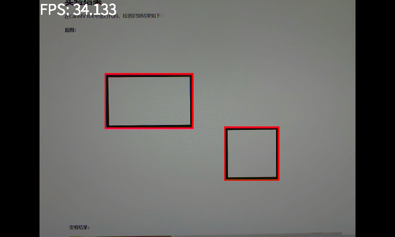
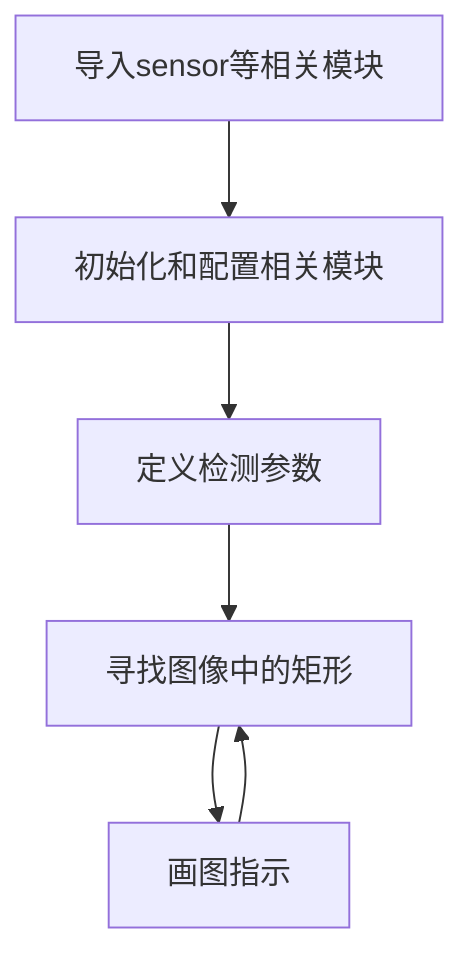

# 矩形检测（彩色图）

## 实验讲解

矩形检测（彩色）用于识别彩色图像里的矩形并画框标注。使用cv_lite库与前面 [矩形检测](../image_detection/find_rects.md) 例程对比速度更快。



## rgb888_find_rectangles对象

### 构造函数
```python
rects = cv_lite.rgb888_find_rectangles(
    image_shape, img_np,
    canny_thresh1, canny_thresh2,
    approx_epsilon,
    area_min_ratio,
    max_angle_cos,
    gaussian_blur_size
)
```
查找图像中的矩形。参数说明：
- `image_shape`: 图像形状，list类型，顺序为[高，宽]，如[480,640]
- `img_np`: 图像数据引用，ulab.numpy.ndarray类型
- `canny_thresh1`: Canny 边缘检测低阈值，int类型
- `canny_thresh2`: Canny 边缘检测高阈值，int类型
- `approx_epsilon`: 多边形拟合精度比例，float类型
- `area_min_ratio`: 最小面积比例，float类型
- `max_angle_cos`: 最大角度余弦，float类型
- `gaussian_blur_size`: 高斯模糊核尺寸，int类型

### 使用方法

以上函数返回rects值：**矩形位置信息列表，每4个元素为一个矩形的位置信息，包括位置x、y、w、h**

更多用法请阅读 [官方文档](https://www.kendryte.com/k230_canmv/zh/main/zh/api/cv_lite/cv_lite.html#grayscale-find-rectangles)

<br></br>

代码编写流程如下：



## 参考代码

### CanMV K230 + 3.5寸mipi屏

```python
'''
实验名称：矩形检测
实验平台：01Studio CanMV K230
教程：wiki.01studio.cc
说明：通过修改lcd_width和lcd_height参数值选择3.5寸或2.4寸屏。
'''

# ============================================================
# MicroPython 基于 cv_lite 的 RGB888 矩形检测测试代码
# RGB888 Rectangle Detection Test using cv_lite extension
# ============================================================

import time, os, sys, gc
from machine import Pin
from media.sensor import *     # 摄像头接口 / Camera interface
from media.display import *    # 显示接口 / Display interface
from media.media import *      # 媒体资源管理器 / Media manager
import _thread
import cv_lite                 # cv_lite扩展模块 / cv_lite extension module
import ulab.numpy as np

#CanMV K230 - 3.5寸mipi屏分辨率定义
lcd_width = 800
lcd_height = 480

'''
#CanMV K230 mini - 2.4寸mipi屏分辨率定义
lcd_width = 640
lcd_height = 480
'''

# -------------------------------
# 图像尺寸 [高, 宽] / Image size [Height, Width]
# -------------------------------
image_shape = [480, 640]

# -------------------------------
# 初始化摄像头（RGB888格式） / Initialize camera (RGB888 format)
# -------------------------------
sensor = Sensor(id=2, width=1280, height=960,fps=90)
sensor.reset()
sensor.set_framesize(width=image_shape[1], height=image_shape[0])
sensor.set_pixformat(Sensor.RGB888)

# -------------------------------
# 初始化显示器（IDE虚拟显示输出） / Initialize display (IDE virtual output)
# -------------------------------
Display.init(Display.ST7701, width=lcd_width, height=lcd_height, to_ide=True, quality=100)

# -------------------------------
# 初始化媒体资源管理器并启动摄像头 / Init media manager and start camera
# -------------------------------
MediaManager.init()
sensor.run()

# -------------------------------
# 启动帧率计时器 / Start FPS timer
# -------------------------------
clock = time.clock()

# -------------------------------
# 可调参数（建议调试时调整）/ Adjustable parameters (recommended for tuning)
# -------------------------------
canny_thresh1       = 50        # Canny 边缘检测低阈值 / Canny edge low threshold
canny_thresh2       = 150       # Canny 边缘检测高阈值 / Canny edge high threshold
approx_epsilon      = 0.04      # 多边形拟合精度（比例） / Polygon approximation precision (ratio)
area_min_ratio      = 0.001     # 最小面积比例（0~1） / Minimum area ratio (0~1)
max_angle_cos       = 0.5       # 最大角余弦（值越小越接近矩形） / Max cosine of angle (smaller closer to rectangle)
gaussian_blur_size  = 5         # 高斯模糊核大小（奇数） / Gaussian blur kernel size (odd number)

# -------------------------------
# 主循环 / Main loop
# -------------------------------
while True:
    clock.tick()

    # 拍摄当前帧图像 / Capture current frame
    img = sensor.snapshot()
    img_np = img.to_numpy_ref()  # 获取 RGB888 ndarray 引用 / Get RGB888 ndarray reference

    # 调用底层矩形检测函数，返回矩形列表 [x0, y0, w0, h0, x1, y1, w1, h1, ...]
    # Call underlying rectangle detection function, returns list of rectangles [x, y, w, h, ...]
    rects = cv_lite.rgb888_find_rectangles(
        image_shape, img_np,
        canny_thresh1, canny_thresh2,
        approx_epsilon,
        area_min_ratio,
        max_angle_cos,
        gaussian_blur_size
    )

    # 遍历检测到的矩形，绘制矩形框 / Iterate detected rectangles and draw bounding boxes
    for i in range(0, len(rects), 4):
        x = rects[i]
        y = rects[i + 1]
        w = rects[i + 2]
        h = rects[i + 3]
        img.draw_rectangle(x, y, w, h, color=(255, 0, 0), thickness=3)

    img.draw_string_advanced(0, 0, 30, 'FPS: '+str("%.3f"%(clock.fps())), color = (255, 255, 255))

    # 显示结果图像 / Show image with blobs
    Display.show_image(img, x=round((lcd_width-sensor.width())/2),y=round((lcd_height-sensor.height())/2))

    # 释放临时变量内存 / Free temporary variables memory
    del img_np
    del img

    # 进行垃圾回收 / Perform garbage collection
    gc.collect()

    # 打印当前帧率和检测到的矩形数量 / Print current FPS and number of detected rectangles
    print("fps:", clock.fps())

# -------------------------------
# 退出时释放资源 / Cleanup on exit
# -------------------------------
sensor.stop()
Display.deinit()
os.exitpoint(os.EXITPOINT_ENABLE_SLEEP)
time.sleep_ms(100)
MediaManager.deinit()

```

### CanMV K230 mini + 2.4寸mipi屏

```python
'''
实验名称：矩形检测
实验平台：01Studio CanMV K230
教程：wiki.01studio.cc
说明：通过修改lcd_width和lcd_height参数值选择3.5寸或2.4寸屏。
'''

# ============================================================
# MicroPython 基于 cv_lite 的 RGB888 矩形检测测试代码
# RGB888 Rectangle Detection Test using cv_lite extension
# ============================================================

import time, os, sys, gc
from machine import Pin
from media.sensor import *     # 摄像头接口 / Camera interface
from media.display import *    # 显示接口 / Display interface
from media.media import *      # 媒体资源管理器 / Media manager
import _thread
import cv_lite                 # cv_lite扩展模块 / cv_lite extension module
import ulab.numpy as np

'''
#CanMV K230 - 3.5寸mipi屏分辨率定义
lcd_width = 800
lcd_height = 480
'''

#CanMV K230 mini - 2.4寸mipi屏分辨率定义
lcd_width = 640
lcd_height = 480


# -------------------------------
# 图像尺寸 [高, 宽] / Image size [Height, Width]
# -------------------------------
image_shape = [480, 640]

# -------------------------------
# 初始化摄像头（RGB888格式） / Initialize camera (RGB888 format)
# -------------------------------
sensor = Sensor(id=2, width=1280, height=960,fps=90)
sensor.reset()
sensor.set_framesize(width=image_shape[1], height=image_shape[0])
sensor.set_pixformat(Sensor.RGB888)

# -------------------------------
# 初始化显示器（IDE虚拟显示输出） / Initialize display (IDE virtual output)
# -------------------------------
Display.init(Display.ST7701, width=lcd_width, height=lcd_height, to_ide=True, quality=100)

# -------------------------------
# 初始化媒体资源管理器并启动摄像头 / Init media manager and start camera
# -------------------------------
MediaManager.init()
sensor.run()

# -------------------------------
# 启动帧率计时器 / Start FPS timer
# -------------------------------
clock = time.clock()

# -------------------------------
# 可调参数（建议调试时调整）/ Adjustable parameters (recommended for tuning)
# -------------------------------
canny_thresh1       = 50        # Canny 边缘检测低阈值 / Canny edge low threshold
canny_thresh2       = 150       # Canny 边缘检测高阈值 / Canny edge high threshold
approx_epsilon      = 0.04      # 多边形拟合精度（比例） / Polygon approximation precision (ratio)
area_min_ratio      = 0.001     # 最小面积比例（0~1） / Minimum area ratio (0~1)
max_angle_cos       = 0.5       # 最大角余弦（值越小越接近矩形） / Max cosine of angle (smaller closer to rectangle)
gaussian_blur_size  = 5         # 高斯模糊核大小（奇数） / Gaussian blur kernel size (odd number)

# -------------------------------
# 主循环 / Main loop
# -------------------------------
while True:
    clock.tick()

    # 拍摄当前帧图像 / Capture current frame
    img = sensor.snapshot()
    img_np = img.to_numpy_ref()  # 获取 RGB888 ndarray 引用 / Get RGB888 ndarray reference

    # 调用底层矩形检测函数，返回矩形列表 [x0, y0, w0, h0, x1, y1, w1, h1, ...]
    # Call underlying rectangle detection function, returns list of rectangles [x, y, w, h, ...]
    rects = cv_lite.rgb888_find_rectangles(
        image_shape, img_np,
        canny_thresh1, canny_thresh2,
        approx_epsilon,
        area_min_ratio,
        max_angle_cos,
        gaussian_blur_size
    )

    # 遍历检测到的矩形，绘制矩形框 / Iterate detected rectangles and draw bounding boxes
    for i in range(0, len(rects), 4):
        x = rects[i]
        y = rects[i + 1]
        w = rects[i + 2]
        h = rects[i + 3]
        img.draw_rectangle(x, y, w, h, color=(255, 0, 0), thickness=3)

    img.draw_string_advanced(0, 0, 30, 'FPS: '+str("%.3f"%(clock.fps())), color = (255, 255, 255))

    # 显示结果图像 / Show image with blobs
    Display.show_image(img, x=round((lcd_width-sensor.width())/2),y=round((lcd_height-sensor.height())/2))

    # 释放临时变量内存 / Free temporary variables memory
    del img_np
    del img

    # 进行垃圾回收 / Perform garbage collection
    gc.collect()

    # 打印当前帧率和检测到的矩形数量 / Print current FPS and number of detected rectangles
    print("fps:", clock.fps())

# -------------------------------
# 退出时释放资源 / Cleanup on exit
# -------------------------------
sensor.stop()
Display.deinit()
os.exitpoint(os.EXITPOINT_ENABLE_SLEEP)
time.sleep_ms(100)
MediaManager.deinit()

```

## 实验结果

在CanMV IDE中运行代码，用户可自行调整参数，过滤一些干扰，识别结果如下：

**矩形识别：**

原图：


实验结果：

