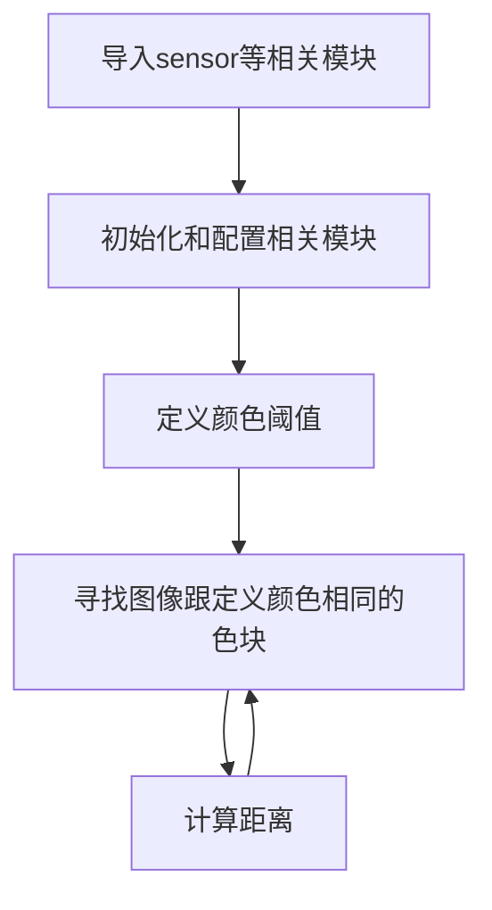

# PnP测距（基于色块）

## 实验讲解

PnP 测距是基于透视 n 点（Perspective-N-Point，简称 PNP）算法的非接触式距离测量方法，核心是通过相机图像与已知参考点求解目标距离。

**典型应用**

- 机器人定位与避障：机器人通过相机识别环境参考点，计算与障碍物距离。
- AR/VR 导航：叠加虚拟信息时，通过 PNP 测距确定现实目标的空间位置。
- 工业视觉测量：无需接触工件，快速测量零件与相机的距离或零件间相对位置。

本节例程基于矩形色块，简单来说就是已知色块的长宽尺寸，然后摄像头识别色块，再计算摄像头到色块的距离。


## rgb888_pnp_distance对象

### 构造函数
```python
# 使用 PnP 估算距离 / Estimate distance via PnP
distance = cv_lite.rgb888_pnp_distance(
    image_shape, img_np, roi,
    camera_matrix, dist_coeffs, dist_len,
    roi_width_real/2, roi_height_real/2
)
```
查找图像中指定的彩色色块。参数说明：
- `image_shape`: 图像形状，list类型，顺序为[高，宽]，如[480,640]；
- `img_np`: 图像数据引用，ulab.numpy.ndarray类型；
- `roi`: 待估算距离的ROI区域，list类型，包括xywh；
- `camera_matrix`: 相机内参矩阵；
- `dist_coeffs`: 畸变系数
- `dist_len`: 畸变系数长度
- `roi_width_real`: 实际ROI宽度，单位cm
- `roi_height_real`: 实际ROI高度，单位cm

### 使用方法

以上函数返回distance值：**估算距离，单位cm**

更多用法请阅读[官方文档](https://www.kendryte.com/k230_canmv/zh/main/zh/api/cv_lite/cv_lite.html#rgb888-pnp-distance)

<br></br>

代码编写流程如下：



## 参考代码

### CanMV K230 + 3.5寸mipi屏

```python
'''
实验名称：PnP测距（基于色块）
实验平台：01Studio CanMV K230
教程：wiki.01studio.cc
说明：通过修改lcd_width和lcd_height参数值选择3.5寸或2.4寸屏。
'''

# ============================================================
# MicroPython RGB888 彩色块检测与距离估计示例（使用 cv_lite 扩展）
# RGB888 Color Blob Detection & Distance Estimation with cv_lite
# ============================================================

import time, os, sys, gc
from machine import Pin
from media.sensor import *   # 摄像头接口 / Camera interface
from media.display import *  # 显示接口 / Display interface
from media.media import *    # 媒体管理器 / Media manager
import _thread
import cv_lite               # 自定义计算机视觉模块 / Custom CV extension
import ulab.numpy as np      # MicroPython 版 NumPy / Lightweight NumPy for uPython

#CanMV K230 - 3.5寸mipi屏分辨率定义
lcd_width = 800
lcd_height = 480

'''
#CanMV K230 mini - 2.4寸mipi屏分辨率定义
lcd_width = 640
lcd_height = 480
'''

# -------------------------------
# 图像尺寸配置 / Image resolution
# -------------------------------
image_shape = [480, 640]  # 图像高 x 宽 / Height x Width

# -------------------------------
# 初始化摄像头 / Initialize RGB888 camera
# -------------------------------
sensor = Sensor(id=2, width=1280, height=960, fps=90)
sensor.reset()
sensor.set_framesize(width=image_shape[1], height=image_shape[0])
sensor.set_pixformat(Sensor.RGB888)  # 设置为 RGB888 格式 / Set pixel format to RGB888

# -------------------------------
# 初始化虚拟显示器 / Initialize virtual display (IDE output)
# -------------------------------
Display.init(Display.ST7701, width=lcd_width, height=lcd_height, to_ide=True, quality=50)

# -------------------------------
# 初始化媒体管理器 / Initialize media manager
# -------------------------------
MediaManager.init()
sensor.run()  # 启动摄像头采集 / Start capturing

# -------------------------------
# 色块检测参数 / Color blob detection parameters
# -------------------------------
threshold = [120, 255, 0, 50, 0, 50]  # 红色RGB阈值 [Rmin, Rmax, Gmin, Gmax, Bmin, Bmax]
#threshold = [0, 50, 120, 255, 0, 50] #绿色
#threshold = [0, 50, 0, 50, 120, 255] #蓝色
min_area = 10                       # 最小检测面积 / Minimum valid blob area
kernel_size = 1                      # 腐蚀膨胀核大小 / Morphological kernel size

# -------------------------------
# 色块检测参数 / Color blob detection parameters
# -------------------------------
threshold = [120, 255, 0, 50, 0, 50]  # 红色RGB阈值 [Rmin, Rmax, Gmin, Gmax, Bmin, Bmax]
#threshold = [0, 50, 120, 255, 0, 50] #绿色
#threshold = [0, 50, 0, 50, 120, 255] #蓝色
min_area = 10                       # 最小检测面积 / Minimum valid blob area
kernel_size = 1                      # 腐蚀膨胀核大小 / Morphological kernel size

# ----------------------------------------
# 相机参数 / 01Studio K230默认相机参数，不同镜头有所差异
# ----------------------------------------
camera_matrix = [
    789.1207591978101,0.0,308.8211709453399,
    0.0,784.6402477892891,220.80604393744628,
    0.0,0.0,1.0
]
dist_coeffs = [-0.0032975761115662697,-0.009984467065645562,-0.01301691382446514,-0.00805834837844004,-1.063818733754765]
dist_len = len(dist_coeffs)

# 实际 ROI 尺寸（单位：厘米）/ Real-world size of detected ROI (cm)
roi_width_real = 3.0     # 例如：色块宽 3cm / Blob width in real world
roi_height_real = 3.0    # 例如：色块高 3cm / Blob height in real world

# -------------------------------
# 帧率计时器 / Frame rate timer
# -------------------------------
clock = time.clock()

# -------------------------------
# 主循环 / Main loop
# -------------------------------
while True:
    clock.tick()  # 启动帧计时器 / Start FPS timer

    img = sensor.snapshot()          # 拍摄一帧 / Capture one frame
    img_np = img.to_numpy_ref()      # 获取图像 NumPy 引用 / Get NumPy reference to RGB data

    # 色块检测：返回多个色块 [x, y, w, h, ...] / Detect color blobs
    blobs = cv_lite.rgb888_find_blobs(image_shape, img_np, threshold, min_area, kernel_size)

    if len(blobs) > 0:
        # 获取第一个色块 ROI（矩形）/ Get first blob's bounding box
        roi = [blobs[0], blobs[1], blobs[2], blobs[3]]

        # 使用 PnP 估算色块距离 / Estimate distance via PnP
        distance = cv_lite.rgb888_pnp_distance(
            image_shape, img_np, roi,
            camera_matrix, dist_coeffs, dist_len,
            roi_width_real, roi_height_real
        )

        # 绘制矩形与距离文字 / Draw bounding box and distance text
        img.draw_rectangle(roi[0], roi[1], roi[2], roi[3], color=(255, 0, 0), thickness=2)
        img.draw_string_advanced(roi[0], roi[1] - 40, 30, str("%.2f"%distance)+' cm', color=(255, 0, 0))

    img.draw_string_advanced(0, 0, 30, 'FPS: '+str("%.3f"%(clock.fps())), color = (255, 255, 255))

    # 显示结果图像 / Show image with blobs
    Display.show_image(img, x=round((lcd_width-sensor.width())/2),y=round((lcd_height-sensor.height())/2))

    # 打印当前帧率 / Print current FPS
    print("findblobs:", clock.fps())

    # 内存回收 / Garbage collection
    gc.collect()

# -------------------------------
# 资源释放 / Clean-up on exit
# -------------------------------
sensor.stop()
Display.deinit()
os.exitpoint(os.EXITPOINT_ENABLE_SLEEP)
time.sleep_ms(100)
MediaManager.deinit()

```

### CanMV K230 mini + 2.4寸mipi屏

```python
'''
实验名称：PnP测距（基于色块）
实验平台：01Studio CanMV K230
教程：wiki.01studio.cc
说明：通过修改lcd_width和lcd_height参数值选择3.5寸或2.4寸屏。
'''

# ============================================================
# MicroPython RGB888 彩色块检测与距离估计示例（使用 cv_lite 扩展）
# RGB888 Color Blob Detection & Distance Estimation with cv_lite
# ============================================================

import time, os, sys, gc
from machine import Pin
from media.sensor import *   # 摄像头接口 / Camera interface
from media.display import *  # 显示接口 / Display interface
from media.media import *    # 媒体管理器 / Media manager
import _thread
import cv_lite               # 自定义计算机视觉模块 / Custom CV extension
import ulab.numpy as np      # MicroPython 版 NumPy / Lightweight NumPy for uPython

'''
#CanMV K230 - 3.5寸mipi屏分辨率定义
lcd_width = 800
lcd_height = 480
'''

#CanMV K230 mini - 2.4寸mipi屏分辨率定义
lcd_width = 640
lcd_height = 480


# -------------------------------
# 图像尺寸配置 / Image resolution
# -------------------------------
image_shape = [480, 640]  # 图像高 x 宽 / Height x Width

# -------------------------------
# 初始化摄像头 / Initialize RGB888 camera
# -------------------------------
sensor = Sensor(id=2, width=1280, height=960, fps=90)
sensor.reset()
sensor.set_framesize(width=image_shape[1], height=image_shape[0])
sensor.set_pixformat(Sensor.RGB888)  # 设置为 RGB888 格式 / Set pixel format to RGB888

# -------------------------------
# 初始化虚拟显示器 / Initialize virtual display (IDE output)
# -------------------------------
Display.init(Display.ST7701, width=lcd_width, height=lcd_height, to_ide=True, quality=50)

# -------------------------------
# 初始化媒体管理器 / Initialize media manager
# -------------------------------
MediaManager.init()
sensor.run()  # 启动摄像头采集 / Start capturing

# -------------------------------
# 色块检测参数 / Color blob detection parameters
# -------------------------------
threshold = [120, 255, 0, 50, 0, 50]  # 红色RGB阈值 [Rmin, Rmax, Gmin, Gmax, Bmin, Bmax]
#threshold = [0, 50, 120, 255, 0, 50] #绿色
#threshold = [0, 50, 0, 50, 120, 255] #蓝色
min_area = 10                       # 最小检测面积 / Minimum valid blob area
kernel_size = 1                      # 腐蚀膨胀核大小 / Morphological kernel size

# -------------------------------
# 色块检测参数 / Color blob detection parameters
# -------------------------------
threshold = [120, 255, 0, 50, 0, 50]  # 红色RGB阈值 [Rmin, Rmax, Gmin, Gmax, Bmin, Bmax]
#threshold = [0, 50, 120, 255, 0, 50] #绿色
#threshold = [0, 50, 0, 50, 120, 255] #蓝色
min_area = 10                       # 最小检测面积 / Minimum valid blob area
kernel_size = 1                      # 腐蚀膨胀核大小 / Morphological kernel size

# ----------------------------------------
# 相机参数 / 01Studio K230默认相机参数，不同镜头有所差异
# ----------------------------------------
camera_matrix = [
    789.1207591978101,0.0,308.8211709453399,
    0.0,784.6402477892891,220.80604393744628,
    0.0,0.0,1.0
]
dist_coeffs = [-0.0032975761115662697,-0.009984467065645562,-0.01301691382446514,-0.00805834837844004,-1.063818733754765]
dist_len = len(dist_coeffs)

# 实际 ROI 尺寸（单位：厘米）/ Real-world size of detected ROI (cm)
roi_width_real = 3.0     # 例如：色块宽 3cm / Blob width in real world
roi_height_real = 3.0    # 例如：色块高 3cm / Blob height in real world

# -------------------------------
# 帧率计时器 / Frame rate timer
# -------------------------------
clock = time.clock()

# -------------------------------
# 主循环 / Main loop
# -------------------------------
while True:
    clock.tick()  # 启动帧计时器 / Start FPS timer

    img = sensor.snapshot()          # 拍摄一帧 / Capture one frame
    img_np = img.to_numpy_ref()      # 获取图像 NumPy 引用 / Get NumPy reference to RGB data

    # 色块检测：返回多个色块 [x, y, w, h, ...] / Detect color blobs
    blobs = cv_lite.rgb888_find_blobs(image_shape, img_np, threshold, min_area, kernel_size)

    if len(blobs) > 0:
        # 获取第一个色块 ROI（矩形）/ Get first blob's bounding box
        roi = [blobs[0], blobs[1], blobs[2], blobs[3]]

        # 使用 PnP 估算色块距离 / Estimate distance via PnP
        distance = cv_lite.rgb888_pnp_distance(
            image_shape, img_np, roi,
            camera_matrix, dist_coeffs, dist_len,
            roi_width_real, roi_height_real
        )

        # 绘制矩形与距离文字 / Draw bounding box and distance text
        img.draw_rectangle(roi[0], roi[1], roi[2], roi[3], color=(255, 0, 0), thickness=2)
        img.draw_string_advanced(roi[0], roi[1] - 40, 30, str("%.2f"%distance)+' cm', color=(255, 0, 0))

    img.draw_string_advanced(0, 0, 30, 'FPS: '+str("%.3f"%(clock.fps())), color = (255, 255, 255))

    # 显示结果图像 / Show image with blobs
    Display.show_image(img, x=round((lcd_width-sensor.width())/2),y=round((lcd_height-sensor.height())/2))

    # 打印当前帧率 / Print current FPS
    print("findblobs:", clock.fps())

    # 内存回收 / Garbage collection
    gc.collect()

# -------------------------------
# 资源释放 / Clean-up on exit
# -------------------------------
sensor.stop()
Display.deinit()
os.exitpoint(os.EXITPOINT_ENABLE_SLEEP)
time.sleep_ms(100)
MediaManager.deinit()
```

## 实验结果

代码默认检测的是红色，用户可以自行修改 `threshold = [120, 255, 0, 50, 0, 50]` 参数的阈值数组编号来切换识别颜色，这里色块的真实尺寸为3cm x 3cm ，大家可以根据自己实际情况调整。

在CanMV IDE中运行代码，这里将摄像头放置在约30cm的位置，可以看到识别结果为29.6cm，跟实际距离接近。

原图：


实验结果：

