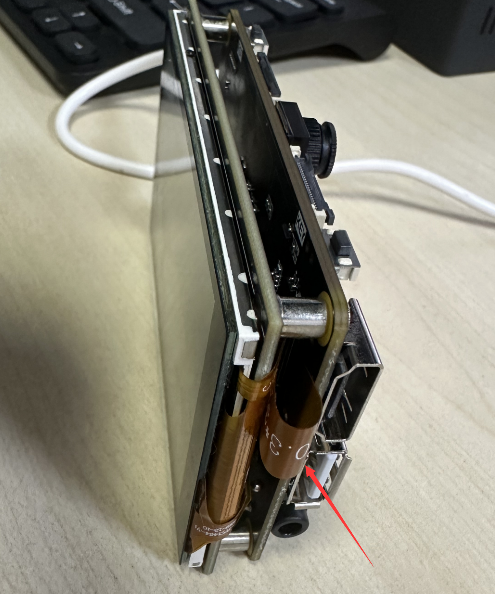

# Display in 3 ways

## Foreword

After the camera captures the image, we need to observe the image, which involves the issue of how to display it. Currently, CanMV K230 supports three display modes: IDE buffer display, external HDMI display or MIPI display.

## Experiment Purpose

Program to implement 3 different display modes of camera images.

## Experimental Explanation

01Studio CanMV K230 development board currently has 3 image display modes, each with its own characteristics:

- `IDE buffer display`：The most cost-effective, image quality is somewhat reduced, but it can meet the debugging needs in most occasions. The maximum supported resolution is 1920x1080.
- `HDMI`：External HDMI display, with the highest definition. Maximum support resolution of 1920x1080.
- `MIPI LCD`：The external 01Studio 3.5-inch MiPi display can be integrated with the development board, suitable for offline deployment and debugging. The maximum supported resolution is 800x480.

The above display methods are integrated in the Display Python API. Users only need to modify the code to achieve different display methods.

## class Display

### Constructors
```python
from media.display import * 
```
Import the Display module to use the Display-related API.

### Methods

```python
Display.init(type = None, width = None, height = None, osd_num = 1, to_ide = False, fps = None)
```
Initialize the Display module.

- `type`: Display type.
    - `VIRT` : IDE buffer；
    - `LT9611` : HDMI；
    - `ST7701` : mipi LCD。

- `width`: Optional parameter, display image width;

- `height`: Optional parameter, display image height;

- `to_ide`: At the same time, it is displayed in IDE, only used when it is set to HDMI or MIPI screen display:
    - `True` : Synchronous display;
    - `False` : Not display.

<br></br>

```python
Display.show_image(img, x = 0, y = 0, layer = None, alpha = 255, flag = 0)
```
Display the image.

- `img`: The image to be displayed, which can be created by an image or captured by a camera.

- `x`: Starting horizontal coordinate;

- `y`: Starting vertical coordinate.

<br></br>

```python
Display.deinit()
```
Unregister the Display module. Must be called before `MediaManager.deinit()` and after `sensor.stop()`.

<br></br>

For more usage, please read:[CanMV K230 Docs](https://developer.canaan-creative.com/k230_canmv/main/zh/api/mpp/K230_CanMV_Display%E6%A8%A1%E5%9D%97API%E6%89%8B%E5%86%8C.html#)


After getting familiar with the usage of Display API, let's take a look at the code writing flow chart:


## Codes

```python
'''
Demo Name：Display in 3 ways
Platform：01Studio CanMV K230
Description: Camera image acquisition through IDE, HDMI and MIPI screen display
Tutorial：wiki.01studio.cc
'''

import time, os, sys

from media.sensor import * #Import the sensor module and use the camera API
from media.display import * #Import the display module and use display API
from media.media import * #Import the media module and use meida API

try:

    sensor = Sensor() #Constructing a camera object
    sensor.reset() #reset the Camera
    sensor.set_framesize(Sensor.FHD) #Set frame size to FHD (1920x1080), default channel 0
    #sensor.set_framesize(width=800,height=480) #Set frame size to 800x480,mipi LCD,channel0
    sensor.set_pixformat(Sensor.RGB565) #Set the output image format, channel 0

    ##############################################################
    ## 3 different ways to display images (modify annotations)
    #############################################################

    Display.init(Display.VIRT, sensor.width(), sensor.height()) #Displaying images via IDE buffer
    #Display.init(Display.LT9611, to_ide=True) #Displaying images via HDMI
    #Display.init(Display.ST7701, to_ide=True) #Display images through 01Studio 3.5-inch mipi display

    MediaManager.init() #Initialize the media resource manager

    sensor.run() #Start the camera

    clock = time.clock()

    while True:


        os.exitpoint() #Detect IDE interrupts

        ####################
        ## Write codes here
        ####################
        clock.tick()

        img = sensor.snapshot() #Take a picture

        Display.show_image(img) #Show the Picture

        print(clock.fps()) #FPS


##############################################
# IDE interrupts the release of resource code
##############################################
except KeyboardInterrupt as e:
    print("user stop: ", e)
except BaseException as e:
    print(f"Exception {e}")
finally:
    # sensor stop run
    if isinstance(sensor, Sensor):
        sensor.stop()
    # deinit display
    Display.deinit()
    os.exitpoint(os.EXITPOINT_ENABLE_SLEEP)
    time.sleep_ms(100)
    # release media buffer
    MediaManager.deinit()

```

## Experimental Results

### IDE buffer display

Click Run Code, and you can see the real-time image captured by the camera displayed on the right side of the IDE.


### HDMI display

Change the reference code to LT9611:
```python
    #################################
    ##  3 different ways to display images (modify annotations)
    #################################

    #Display.init(Display.VIRT, sensor.width(), sensor.height()) #Displaying images via IDE buffer
    Display.init(Display.LT9611, to_ide=True) #Displaying images via HDMI
    #Display.init(Display.ST7701, to_ide=True) #Display images through 01Studio 3.5-inch mipi display

```

Connect to an HDMI display via an HDMI cable:


Run the code and you can see the HDMI display camera captures images, which supports up to 1080p:


### 3.5-inch mipi LCD display

To display images using a 3.5-inch mipi display, two places need to be modified:

Change the camera capture resolution to below 800x480:
```python
    #sensor.set_framesize(Sensor.FHD) #Set frame size to FHD (1920x1080), default channel 0
    sensor.set_framesize(width=800,height=480) #Set frame size to 800x480,mipi LCD,channel0
    sensor.set_pixformat(Sensor.RGB565) #Set the output image format, channel 0
```

将参考代码中的代码改成ST7701 :
```python
    ##############################################################
    ## 3 different ways to display images (modify annotations)
    #############################################################

    #Display.init(Display.VIRT, sensor.width(), sensor.height()) #Displaying images via IDE buffer
    #Display.init(Display.LT9611, to_ide=True) #Displaying images via HDMI
    Display.init(Display.ST7701, to_ide=True) #Display images through 01Studio 3.5-inch mipi display

```

Connect 01Studio 3.5-inch mipi screen via cable:


Run the code, and you can see the camera captured image displayed on the mipi screen, with a maximum supported resolution of 800x480:
