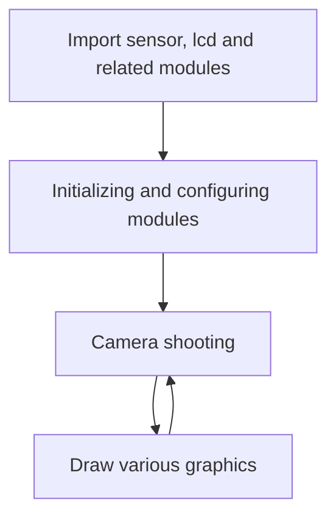
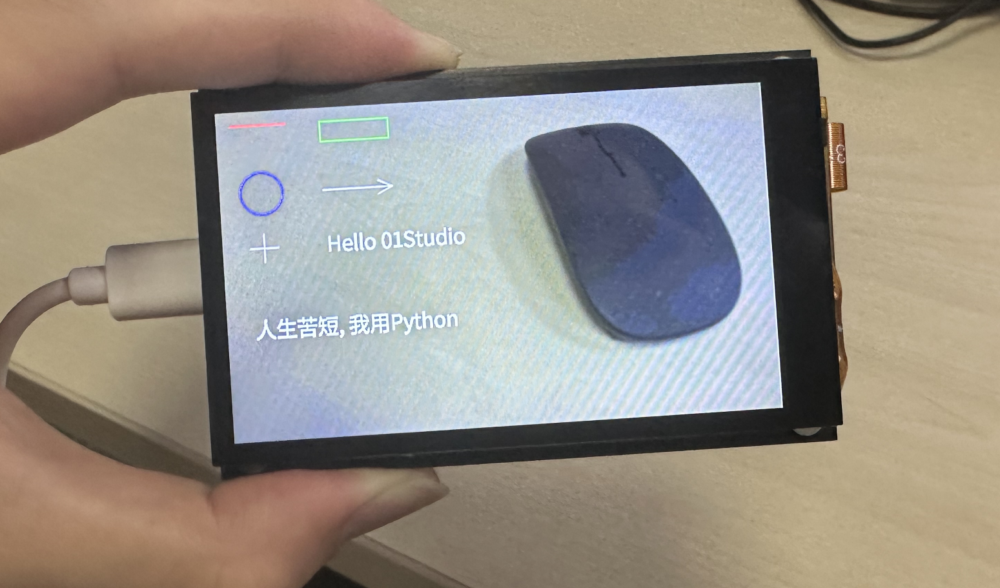
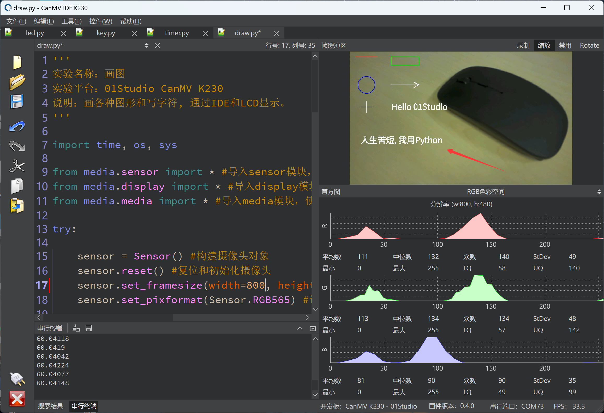

# Draw

## Foreword
After collecting photos through the camera, we will do some processing, and at this time we often need some graphics to indicate, such as marking an arrow at a certain position in the picture, using a rectangular frame to prompt after face recognition, etc. This section is about learning how to use the function of drawing on graphics.

## Experiment Purpose
Draw various graphics on the image captured by the camera.

## Experimental Explanation

In the previous section, we learned about the application of the camera sensor module. The real-time data collected by the camera is the image. Yes, this section of the experiment is based on the very important image module. CanMV has encapsulated image processing (including drawing) into various modules. We only need to be familiar with its constructor and usage, as follows:

## class image

### Constructors
```python
img=sensor.snapshot()
```
Returns the image object captured by the camera.
<br></br>

```python
img=image.Image(path[, copy_to_fb=False])
```
Create an image object by reading a picture.
- `copy_to_fb`: Choose whether to load large images.
    - `True` : Can load large images.
    - `False` : Cannot load large images.

Example：img = image.Image("01Studio.bmp", copy_to_fb=True) #Indicates loading the 01Studio.bmp picture in the root directory.

<br></br>

```python
img=image.Image(w, h, format)
```
Actively create an image.
- `w`: width
- `h`: height
- `format` : Image format. Some formats are as follows:
    - `GRAYSCALE` : Grayscale images;
    - `RGB565` : 16-bit color; (Most image processing functions use this format.)
    - `RGB888` : 24-bit true color

Example：img = image.Image(640, 480, image.RGB565) #Indicates creating a 640x480 image in RGB565 format.

<br></br>

### Methods

```python
image.draw_line(x0, y0, x1, y1[, color[, thickness=1]])
```
Draw line.
- `x0, y0`: Starting coordinates;
- `x1, y1`: End point coordinates;
- `color`: Line color;
- `thickness`: Line Thickness;

<br></br>

```python
image.draw_rectangle(x, y, w, h[, color[, thickness=1[, fill=False]]])
```
Draw a rectangle.
- `x, y`: Starting coordinates;
- `w`: width;
- `h`: height;
- `color`: color;
- `thickness`: Border thickness;
- `fill`: fill or not.
    - `True` : fill;
    - `False` : Not fill.

<br></br>

```python
image.draw_circle(x, y, radius[, color[, thickness=1[, fill=False]]])
```
Draw circle
- `x, y`: Center of the circle;
- `radius`: radius;
- `color`: color;
- `thickness`: Border thickness;
- `fill`: fill or not;、
    - `True` : fill;
    - `False` : Not fill.

<br></br>

```python
image.draw_arrow(x0, y0, x1, y1[, color[, size,[thickness=1]]])
```
Draw arrow.
- `x0, y0`: Starting coordinates;
- `x1, y1`: End point coordinates;
- `color`: color;
- `size`: Arrow position size;
- `thickness`: Border thickness;

<br></br>

```python
image.draw_cross(x, y[, color[, size=5[, thickness=1]]])
```
Draw cross.
- `x, y`: Center coordinates of cross;
- `color`: color;
- `size`: size of the cross;
- `thickness`: order thickness;

<br></br>

```python
image.draw_string(x, y, text[, color[, scale=1[,mono_space=True…]]]])
```
Draw String。
- `x, y`: Starting coordinates;
- `text`: text;
- `color`: color;
- `scale`: size of the font;
- `mono_space`: Mandatory interval;
    - `True` : interval;
    - `False` : No interval.

<br></br>

```python
image.draw_string_advanced(x, y, char_size,str,[color, font])
```
Draw String(support Chinese)
- `x, y`: Starting coordinates;
- `char_size`: size of the font;
- `text`: text;
- `color`: color;
- `font`: font type.

<br></br>

For more usage, please read: [CanMV K230 Docs](https://developer.canaan-creative.com/k230_canmv/main/zh/api/openmv/image.html)

After getting familiar with the drawing function of the image object, we try to draw line segments, rectangles, circles, arrows, crosses and characters in the images captured by the camera. The specific programming ideas are as follows:



## Codes

```python
'''
Demo Name：Draw
Platform：01Studio CanMV K230
Description: Draw various graphics and write characters, and display them through IDE and LCD.
Tutorial：wiki.01studio.cc
'''

import time, os, sys

from media.sensor import * #Import the sensor module and use the camera API
from media.display import * #Import the display module and use display API
from media.media import * #Import the media module and use meida API

try:

    sensor = Sensor() #Constructing a camera object
    sensor.reset() #reset the Camera
    #sensor.set_framesize(Sensor.FHD) #Set frame size to FHD (1920x1080), default channel 0
    sensor.set_framesize(width=800,height=480) #Set frame size to 800x480,mipi LCD,channel0
    sensor.set_pixformat(Sensor.RGB565) #Set the output image format, channel 0

    ##############################################################
    ## 3 different ways to display images (modify annotations)
    #############################################################

    #Display.init(Display.VIRT, sensor.width(), sensor.height()) #Displaying images via IDE buffer
    #Display.init(Display.LT9611, to_ide=True) #Displaying images via HDMI
    Display.init(Display.ST7701, to_ide=True) #Display images through 01Studio 3.5-inch mipi display

    MediaManager.init() #Initialize the media resource manager

    sensor.run() #Start the camera

    clock = time.clock()

    while True:


        os.exitpoint() #Detect IDE interrupts

        ####################
        ## Write codes here
        ####################
        clock.tick()

        img = sensor.snapshot() #Take a picture
        
        # Draw a line segment: from x0, y0 to x1, y1, color red, line width 2.
        img.draw_line(20, 20, 100, 20, color = (255, 0, 0), thickness = 2)

        #Draw a rectangle: green without filling.
        img.draw_rectangle(150, 20, 100, 30, color = (0, 255, 0), thickness = 2, fill = False)

        #Draw a circle: no blue fill.
        img.draw_circle(60, 120, 30, color = (0, 0, 255), thickness = 2, fill = False)

        #Draw arrow: white.
        img.draw_arrow(150, 120, 250, 120, color = (255, 255, 255), size = 20, thickness = 2)

        #Draw Cross
        img.draw_cross(60, 200, color = (255, 255, 255), size = 20, thickness = 2)

        #Draw String
        #img.draw_string(150, 200, "Hello 01Studio!", color = (255, 255, 255), scale = 4, mono_space = False)

        #Write characters, support Chinese.
        img.draw_string_advanced(150, 180, 30, "Hello 01Studio", color = (255, 255, 255))
        img.draw_string_advanced(40, 300, 30, "人生苦短, 我用Python", color = (255, 255, 255))

        Display.show_image(img)

        print(clock.fps()) #FPS


##############################################
# IDE interrupts the release of resource code
##############################################
except KeyboardInterrupt as e:
    print("user stop: ", e)
except BaseException as e:
    print(f"Exception {e}")
finally:
    # sensor stop run
    if isinstance(sensor, Sensor):
        sensor.stop()
    # deinit display
    Display.deinit()
    os.exitpoint(os.EXITPOINT_ENABLE_SLEEP)
    time.sleep_ms(100)
    # release media buffer
    MediaManager.deinit()
```

## Experimental Results

Open the drawing routine file draw.py in CanMV IDE and click Run. You can see various graphics drawn on the LCD.



The IDE buffer also has corresponding display:



Drawing graphics is a very basic function and will be used frequently in future experiments, especially when indicating identification content.