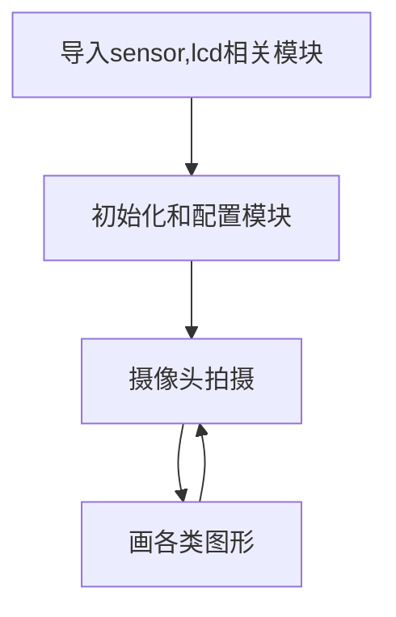

# 画图

## 前言
通过摄像头采集到照片后，我们会进行一些处理，而这时候往往需要一些图形来指示，比如在图片某个位置标记箭头、人脸识别后用矩形框提示等。本节就是学习在图形上画图的使用功能。

## 实验目的
在摄像头拍摄的图像上画各种图形。

## 实验讲解

上一节我们学习了摄像头sensor模块应用，通过摄像头实时采集到的是图片image, 没错，本节实验就是建立在非常重要的image模块上面。CanMV已经将图片处理（包含画图）封装成各类模块，我们只需要熟悉其构造函数和使用方法即可，具体如下：

## image对象

### 构造函数
```python
img=sensor.snapshot()
```
通过摄像头拍摄方式返回image对象。
<br></br>

```python
img=image.Image(path[, copy_to_fb=False])
```
通过读取图片方式创建image对象。
- `copy_to_fb`: 加载大图片。
    - `True` : 可以加载大图片。
    - `False` : 不可以加载大图片。

例：img = image.Image("01Studio.bmp", copy_to_fb=True) #表示加载根目录下的01Studio.bmp图片。

<br></br>

```python
img=image.Image(w, h, format)
```
主动创建一个图像。
- `w`: 图像宽度
- `h`: 图像高度
- `format` : 图像格式。部分格式如下：
    - `GRAYSCALE` : 图像格式；
    - `RGB565` : 16bit彩色；(大部分image图像处理函数使用这个格式。)
    - `RGB888` : 24bit真彩色

例：img = image.Image(640, 480, image.RGB565) #表示创建一张640x480, 格式为RGB565图像。

<br></br>

### 使用方法

```python
image.draw_line(x0, y0, x1, y1[, color[, thickness=1]])
```
画线段。
- `x0, y0`: 起始坐标;
- `x1, y1`: 终点坐标;
- `color`: 颜色;
- `thickness`: 线条粗细;

<br></br>

```python
image.draw_rectangle(x, y, w, h[, color[, thickness=1[, fill=False]]])
```
画矩形。
- `x, y`: 起始坐标;
- `w`: 宽度;
- `h`: 高度;
- `color`: 颜色;
- `thickness`: 边框粗细;
- `fill`: 是否填充;、
    - `True` : 填充。
    - `False` : 不填充。

<br></br>

```python
image.draw_circle(x, y, radius[, color[, thickness=1[, fill=False]]])
```
画圆。
- `x, y`: 圆心;
- `radius`: 宽度;
- `h`: 高度;
- `color`: 颜色;
- `thickness`: 线条粗细;
- `fill`: 是否填充;、
    - `True` : 填充。
    - `False` : 不填充。

<br></br>

```python
image.draw_arrow(x0, y0, x1, y1[, color[, size,[thickness=1]]])
```
画箭头。
- `x0, y0`: 起始坐标;
- `x1, y1`: 终点坐标;
- `color`: 颜色;
- `size`: 箭头位置大小;
- `thickness`: 线条粗细;

<br></br>

```python
image.draw_cross(x, y[, color[, size=5[, thickness=1]]])
```
画十字交叉。
- `x, y`: 交叉中点坐标;
- `color`: 颜色;
- `size`: 大小;
- `thickness`: 线条粗细;

<br></br>

```python
image.draw_string(x, y, text[, color[, scale=1[,mono_space=True…]]]])
```
写字符。
- `x, y`: 起始坐标;
- `text`: 字符内容;
- `color`: 颜色;
- `scale`: 字体大小;
- `mono_space`: 强制间隔;
    - `True` : 有间隔。
    - `False` : 无间隔。

<br></br>

```python
image.draw_string_advanced(x, y, char_size,str,[color, font])
```
写字符，支持中文。
- `x, y`: 起始坐标;
- `char_size`: 字体大小;
- `text`: 字符内容;
- `color`: 颜色;
- `font`: 字体类型。

<br></br>

更多用法请阅读: [CanMV K230官方文档](https://developer.canaan-creative.com/k230_canmv/main/zh/api/openmv/image.html)

熟悉了image对象的画图功能后，我们尝试在摄像头采集到的画面依次画出线段、矩形、圆形、箭头、十字交叉和字符。具体编程思路如下：



## 参考代码

```python
'''
实验名称：画图
实验平台：01Studio CanMV K230
说明：画各种图形和写字符, 通过IDE和LCD显示。
'''

import time, os, sys

from media.sensor import * #导入sensor模块，使用摄像头相关接口
from media.display import * #导入display模块，使用display相关接口
from media.media import * #导入media模块，使用meida相关接口

try:

    sensor = Sensor() #构建摄像头对象
    sensor.reset() #复位和初始化摄像头
    sensor.set_framesize(width=800, height=480) #设置帧大小VGA，默认通道0
    sensor.set_pixformat(Sensor.RGB565) #设置输出图像格式，默认通道0

    #Display.init(Display.VIRT, sensor.width(), sensor.height()) #使用IDE缓冲区输出图像
    Display.init(Display.ST7701,to_ide=True) #通过01Studio 3.5寸mipi显示屏显示图像
    MediaManager.init() #初始化media资源管理器

    sensor.run() #启动sensor

    clock = time.clock()

    while True:


        os.exitpoint() #检测IDE中断

        ################
        ## 这里编写代码 ##
        ################
        clock.tick()

        img = sensor.snapshot()
        # 画线段：从 x0, y0 到 x1, y1 坐标的线段，颜色红色，线宽度 2。
        img.draw_line(20, 20, 100, 20, color = (255, 0, 0), thickness = 2)

        #画矩形：绿色不填充。
        img.draw_rectangle(150, 20, 100, 30, color = (0, 255, 0), thickness = 2, fill = False)

        #画圆：蓝色不填充。
        img.draw_circle(60, 120, 30, color = (0, 0, 255), thickness = 2, fill = False)

        #画箭头：白色。
        img.draw_arrow(150, 120, 250, 120, color = (255, 255, 255), size = 20, thickness = 2)

        #画十字交叉。
        img.draw_cross(60, 200, color = (255, 255, 255), size = 20, thickness = 2)

        #写字符。
        #img.draw_string(150, 200, "Hello 01Studio!", color = (255, 255, 255), scale = 4, mono_space = False)

        #写字符，支持中文。
        img.draw_string_advanced(150, 180, 30, "Hello 01Studio", color = (255, 255, 255))
        img.draw_string_advanced(40, 300, 30, "人生苦短, 我用Python", color = (255, 255, 255))

        Display.show_image(img)

        print(clock.fps()) #打印FPS


###################
# IDE中断释放资源代码
###################
except KeyboardInterrupt as e:
    print("user stop: ", e)
except BaseException as e:
    print(f"Exception {e}")
finally:
    # sensor stop run
    if isinstance(sensor, Sensor):
        sensor.stop()
    # deinit display
    Display.deinit()
    os.exitpoint(os.EXITPOINT_ENABLE_SLEEP)
    time.sleep_ms(100)
    # release media buffer
    MediaManager.deinit()
```

## 实验结果

在CanMV IDE中打开画图例程文件draw.py，点击运行。可以看到在在LCD中画上了各种图形。


图像缓冲区也有相应的显示：


画图形是很基础的功能，在以后的实验中特别是指示识别内容时候会经常用到。