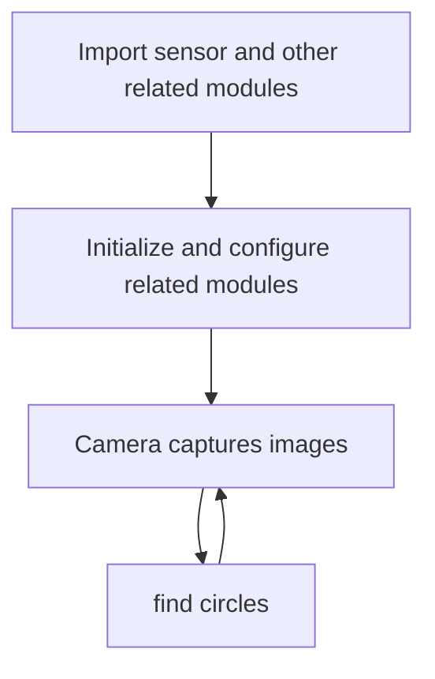
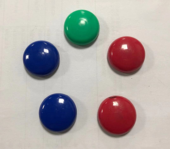
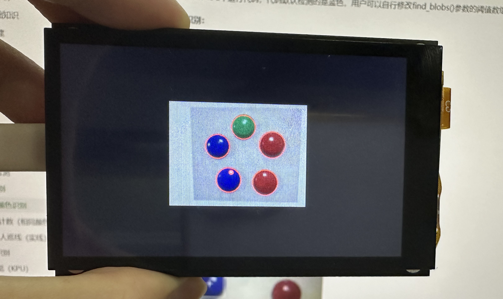

# find circles

## Foreword
This section learns to detect and recognize circles in images.

## Experiment Purpose
Through programming, CanMV K230 can detect and identify circles in images and draw pictures to indicate them.

## Experimental Explanation

CanMV integrates the circle recognition find_circles function, which is located in the image module, so we can directly process the captured pictures. Then we look at the relevant instructions of the circle recognition function as before, as follows:

## class find_circles

### Constructors
```python
image.find_circles([roi[, x_stride=2[, y_stride=1[, threshold=2000[, x_margin=10[, y_margin=10
                    [, r_margin=10[, r_min=2[, r_max[, r_step=2]]]]]]]]]])
```
Find circle function. Returns an image.circle object, which has 4 values: x, y (center), r (radius) and magnitude. The larger the magnitude, the higher the credibility of the recognized circle.

Parameter Description:
- `roi`: Recognition area (x, y, w, h). If not specified, the entire image is used by default.
- `threshold`: Threshold. Return circles greater than or equal to threshold to adjust recognition confidence.
- `x_stride`  `y_stride` : The amount of x,y pixels to skip during Hough transform;
- `x_margin` `y_margin` `r_margin` : Controls the merging of detected circles;
- `r_min`  `r_max`: Control the radius range of the recognized circle;
- `r_step`: Control identification step.

### Methods

Call this function directly. (Most parameters can be left as default, **compressed images and bayer images are not supported**)

For more usage, please read the official documentation:<br></br>
https://www.kendryte.com/k230_canmv/main/zh/api/openmv/image.html#find-circles

<br></br>

The programming ideas are as follows:



## Codes

```python
'''
Demo Name：find circles
Platform：01Studio CanMV K230
Tutorial：wiki.01studio.cc
Description: It is recommended to use a resolution below 320x240.
             A resolution that is too high will cause the frame rate to drop.
             Select 3.5-inch or 2.4-inch mipi screen by modifying the lcd_width and lcd_height parameter values.
'''

import time, os, sys

from media.sensor import * #Import the sensor module and use the camera API
from media.display import * #Import the display module and use display API
from media.media import * #Import the media module and use meida API

#3.5 inch mipi screen resolution definition
lcd_width = 800
lcd_height = 480

'''
#2.4 inch mipi screen resolution definition
lcd_width = 640
lcd_height = 480
'''

sensor = Sensor(width=1280, height=960) #Build a camera object and set the camera image length and width to 4:3
sensor.reset() # reset the Camera
sensor.set_framesize(width=320, height=240) #Set the frame size to resolution (320x240), default channel 0
sensor.set_pixformat(Sensor.RGB565) #Set the output image format, channel 0

Display.init(Display.ST7701, width=lcd_width, height=lcd_height, to_ide=True) #Use 3.5-inch mipi screen and IDE buffer to display images at the same time
#Display.init(Display.VIRT, sensor.width(), sensor.height()) #Use only the IDE buffer to display images

MediaManager.init() #Initialize the media resource manager

sensor.run() #Start the camera

clock = time.clock()

while True:

    ####################
    ## Write codes here
    ####################
    clock.tick()

    img = sensor.snapshot() # Take a picture

    # The circle class has 4 parameter values: center (x, y), r (radius) and magnitude;
    # The larger the magnitude, the higher the credibility of the identified circle.
    # `threshold` The parameter controls the number of circles found, and increasing the value will reduce the total #             number of recognized circles.
    # `x_margin`, `y_margin`, and `r_margin` Controls the merge adjustment for detected approaching circles.
    # r_min, r_max, and r_step Used to specify the radius range of the test circle.
    for c in img.find_circles(threshold = 2000, x_margin = 10, y_margin= 10,
                              r_margin = 10,r_min = 2, r_max = 100, r_step = 2):
        #Draw a red circle as an indication
        img.draw_circle(c.x(), c.y(), c.r(), color = (255, 0, 0),thickness=2)

        print(c) #Print circular information

    #Display.show_image(img) #Display images

    #Display images, only used for LCD center display
    Display.show_image(img, x=round((lcd_width-sensor.width())/2),y=round((lcd_height-sensor.height())/2))

    print(clock.fps()) #FPS

```

## Experimental Results

Run the code in CanMV IDE, and the recognition results are as follows:

**Original image:**



**Identification results:**


