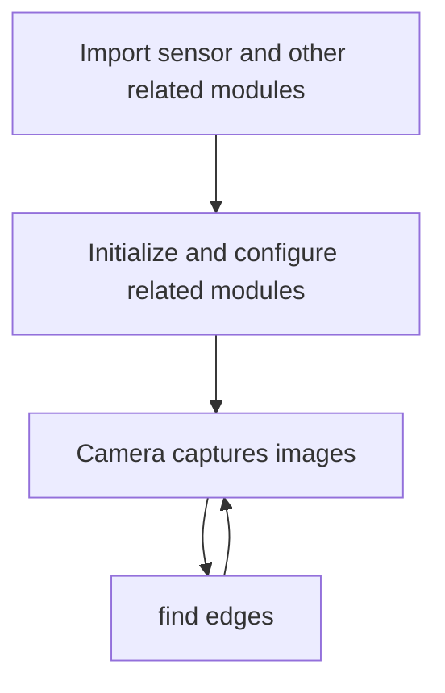
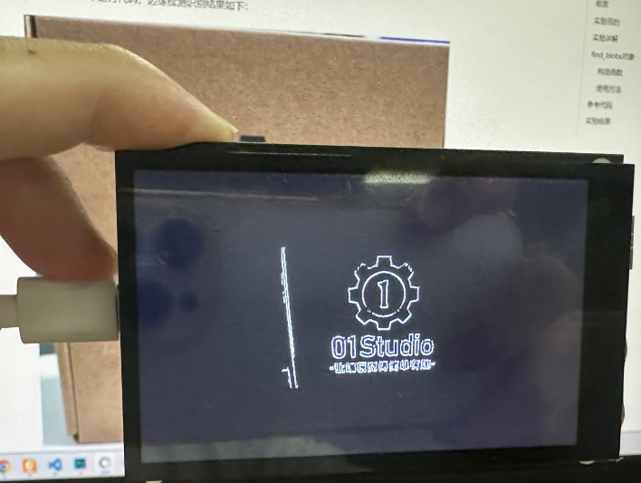

# find edges

## Foreword
Every object in life has an edge. In simple terms, it is a contour. In this section, we will learn how to use MicroPython combined with the CanMV K230's built-in library to perform image contour detection.

## Experiment Purpose
CanMV K230 is used to perform edge detection on images through programming.

## Experimental Explanation

CanMV integrates the RGB565 color block recognition find_edges function, which is located under the image module, so we can directly process the captured pictures. Then, as usual, we look at the description of the objects and functions related to this experiment, as follows:


## class find_edges

### Constructors
```python
image.find_edges(edge_type[, threshold])
```
Edge detection, converting the image to black and white, retaining white pixels at the edges.

Parameter Description:
- `edge_type`: Processing method.
    - `image.EDGE_SIMPLE `: Simple threshold high-pass filtering algorithm;
    - `image.EDGE_CANNY`: Canny edge detection algorithm;
- `threshold`: A two-tuple containing high and low thresholds, the default is (100,200), only supported for grayscale images.

### Methods

Call the function directly.

For more usage, please read the official documentation:<br></br>
https://developer.canaan-creative.com/k230_canmv/main/zh/api/openmv/image.html#find-edges

<br></br>

It can be seen that the edge processing method is very simple. Combined with the application of the previous camera, we organize the programming ideas as follows:



## Codes

```python
'''
Demo Name：find edges
Platform：01Studio CanMV K230
Tutorial：wiki.01studio.cc
Description: It is recommended to use a resolution below 320x240. A resolution that is too high will cause the frame rate to drop.
'''

import time, os, sys, gc

from media.sensor import * #Import the sensor module and use the camera API
from media.display import * #Import the display module and use display API
from media.media import * #Import the media module and use meida API

try:

    sensor = Sensor(width=1280, height=960) #Build a camera object and set the camera image length and width to 4:3
    sensor.reset() # reset the Camera
    sensor.set_framesize(width=320, height=240) #Set the frame size to resolution (320x240), default channel 0
    sensor.set_pixformat(Sensor.GRAYSCALE) # Set the output image format, channel 0

    Display.init(Display.ST7701, to_ide=True) #Use 3.5-inch mipi screen and IDE buffer to display images at the same time
    #Display.init(Display.VIRT, sensor.width(), sensor.height()) #Use only the IDE buffer to display images

    MediaManager.init() #Initialize the media resource manager

    sensor.run() #Start the camera

    clock = time.clock()

    while True:

        os.exitpoint() #Detect IDE interrupts

        ####################
        ## Write codes here
        ####################
        clock.tick()

        img = sensor.snapshot() # Take a picture

        # Using the Canny edge detector
        img.find_edges(image.EDGE_CANNY, threshold=(50, 80))

        # You can also use simple fast edge detection, which has average effect. The configuration is as follows
        #img.find_edges(image.EDGE_SIMPLE, threshold=(100, 255))

        #Display.show_image(img) #Display pictures

        #Display pictures, only used for LCD center display
        Display.show_image(img, x=round((800-sensor.width())/2),y=round((480-sensor.height())/2))

        print(clock.fps()) #FPS

##############################################
# IDE interrupts the release of resource code
##############################################
except KeyboardInterrupt as e:
    print("user stop: ", e)
except BaseException as e:
    print(f"Exception {e}")
finally:
    # sensor stop run
    if isinstance(sensor, Sensor):
        sensor.stop()
    # deinit display
    Display.deinit()
    os.exitpoint(os.EXITPOINT_ENABLE_SLEEP)
    time.sleep_ms(100)
    # release media buffer
    MediaManager.deinit()
```

## Experimental Results

Running the code in CanMV IDE, the edge detection results are as follows:

**Original image:**


**Identification results:**


