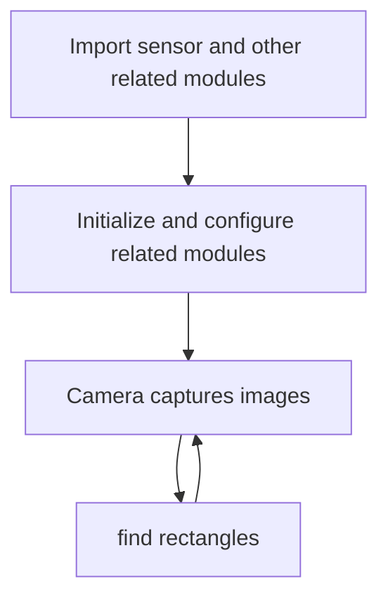

# find rectangles

## Foreword
This section learns to detect and recognize rectangles in images.

## Experiment Purpose
Through programming, CanMV K230 can detect and identify rectangles in images and draw pictures to indicate them.

## Experimental Explanation

CanMV integrates the rectangle recognition find_rects function, which is located under the image module, so we can directly process the captured pictures. Then we look at the relevant instructions of the recognition function as usual, as follows:

## class find_rects

### Constructors
```python
image.find_rects([roi=Auto, threshold=10000])
```
Rectangle recognition function. Returns a list of `image.rect` rectangle objects.

Parameter Description:
- `roi`: Recognition area (x, y, w, h). If not specified, the entire image is used by default.
- `threshold`: Threshold. Returns rectangles greater than or equal to threshold to adjust the recognition confidence.

### Methods

Call this function directly. (Most parameters can be left as default, **compressed images and bayer images are not supported**)

For more usage, please read the official documentation:<br></br>
https://developer.canaan-creative.com/k230_canmv/main/zh/api/openmv/image.html#find-rects

<br></br>

The programming ideas are as follows:



## Codes

```python
'''
Demo Name：find rectangles
Platform：01Studio CanMV K230
Tutorial：wiki.01studio.cc
Description: It is recommended to use a resolution below 320x240.
             A resolution that is too high will cause the frame rate to drop.
'''

import time, os, sys

from media.sensor import * #Import the sensor module and use the camera API
from media.display import * #Import the display module and use display API
from media.media import * #Import the media module and use meida API

sensor = Sensor(width=1280, height=960) #Build a camera object and set the camera image length and width to 4:3
sensor.reset() # reset the Camera
sensor.set_framesize(width=320, height=240) #Set the frame size to resolution (320x240), default channel 0
sensor.set_pixformat(Sensor.RGB565) #Set the output image format, channel 0

Display.init(Display.ST7701, to_ide=True) #Use 3.5-inch mipi screen and IDE buffer to display images at the same time
#Display.init(Display.VIRT, sensor.width(), sensor.height()) #Use only the IDE buffer to display images

MediaManager.init() #Initialize the media resource manager

sensor.run() #Start the camera

clock = time.clock()

while True:

    ####################
    ## Write codes here
    ####################
    clock.tick()

    img = sensor.snapshot() # Take a picture

    # `threshold` You need to set a relatively large value to filter out noise.
    #This way, rectangles with lower edge brightness are detected in the image. The larger the magnitude of the #rectangle edge, the stronger the contrast…

    for r in img.find_rects(threshold = 10000):
        img.draw_rectangle(r.rect(), color = (255, 0, 0),thickness=2) #draw rectangls
        for p in r.corners(): img.draw_circle(p[0], p[1], 5, color = (0, 255, 0))#Draw small circles on the four corners
        print(r)

    #Display.show_image(img) #Display images

    #Display images, only used for LCD center display
    Display.show_image(img, x=round((800-sensor.width())/2),y=round((480-sensor.height())/2))

    print(clock.fps()) #FPS

```

## Experimental Results

Run the code in CanMV IDE, and the recognition results are as follows:

**Original image:**


**Identification results:**


