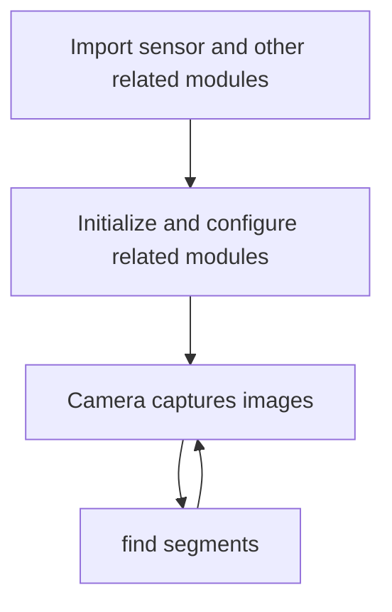
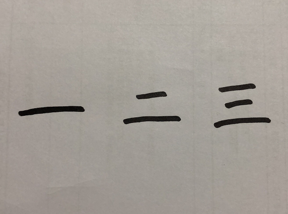
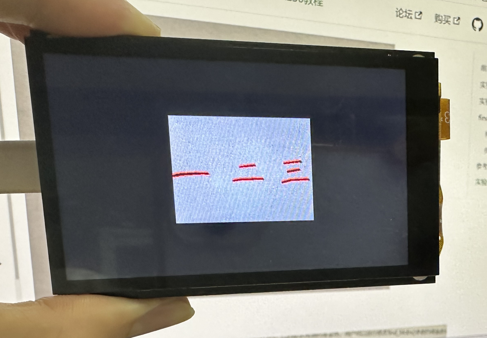

# find segments

## Foreword
This section studies the detection and recognition of line segments in images.

## Experiment Purpose
Through programming, CanMV K230 can detect and identify line segments in the image and draw pictures to indicate them.

## Experimental Explanation

CanMV integrates the line segment recognition find_line_segments function, which is located in the image module, so we can directly process the captured image. Then, as usual, we look at the description of the line segment recognition function, as follows:

## class find_line_segments

### Constructors
```python
image.find_line_segments([roi[, merge_distance=0[, max_theta_difference=15]]])
```
Line segment recognition function. Returns a list of `image.line` line segment objects.

Parameter Description:
- `roi`: Recognition area (x, y, w, h). If not specified, the entire image is used by default.
- `merge_distance`: The maximum number of pixels that two line segments can be separated from each other without being merged;
- `max_theta_difference`: Merge line segments with less than this angle.

### Methods

Call this function directly. (Most parameters can be left as default, **compressed images and bayer images are not supported**)

For more usage, please read the official documentation:<br></br>
https://www.kendryte.com/k230_canmv/main/zh/api/openmv/image.html#find-segments

<br></br>

The programming ideas are as follows:



## Codes

```python
'''
Demo Name：find segments
Platform：01Studio CanMV K230
Tutorial：wiki.01studio.cc
Description: It is recommended to use a resolution below 320x240. 
             A resolution that is too high will cause the frame rate to drop.
             Select 3.5-inch or 2.4-inch mipi screen by modifying the lcd_width and lcd_height parameter values.
'''

import time, os, sys

from media.sensor import * #Import the sensor module and use the camera API
from media.display import * #Import the display module and use display API
from media.media import * #Import the media module and use meida API

#3.5 inch mipi screen resolution definition
lcd_width = 800
lcd_height = 480

'''
#2.4 inch mipi screen resolution definition
lcd_width = 640
lcd_height = 480
'''

enable_lens_corr = False # Set to True to get straighter lines.

sensor = Sensor(width=1280, height=960) #Build a camera object and set the camera image length and width to 4:3
sensor.reset() # reset the Camera
sensor.set_framesize(width=320, height=240) #Set the frame size to resolution (320x240), default channel 0
sensor.set_pixformat(Sensor.RGB565) #Set the output image format, channel 0

Display.init(Display.ST7701, width=lcd_width, height=lcd_height, to_ide=True) #Use mipi lcd and IDE buffer to display images at the same time
#Display.init(Display.VIRT, sensor.width(), sensor.height()) #Use only the IDE buffer to display images

MediaManager.init() #Initialize the media resource manager

sensor.run() #Start the camera

clock = time.clock()

while True:

    ####################
    ## Write codes here
    ####################
    clock.tick()

    img = sensor.snapshot() # Take a picture

    if enable_lens_corr: img.lens_corr(1.8) # for 2.8mm lens...

    '''
    `merge_distance` controls whether or not close segments are merged. A value of 0 (default) means no merging. A value of 1 means that segments that are 1 pixel closer are merged. So you can control the number of detected segments by changing this parameter.

    `max_theta_diff` controls the merging of line segments that differ by a certain angle. The default is 15 degrees, which means that line segments within 15 degrees will be merged.
    '''

    for l in img.find_line_segments(merge_distance = 0, max_theta_diff = 5):

        img.draw_line(l.line(), color = (255, 0, 0), thickness=2)
        print(l)

    #Display.show_image(img) #Display images

    #Display images, only used for LCD center display
    Display.show_image(img, x=round((lcd_width-sensor.width())/2),y=round((lcd_height-sensor.height())/2))

    print(clock.fps()) #FPS

```

## Experimental Results

Run the code in CanMV IDE, and the recognition results are as follows:

**Original image:**



**Identification results:**

