# linear regression fast（Line patrol）

## Foreword
Fast linear regression has a wide range of uses, such as the cars and robots that are often used in competitions to patrol the line. They can use linear regression to determine the trajectory of the dotted and solid lines, and thus make judgments and responses. In this section, we will learn the programming method of CanMV K230 linear regression.

## Experiment Purpose
Through programming, CanMV K230 can detect and identify the solid lines (or dotted lines) in the image and draw a picture to indicate them.

## Experimental Explanation

CanMV integrates the fast linear regression get_regression function, which is located under the image module, so we can directly process the captured pictures. Then we look at the function description as usual, as follows:

## class get_regression

### Constructors
```python
image.get_regression(thresholds[, invert=False[, roi[, x_stride=2[, y_stride=1[, 
                    area_threshold=10[, pixels_threshold=10[, robust=False]]]]]]])
```
Linear regression calculation. Perform linear regression calculation on all threshold pixels in the image using the least squares method. This is usually faster, but cannot handle any outliers.

Parameter Description:
- `threshold`: Must be a list of tuples. (lo, hi) defines the color range you want to track. For grayscale images, each tuple needs to contain two values: the minimum grayscale value and the maximum grayscale value.

### Methods

Call the function directly.

For more usage, please read: [CanMV K230 Docs](https://developer.canaan-creative.com/k230_canmv/main/zh/api/openmv/image.html#get-regression)


In order to improve the processing effect, we can first convert the image into a binary (black and white) image. The method is as follows:

```python
image.binary(thresholds[, invert=False[, zero=False[, mask=None[, to_bitmap=False[, copy=False]]]]])
```

Linear regression calculation. Perform linear regression calculation on all threshold pixels in the image using the least squares method. This is usually faster, but cannot handle any outliers.

- `threshold`: Must be a list of tuples. (lo, hi) defines the color range you want to track. For grayscale images, each tuple needs to contain two values: the minimum grayscale value and the maximum grayscale value.

For example: thresholds=(0,100), then this function means changing the grayscale value range of (0,100) to white.

<br></br>

The programming ideas are as follows:

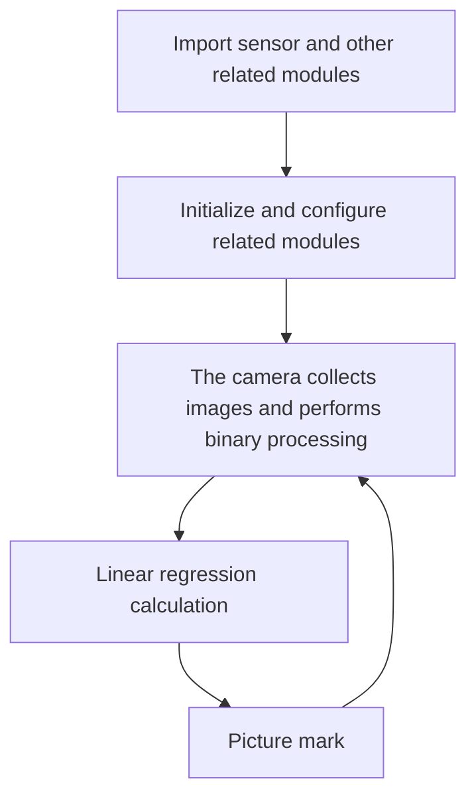

## Codes

```python
'''
Demo Name：linear regression fast（Line patrol）
Platform：01Studio CanMV K230
Tutorial：wiki.01studio.cc
'''

import time, os, sys

from media.sensor import * #Import the sensor module and use the camera API
from media.display import * #Import the display module and use display API
from media.media import * #Import the media module and use meida API


THRESHOLD = (0, 100)  # Grayscale threshold for black and white images
BINARY_VISIBLE = True # Using binarized images allows you to see what linear regression is doing.
                      # This may reduce FPS.

try:

    sensor = Sensor(width=1280, height=960) #Build a camera object and set the camera image length and width to 4:3
    sensor.reset() # reset the Camera
    sensor.set_framesize(width=640, height=480) # Set the frame size to resolution (320x240), default channel 0
    sensor.set_pixformat(Sensor.GRAYSCALE) # Set the output image format, channel 0

    Display.init(Display.ST7701, to_ide=True) #Use 3.5-inch mipi screen and IDE buffer to display images at the same time
    #Display.init(Display.VIRT, sensor.width(), sensor.height()) #Use only the IDE buffer to display images

    MediaManager.init() #Initialize the media resource manager

    sensor.run() #Start the camera

    clock = time.clock()

    while True:

        os.exitpoint() #Detect IDE interrupts

        ####################
        ## Write codes here
        ####################
        clock.tick()

        #image.binary([THRESHOLD]) # The gray value in the THRESHOLD range becomes white
        img = sensor.snapshot().binary([THRESHOLD]) if BINARY_VISIBLE else sensor.snapshot()
        
        # Returns an object similar to find_lines() and find_line_segments().
        # The following functions are used: x1(), y1(), x2(), y2(), length(),
        # theta() (rotation in degrees), rho(), and magnitude().
        #
        # magnitude() represents the linear regression instruction, and its value is (0, INF].
        # 0 represents a circle, and the larger the INF value, the better the linear fit effect.

        line = img.get_regression([(255,255) if BINARY_VISIBLE else THRESHOLD])

        if (line):

            img.draw_line(line.line(), color = 127,thickness=4)

            print(line) #Printing Results

        #Display images, only used for LCD center display
        Display.show_image(img, x=round((800-sensor.width())/2),y=round((480-sensor.height())/2))


        print("FPS %f, mag = %s" % (clock.fps(), str(line.magnitude()) if (line) else "N/A"))


##############################################
# IDE interrupts the release of resource code
##############################################
except KeyboardInterrupt as e:
    print("user stop: ", e)
except BaseException as e:
    print(f"Exception {e}")
finally:
    # sensor stop run
    if isinstance(sensor, Sensor):
        sensor.stop()
    # deinit display
    Display.deinit()
    os.exitpoint(os.EXITPOINT_ENABLE_SLEEP)
    time.sleep_ms(100)
    # release media buffer
    MediaManager.deinit()
```

## Experimental Results

Run the code in CanMV IDE, and the detection and recognition results are as follows:

### Dashed Line Test

Original image:

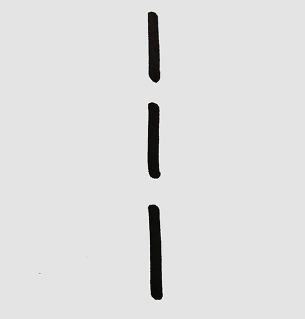 

Identification results:

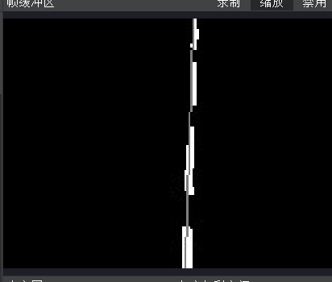

<br></br>

### Dashed curve test

Original image:

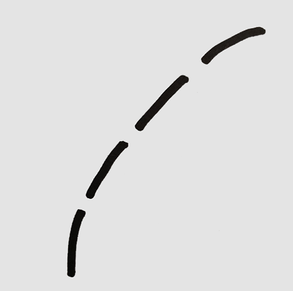 

Identification results:

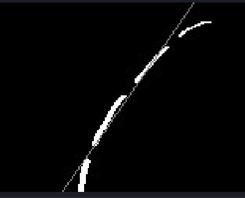

<br></br>

### Solid Line Test

Original image:

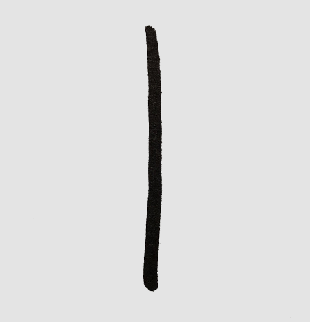 

Identification results:

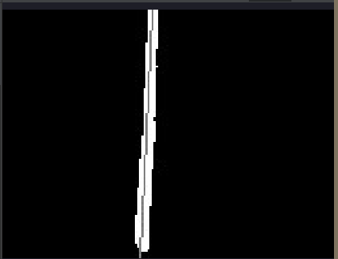

### Solid curve test

Original image:

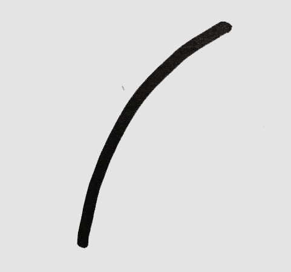 

Identification results:

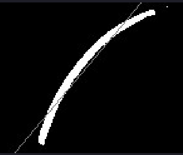

You can see the recognition results in the serial terminal:

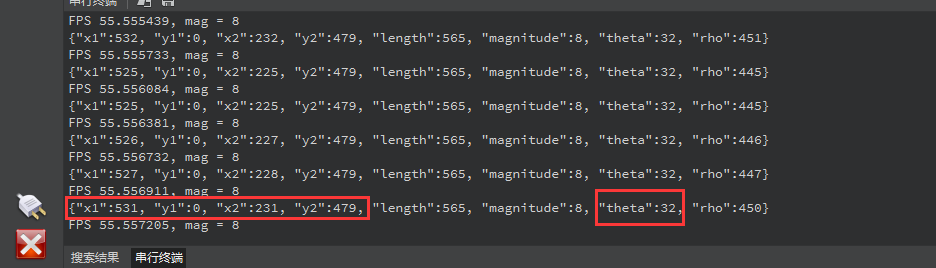

The above results contain the coordinates of the two points of the fitted line segment, the length, and the very important `theta` angle information. The `theta` angle is expressed as follows:

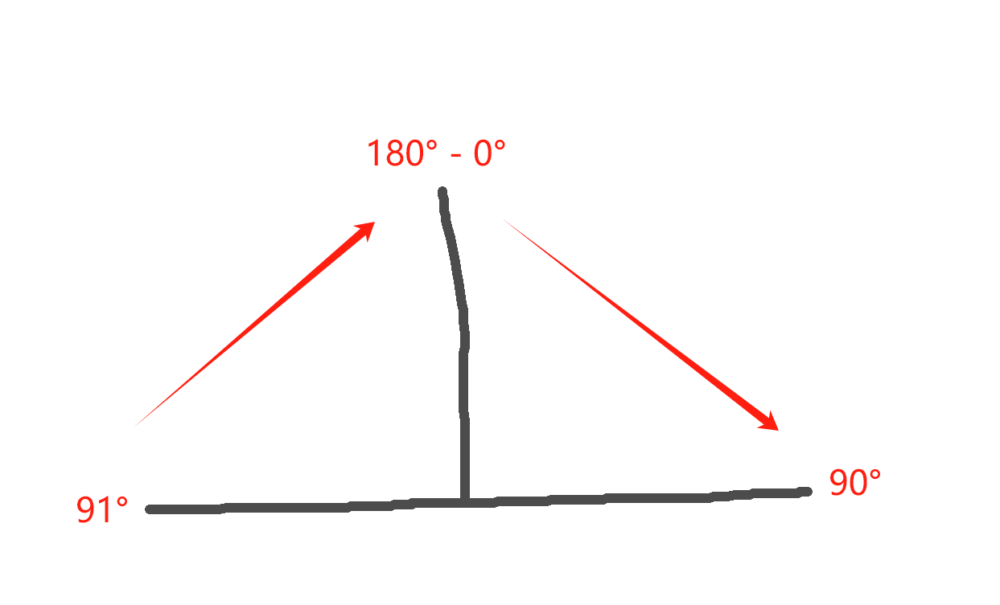

From left to right, the changes are 91°->180°(0°)->90°. You can observe the experimental data in the figure above to understand that the essence of the line patrol car is to keep this fitting line segment at 0°.


