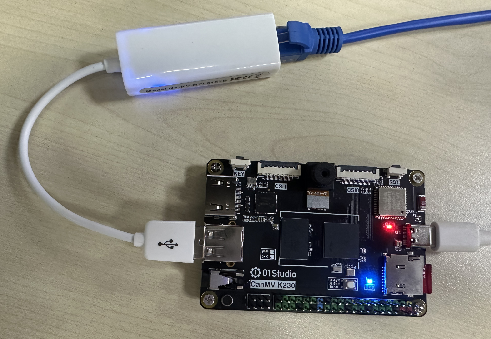
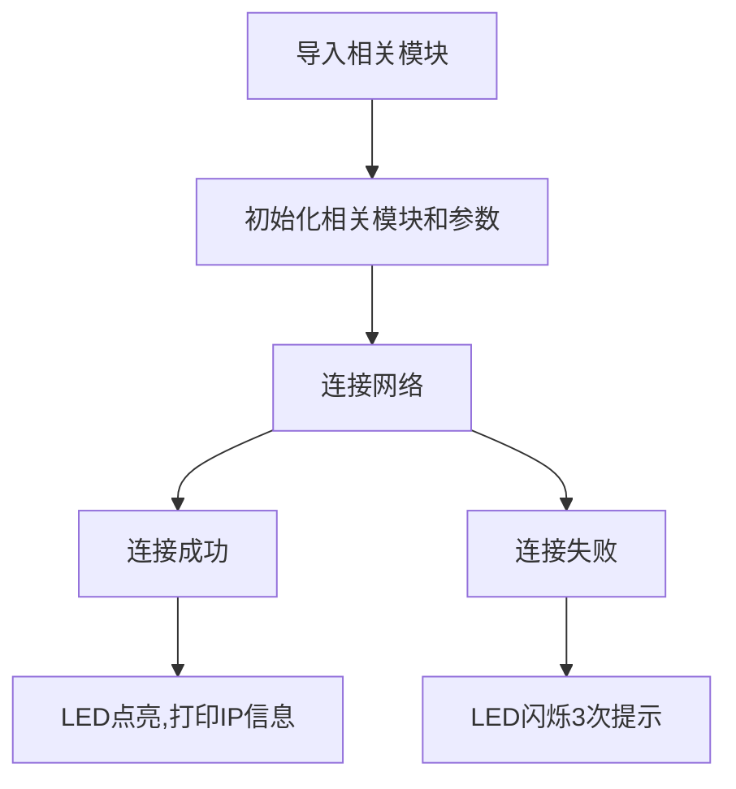
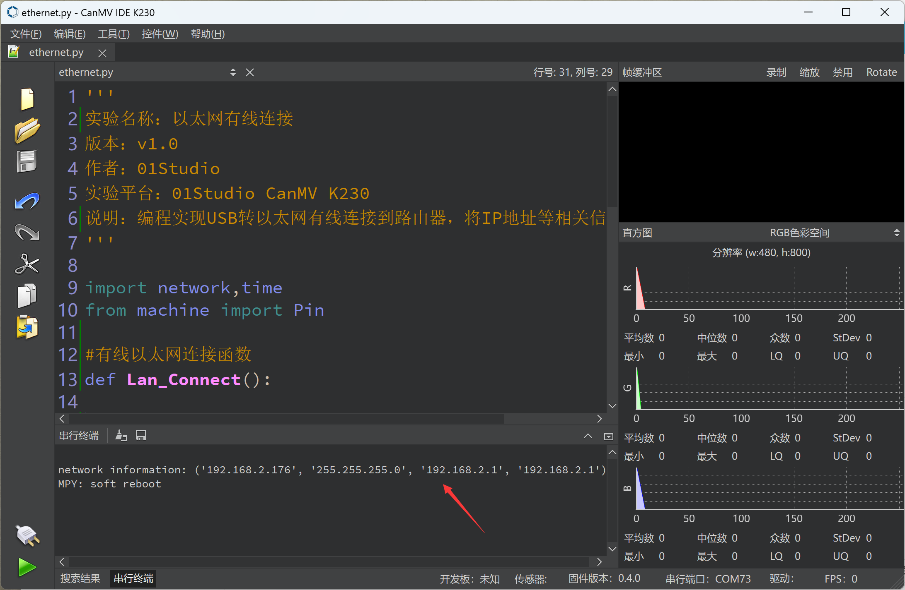

# 以太网有线连接

## 前言

除了使用CanMV K230 板载WiFi模块连接到网络外，还可以使用USB转以太网设备实现有线连接。适用于只有有线以太网网络场景。

## 实验目的

编程实现USB转以太网设备有线方式连接到路由器，将IP地址等相关信息通过串口终端打印。

## 实验讲解

有线以太网需要借助一个USB转以太网设备，型号为：USB2.0 RTL8152B 免驱百兆网卡： [**点击购买>>**](https://item.taobao.com/item.htm?id=822775353673)

将USB转以太网卡USB端插入01Studio CanMV K230开发板，另一头插入网线连接到路由器。



:::tip 提示
务必先插入USB转以太网卡，再上电，系统会在上电过程中初始化该设备。
:::

以太网跟无线连接方式一样使用MicroPython库已经集成了的network模块，开发者使用内置的network模块函数可以非常方便地连接上网络。

我们先来看看network基于有线以太网（LAN模块）的构造函数和使用方法。

## network对象

### 构造函数
```python
lan = network.LAN()
```
构建LAN（有线）连接对象。 

### 使用方法
```python
lan.active([is_active])
```
激活或停用网络接口。
- `[is_active]`: 激活或停用网络接口，参数为空时返回当前接口状态：

    - `True`: 激活网络接口;
    - `False`: 关闭网络接口。

<br></br>

```python
lan.isconnected()
```
检查设备是否已经连接上。返回 `Ture`:已连接；`False`:未连接。

<br></br>

```python
wlan.ifconfig([(ip, subnet, gateway, dns)])
```
配置WiFi信息，当参数为空时表示查看WiFi连接信息。
- `ip`: IP地址；
- `subnet` : 子网掩码；
- `gateway`: 网关地址；
- `dns` : DNS信息。

**例：wlan.ifconfig(('192.168.1.110', '255.255.255.0', '192.168.1.1', '8.8.8.8')) 。**

<br></br>

更多用法请阅读官方文档：<br></br>
https://docs.micropython.org/en/latest/library/network.WLAN.html

从上表可以看到MicroPython通过模块封装，让以太网有线联网变得非常简单

代码编写流程如下：



## 参考代码

```python
'''
实验名称：以太网有线连接
实验平台：01Studio CanMV K230
说明：编程实现USB转以太网卡有线连接到路由器，将IP地址等相关信息打印出来。
教程：wiki.01studio.cc
'''

import network,time
from machine import Pin

#有线以太网连接函数
def Lan_Connect():

    LAN_LED=Pin(52, Pin.OUT) #初始化联网指示灯

    lan = network.LAN()

    if lan.isconnected(): #连接成功

        #LED蓝灯点亮
        LAN_LED.value(1)

        #串口打印信息
        print('network information:', lan.ifconfig())

    else: #连接失败

        #LED闪烁3次提示
        for i in range(3):
            LAN_LED.value(1)
            time.sleep_ms(300)
            LAN_LED.value(0)
            time.sleep_ms(300)

#执行以太网连接函数
Lan_Connect()

```

## 实验结果

运行程序，可以观察到连接以太网连接成功后串口终端打印IP等信息。



以太网连接成功后也可以实现前面Socket、MQTT等功能，修改代码即可实现。