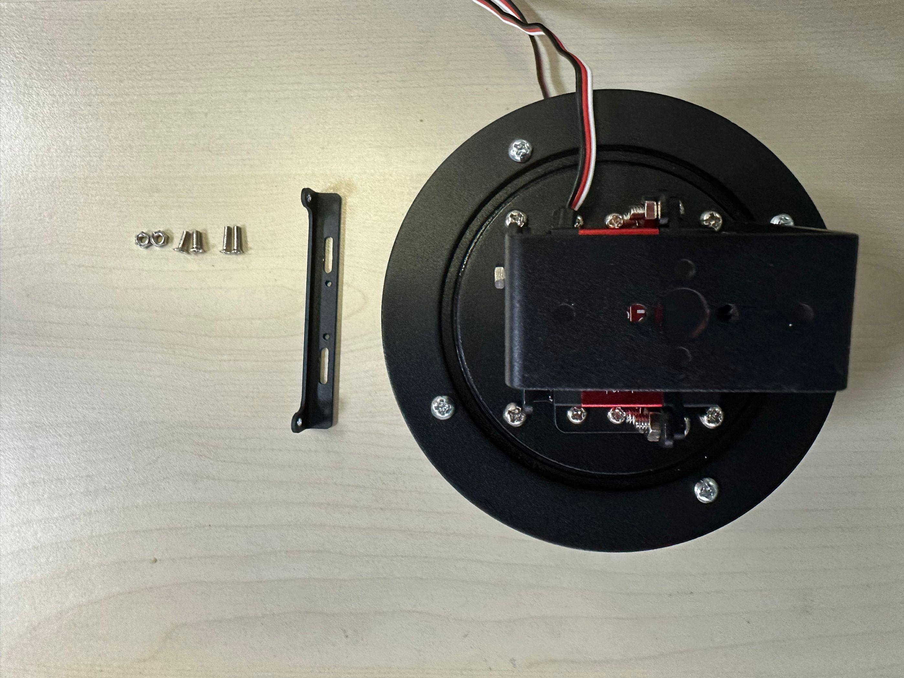

# 云台介绍和组装

二维舵机云台是一种通过两个独立舵机实现水平（X轴）和垂直（Y轴）方向旋转的机械结构，广泛应用于机器人、安防监控、无人机、智能设备等领域，旨在扩展设备的视野范围并实现精准角度控制。其核心由两个舵机（如 MG90S、SG90 等型号）构成，分别负责 X 轴（水平）和 Y 轴（垂直）的转动，通过 PWM 信号控制舵机角度，配合微控制器（如树莓派、Arduino）实现精确的方向调整。

**典型应用场景**
- 安防与监控：实现 360° 无死角巡航，配合红外或高清摄像头进行周界防范。
- 无人机与航模：稳定拍摄设备，通过姿态传感器（如 MPU6050）补偿飞行抖动，提升画面质量。
- 机器人与智能小车：作为视觉系统的载体，用于环境感知、路径规划或人机交互。
- 教育与科研：在开源项目中常用于学习 PID 控制、机械臂运动学及图像处理算法，例如结合树莓派实现人脸检测追踪。

## 产品介绍

01Studio 二维舵机云台 [**点击购买>>**](https://item.taobao.com/item.htm?id=956013958624)

### 参数

|  产品参数 |
|  :---:  | ---  |
| 舵机类型  | 单轴舵机 |
| 水平角度 | 270° | 
| 垂直角度  | 180° |
| 控制方式  | PWM |
| 工作电压  | 5V |
| 电流  | 1-3A|
| 材质  | 铝合金 |
| 载重  | 1KG |
| 尺寸  | 长宽高: 120x120x130mm |
| 重量  | 550g |

### 尺寸图

## 组装

舵机云台主体出厂已经组装好。只需要装上配套的CanMV K230或CanMV K230 mini固定支架即可。下面以01科技CanMV K230开发板进行安装说明，CanMV K230 mini安装方法一样：

先检查清单：

- 二维舵机云台 x1
- CanMV K230开发板固定板 x1
- M3*8十字平头螺丝 x2
- M3螺母 x2
- M2.5*10十字平头螺丝 x2

### 固定板安装

线一侧朝向自己，将固定板尽量居中放在顶部。固定板朝向如下（看2个小耳朵位置）。

使用2个**M3*8十字平头螺丝**和2个**M3螺母**固定。

### 开发板安装

然后将CanMV K230开发板配套的M2.5*6螺丝拧下来：

将支架固定孔对准开发板固定孔，使用M2.5*6螺丝拧紧即可。

 **如果装了外壳，可以使用配套的M2.5*10长螺丝拧紧。**

至此，组装完成。

### 驱动板组装

01Studio 二维舵机云台默认使用pyMotors多路舵机驱动板，通过I2C方式与K230连接，使用K230 micropython算法直接控制，无线额外单片机驱动板处理。

如果你购买的是含驱动板的二维舵机云台套餐，请检查下面清单：

- pyMotors驱动板 x1
- xh1.25转2.54mm连接线(30cm) x1
- 2.54mm公对母杜邦线（30cm）x1
- 电源适配器（5V/3A）x1
- USB转DC2.1电源线 x1

组装方法如下：

使用xh1.25转2.54mm连接线(30cm)连接K230开发板和pyMotors舵机模块：

注意彩色排线颜色随机，因此第一根GND可能是红色线，注意不要接错。顺序是  GND-3.3V-SDA（IO11）-SCL(IO12)

使用配套的5V适配器和电源线供电。旁边的是电源自锁开关。

关于K230供电，调试时可以使用USB通过电脑直接供电。[离线运行代码](../../getting_start/run_offline.md)可以使用配套的2.54mm母对母（30cm）杜邦线通过驱动板供电。K230排针接线可参考：[K230杜邦线供电](../../getting_start/power_supply.md#dupont-line)

:::danger 警告
当使用驱动板给K230供电时，适配器电源务必使用5V，超出会导致K230开发板烧坏。
:::

舵机驱动板这边可以借用16路任意1路的红黑排针，红色表示驱动板输入电压（给K230供电时电源输入要5V），黑色为GND。

### 舵机接线

将水平（X轴）270°舵机3P线接到S0，垂直（Y轴）180°舵机3P线接到S1。**黑色表示GND，红色表示VCC，白色表示信号线。**

到这里，舵机云台、开发板、舵机驱动板和舵机已经组装完成，下一节将讲解如何驱动舵机。

